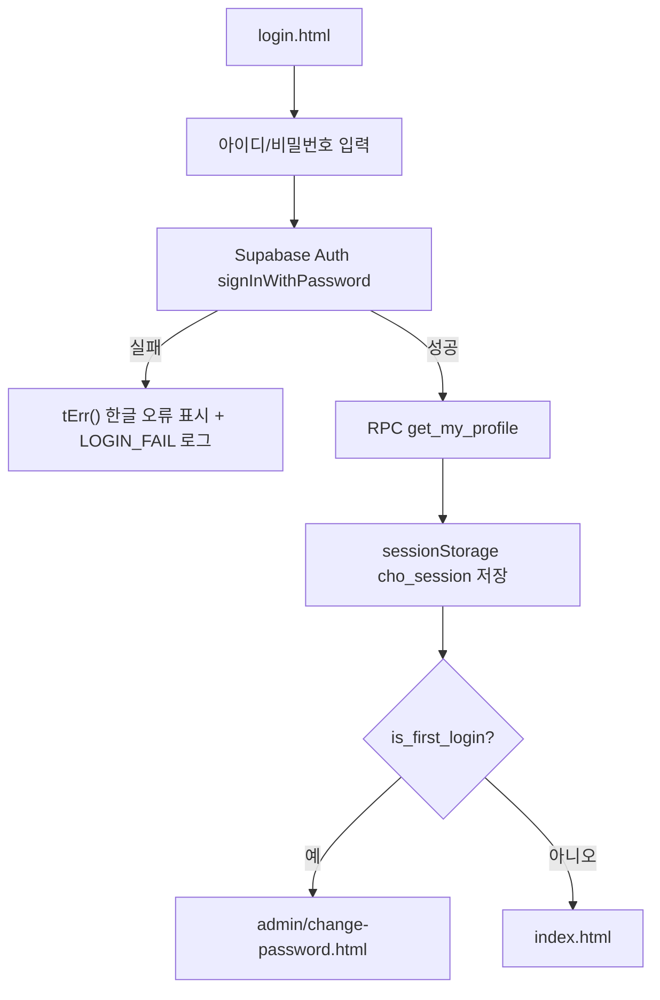
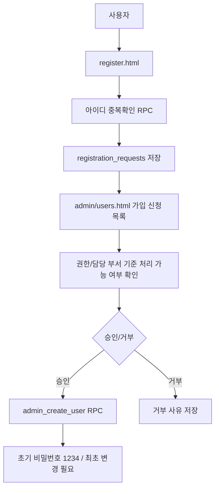
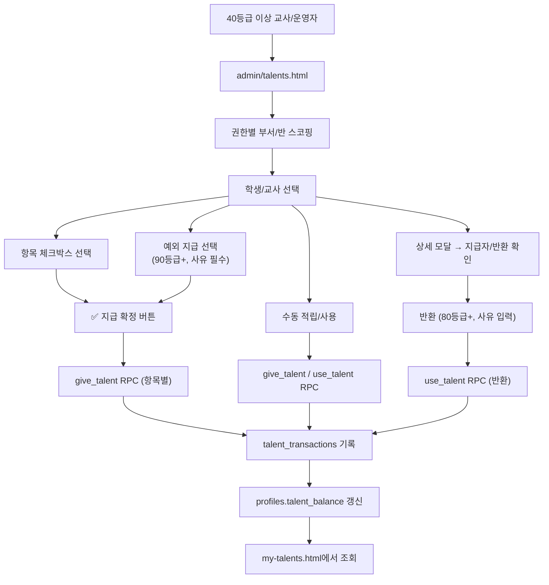
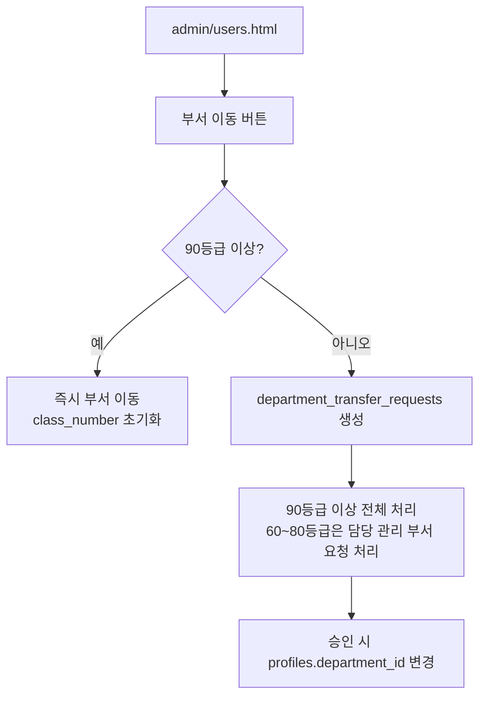
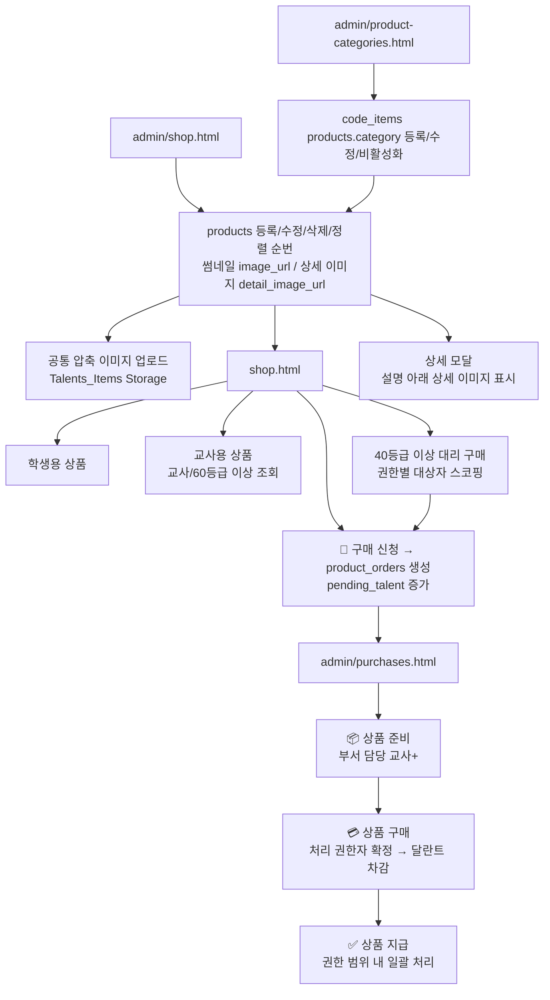

# CHO-Talents

초등부 달란트 운영을 위한 정적 웹 기반 관리 사이트입니다. 로그인 사용자는 달란트 잔액, 상점 상품, 구매 내역, Q&A와 상품 추천을 확인하고, 부서 담당 교사 이상 권한자는 비밀 투표를 포함해 권한 범위 안에서 달란트, 사용자, 상품, 구매, 부서, 질문, 공지, 보고서, 로그를 관리합니다.

**Live:** https://cho-talents.github.io/CHO-Talents/

## 프로젝트 개요

| 항목 | 내용 |
|---|---|
| 서비스명 | ⭐ 달란트 마을 / CHO-Talents |
| 목적 | 초등부 학생/교사 달란트 적립, 사용, 상품 구매, 운영 관리를 한 곳에서 처리 |
| 배포 | GitHub Pages 정적 사이트 |
| 데이터 | Supabase PostgreSQL, Auth, Storage, RPC, RLS |
| 현재 버전 | `v4.2.16` (`js/version.js` 기준, 2026-08-24) |
| 작성 기준 | `develop` 브랜치 현재 코드와 `APP_VERSION.history` |

## 현재 버전 요약

- **v4.2.16 주요 변경 사항**:
  - 최고관리자 전역 권한 승격과 사용자 수정 예외를 되돌려, 현재 `permission_level`별 기존 기능 규칙을 복구했습니다.
  - `profiles.is_super_admin=true` 계정만 네비게이션의 테스트 권한 콤보에서 본인 권한을 바꿀 수 있습니다. 변경 후 새 권한 기준으로 페이지가 다시 열립니다. 운영 DB에는 `docs/TASK-111_super_admin_permission_test_control.sql` 적용이 필요합니다.

- **v4.2.8 주요 변경 사항**:
  - 달란트 지급은 한국 시간 기준 일요일이면 당일, 월~토요일이면 다음 일요일을 지급 대상일(`grant_date`)로 기록합니다. 월별 달란트 관리에서 직접 고른 일요일은 그대로 사용합니다.
  - QR 수령은 실제 수령 발생 시각(`created_at`/`scanned_at`)과 지급 대상일을 분리해 수령 내역과 QR 관리에서 함께 표시합니다. 운영 DB에는 `docs/TASK-104_qr_grant_date.sql`, `docs/TASK-105_sunday_grant_dates.sql` 적용이 필요합니다.

- **v3.89.0 주요 변경 사항**:
  - 미확인 ERROR+ 로그 그리드의 행 전체를 클릭해 상세 모달을 열 수 있습니다.
  - 서비스 통계에서 수집 실행별 서비스·수집 항목·실패 사유를 별도 목록으로 확인합니다.
  - 사용자 통계는 학생/교사 필터와 날짜·요일·시간·부서·사용자별 2차원 막대 그래프를 제공합니다. 이 필터는 `TASK-091_user_stats_filters.sql`의 관리자 전용 RPC 보강이 필요합니다.
  - 상품 등록은 상품명·대상·카테고리·썸네일 이미지·구매 URL을 필수로 검증하고, 교사용/학생용 목록에서 전체·활성·비활성 필터를 제공합니다. 상점 카드의 대표 이미지는 잘리지 않도록 축소 표시됩니다.
  - 역할별 가이드 전환기는 현재 권한 이하의 가이드만 누적 표시하며, 관리자 가이드는 관리자(100+) 전용입니다.

- `APP_VERSION.current`는 `4.2.16`로 갱신되어 있습니다.
- **v3.88.0 주요 변경 사항**:
  - 상품 추천 투표의 진행 중 익명 득표·유권자 정원 확인, 채택/불채택 직접 결정, 현재 유효 정원 기준 종료 처리는 `profiles.is_super_admin=true`인 최고관리자만 사용할 수 있습니다.
  - 일반 관리자(100)는 종료 전 득표 수를 보거나 위 특례 RPC를 실행할 수 없습니다. 운영 DB에는 `docs/TASK-090_product_suggestion_super_admin_vote_privileges.sql` 적용이 필요합니다.
- **v3.87.0 주요 변경 사항**:
  - 상품 추천 등록 완료와 투표 종료 결과를 운영관리 Slack 채널로 알립니다. 등록 알림에는 상품명·등록 시각, 종료 알림에는 상품명·결과·찬성/반대/총 득표 수·종료 방식을 포함합니다.
  - 추천자와 개별 투표자 정보는 Slack 알림에 포함하지 않습니다. 운영 DB에는 `docs/TASK-089_product_suggestion_slack_notifications.sql` 적용과 `slack-notify` Edge Function 재배포가 필요합니다.
- **v3.86.0 주요 변경 사항**:
  - 상품 추천이 채택될 때마다 등록자에게 `상품 추천 채택` 항목으로 1달란트가 자동 지급됩니다. 추천 건별 보상 원장으로 재시도·중복 지급을 방지합니다.
  - 채택으로 생성되는 상품은 순번 `999`, 달란트 `0`, 비활성 상태로 등록되어 상품 관리에서 검토 후 조정할 수 있습니다.
  - 운영 DB에는 `docs/TASK-088_product_suggestion_adoption_talent.sql` 적용이 필요합니다.
- **v3.85.0 주요 변경 사항**:
  - 상품 추천은 선택형 상세 설명 이미지(URL 또는 파일)를 지원하며, 추천/투표 상세 모달의 긴 구매 URL은 `상품 보기` 버튼으로 표시합니다.
  - 일반 투표자는 투표 종료 전 찬성·반대 득표 수를 볼 수 없고, 관리자(100+)만 진행 중 집계를 확인합니다. 종료된 투표에는 새 투표와 기존 투표 변경이 모두 차단됩니다.
  - 구매 담당 교사(70+) 이상은 `상품 > 상품 관리` 바로 아래의 `상품 일괄 등록`에서 엑셀 양식 다운로드, 행별 검증 미리보기, 성공/실패 사유 확인을 할 수 있습니다.
  - 관리 변경 로그는 변경 항목과 이전 값 → 변경 값을 구조화해 기록합니다.
- **v3.84.0 주요 변경 사항**:
  - 관리자는 `상품 추천 투표` 상세 모달에서 투표 완료 전에도 채택 또는 불채택을 직접 결정할 수 있습니다.
  - 예외 결정은 관리자(100+)만 가능하며, 투표자·개별 찬반·추천자 정보는 화면과 작업 이력에 남기지 않습니다.
  - 운영 DB에는 `docs/TASK-086_product_suggestion_admin_decision.sql` 적용이 필요합니다.
- **v3.83.1 주요 변경 사항**:
  - 상품 구매는 권한과 관계없이 활성 상품만 표시하며, 비활성 채택 상품은 상품 관리에서만 확인합니다.
- **v3.83.0 주요 변경 사항**:
  - 내 추천 목록은 채택여부·상품명·추천일·상세만 표시하며, 행 또는 상세 버튼에서 전체 입력 정보를 확인합니다.
  - `상품 관리`는 채택된 비활성 상품을 포함해 활성/비활성 상품을 모두 표시합니다.
  - 모바일 상품 추천 투표는 다섯 열로 압축하고, 상세 모달에서 찬성 또는 반대할 수 있습니다.
- **v3.82.2 주요 변경 사항**:
  - 상품 추천 SQL의 권한 계산과 Storage 소유자 비교를 타입 호환 방식으로 보완해 `text = uuid` 오류 없이 적용할 수 있습니다.
- **v3.82.1 주요 변경 사항**:
  - `상품 > 구매 관리` 바로 아래에 `상품 추천 투표`를 배치하고, 등록 시점 투표 정원에 포함된 미투표 추천 수를 별도 배지로 표시합니다.
  - 상품 상위 메뉴 배지는 구매 관리 처리 대기 수와 상품 추천 투표 미투표 수를 합산해 표시합니다.
- **v3.82.0 주요 변경 사항**:
  - 로그인 사용자가 상품명, 상품 URL 또는 이미지, 설명, 원화 금액, 카테고리로 상품을 추천하고 자신의 추천 처리 상태를 확인할 수 있습니다.
  - 추천 등록 시점의 부서 담당 교사 이상 정원을 기준으로 비밀 투표를 진행합니다. 미투표자는 결과와 집계를 볼 수 없고, 완료/미완료 필터도 미투표 상태를 반영합니다.
  - 관리자는 투표자 신원 없이 진행률과 찬성/반대 집계를 확인합니다. 현재 유효 정원이 등록 시점 과반보다 줄어든 경우, 현재 유효 정원 과반 결과로만 투표 종료를 처리할 수 있습니다.
  - 채택 상품은 추천 카테고리(미선택 시 `gift`), 달란트 0, 순번 0, 학생 대상, 비활성 상태로 생성되며 추천자 이력은 상품과 추천 연결에 보존됩니다.
- **v3.81.1 주요 변경 사항**:
  - 사용자 통계 표의 행을 클릭하거나 키보드 Enter·Space를 눌러도 상세 모달을 열 수 있습니다.
- **v3.81.0 주요 변경 사항**:
  - `관리 > 사용자 통계`의 날짜·요일·시간·부서·사용자별 통계 표에 관리 열과 상세 버튼을 추가했습니다.
  - 날짜·요일·시간·부서별 상세에는 사용자·로그인 횟수·최근 로그인 시각을, 사용자별 상세에는 KST 로그인 이력과 당시 부서·권한을 표시합니다.
- **v3.80.1 주요 변경 사항**:
  - 상품 구매 카드의 썸네일을 선택하면 이미지 확대 모달 대신 상품 상세 모달을 표시합니다.
  - 상품 상세 모달은 카테고리·대상·달란트, 썸네일, 설명, 상세 이미지 순서로 상품 정보를 보여줍니다.
- **v3.80.0 주요 변경 사항**:
  - `달란트 적립`은 학생/교사별 활성 `talent_items` 행을 카드로 직접 생성하므로, 항목 관리에서 추가·수정·활성화한 항목이 이름 매칭 없이 정렬 순서대로 표시됩니다.
  - `달란트 항목 관리`에서 안내 카드용 이모지를 저장·수정할 수 있으며, 기존 운영 DB에는 `docs/TASK-083_talent_item_emoji.sql`로 `talent_items.emoji` 컬럼과 기본 이모지를 적용합니다.
- **v3.79.1 주요 변경 사항**:
  - `profiles.is_super_admin=true`인 최고관리자 계정은 사용자 로그인 이력에 기록하지 않으며, 기존 이력도 정리하고 사용자 통계 집계에서 제외합니다.
- **v3.79.0 주요 변경 사항**:
  - 성공 로그인 시 사용자·부서 스냅샷을 `user_login_history`에 별도 저장하고, 관리자(100+)가 `관리 > 사용자 통계`에서 날짜별·요일별·시간별·부서별·사용자별 로그인 통계를 KST 기준으로 조회합니다.
  - 구매 통계의 전체·부서별·사용자별 행과 작업 이력 행을 클릭해도 기존 상세 모달을 열 수 있습니다.
  - 메인 화면 즐겨찾기는 PC·모바일 모두 최대 20개까지 선택할 수 있습니다.
- **v3.74.0 주요 변경 사항**:
  - 활동 로그 `details` 저장 기준을 영어 key 중심으로 통일하고, 한글 별칭/영문 원본/공통 필드 중복 저장을 중단했습니다.
  - 작업명, 사용자 계정, 로그 일시, 레벨, 발생 페이지는 `activity_logs` 기본 컬럼과 로그 화면 표시 영역에서 처리하고, `details`에는 실제 처리 상세만 저장합니다.
  - 신규 로그에서 `_client`/`클라이언트` 자동 수집을 중단해 IP, 브라우저, OS, 해상도, 기기 정보가 더 이상 저장되지 않습니다.
  - 로그 화면, 작업 이력 화면, WARN+ Slack 알림은 영어로 저장된 action/details를 코드북과 공통 매핑 기준으로 한글 치환해 보여줍니다.
  - 기존 `activity_logs.details`의 중복 한글 별칭과 client 항목을 정리하는 `docs/TASK-074_activity_logs_english_details.sql`을 추가했습니다.
- **v3.73.0 주요 변경 사항**:
  - `서비스 통계` 페이지에 `service_usage_snapshots`, `service_usage_collection_runs` 180일 초과 수동 정리 버튼을 추가했습니다.
  - `로그` 페이지에 확인 완료 `activity_logs` 180일 초과 실제 삭제 버튼을 추가했습니다.
  - 수동 삭제 RPC는 관리자(100+) 또는 service_role만 실행할 수 있으며, 미확인 활동 로그는 계속 보호됩니다.
- **v3.72.0 주요 변경 사항**:
  - `service_usage_snapshots`, `service_usage_collection_runs`, `activity_logs`에 180일 보존 정책을 추가했습니다.
- `activity_logs`는 확인 완료된 로그만 180일 초과 시 삭제하고, 미확인 로그는 확인될 때까지 자동/선택 삭제 대상에서 제외합니다.
  - `docs/TASK-072_data_retention_180d.sql`에 매일 03:30(KST) 실행되는 `cho-data-retention-180d` pg_cron 작업과 수동 실행용 `cleanup_data_retention_180d()` 함수를 추가했습니다.
- **v3.71.0 주요 변경 사항**:
  - 서비스 사용량 자동 수집 주기를 6시간에서 1시간으로 단축했습니다.
  - `docs/TASK-070_service_usage_cron.sql`의 pg_cron 작업을 `cho-service-usage-collect-1h`, `0 * * * *` 기준으로 변경하고 기존 6시간 작업은 재설정 시 함께 제거하도록 했습니다.
  - `운영 > 로그 > 서비스 통계` 화면과 서비스 통계 운영 설정 문서를 매시간 정각(KST) 자동 수집 기준으로 갱신했습니다.
  - README, 사이트 안내서, 아키텍처 문서, 역할별 가이드와 권한/로그/Slack/작업 이력 룰 페이지를 v3.71.0 현재 운영 기준으로 동기화했습니다.
- **v3.70.0 주요 변경 사항**:
  - `운영 > 로그` 아래에 부장 교사(80+) 이상 전용 `서비스 통계` 페이지를 추가했습니다.
  - GitHub, Supabase, Kakao Developers, Slack의 무료 할당량, 현재/남은 값과 사용률, 기간 종료 예상 사용률, 30일 추이를 표시합니다.
  - 공식 관리 API·Database 직접값·프로젝트 호출 계측을 예약 수집으로 병합하고, 70%·85%·95% 도달 시 운영관리 Slack 채널에 단계별 알림을 보냅니다.
  - 페이지 트래픽, Supabase 요청/응답량, Kakao 지도 SDK/장소 검색, Slack Webhook 성공·실패를 개인정보 없이 누적합니다.
  - TASK-070 서비스 통계 스키마/RLS/RPC, Edge Function, Cron/Vault 설정 SQL과 Secret 설정 문서를 추가했습니다.
- **v3.69.0 주요 변경 사항**:
  - `공지 사항` 열람 현황의 확인자/미확인자 스위치를 `전체/확인자/미확인자` 콤보박스 필터로 변경했습니다.
  - `상품 관리` 이미지를 구매 카드용 썸네일과 상세 모달 설명 아래에 표시되는 상세 설명 이미지로 분리했습니다. DB에는 `products.detail_image_url` 컬럼을 추가합니다.
  - 사용자/관리자/부서/달란트/달란트 항목/달란트 통계/QR 관리 주요 그리드에서 로우 클릭으로 상세 또는 수정 모달이 열리도록 정리했습니다.
  - `달란트 수령` 최근 수령 내역의 지급자 표시는 실제 지급자 이름을 사용하며, 관리자 권한에서는 이름 옆에 아이디도 표시합니다.
  - `달란트 QR 관리` 수령자 모달을 사용자별 묶음 목록으로 바꾸고 사용자 유형, 부서, 이름/아이디 검색 필터와 지급 항목 상세 영역을 추가했습니다.
  - `로그 작성 룰`에 페이지별 발생 조건, 로그 항목, 데이터 참조 위치, Slack 알림 항목 표를 추가했습니다.
- **v3.68.0 주요 변경 사항**:
  - `공지 사항` 열람 현황 모달 상단에 공지 등록일시와 등록자 정보를 표시하고, 그리드 맨 왼쪽에 사용자 유형 열을 추가했습니다.
  - 공지 열람 현황에서 확인자/미확인자를 스위치 필터로 나누어 조회할 수 있습니다.
  - `상품 카테고리 관리` 그리드에서 코드 열을 숨기고, 카테고리 로우 클릭 시 수정 모달이 열리도록 개선했습니다.
  - `상품 구매` 최초 로드 정렬을 카테고리 순번 그룹화 후 상품 정렬 순번 → 상품명 기준으로 보정했습니다.
  - `js/version.js`에 v3.60.0 이하 과거 버전 이력을 병합해 버전 이력 페이지가 전체 운영 변경 내역을 표시하도록 복구했습니다.
- **v3.67.0 주요 변경 사항**:
  - `예외 지급/반환 관리` 요약 카드 색상과 다크 모드 그리드 hover 대비를 각 그리드 색상 기준으로 개선했습니다.
  - `상품 관리`에서 카테고리 관리 패널을 제거하고 구매 담당 교사(70+) 이상 전용 `상품 카테고리 관리` 페이지를 추가했습니다.
  - 상품에 `정렬 순번`을 추가하고 최초 목록을 카테고리 순번 → 상품 순번 → 상품명 기준으로 정렬합니다. 상품 로우 클릭 시 수정 창이 열립니다.
  - `달란트 항목 관리`의 관리 열 버튼을 `관리` 드롭다운 메뉴로 통합했습니다.
  - `버전` 페이지는 표시 버전 수와 표시 변경 항목 수를 구분해 보여줍니다.
- **v3.66.2 주요 변경 사항**:
  - `예외 지급/반환 관리`의 네비게이션 배지는 실제 예외 지급 요청 승인/거부가 가능한 전도사님(90+) 이상에게만 표시합니다.
  - 요약 카드와 그리드의 순서/명칭/색상을 `예외 지급 요청 → 예외 지급 내역 → 달란트 반환 내역 → 전체 처리` 기준으로 통일했습니다.
  - 예외 지급 내역과 달란트 반환 내역을 시간순으로 함께 확인하는 `전체 처리` 통합 그리드를 추가했습니다.
- **v3.66.1 주요 변경 사항**:
  - 각 HTML 파일의 고정 버전 쿼리 문자열을 제거하고, `js/version.js`가 최신 버전 확인과 로드된 CSS/JS 자산 재검증을 중앙에서 담당합니다.
  - 구버전 자산이 감지되면 한 번 새로고침해 최신 자산을 받아오고, 이후 세션 버전이 맞지 않으면 재로그인 안내를 표시합니다.
- **v3.66.0 주요 변경 사항**:
  - 신규 활동 로그 저장 시 원본 키와 함께 한글 상세 키 별칭을 저장했습니다. 현재 운영 기준은 v3.74.0의 영어 key 저장/한글 표시 정책입니다.
  - 로그 관리와 작업 이력 상세 모달은 한글화된 상세 데이터를 우선 표시했습니다. 현재는 저장된 영어 details를 화면에서 한글로 치환합니다.
  - 기존 `activity_logs.details` 데이터에 한글 별칭을 추가하는 `docs/TASK-067_korean_activity_logs.sql`을 추가했습니다. 현재 기존 로그 중복 정리는 `docs/TASK-074_activity_logs_english_details.sql`을 사용합니다.
  - 인증/버전/아이디 확인 관련 실제 발생 로그 액션의 한글 라벨을 보강했습니다.
- **v3.65.0 주요 변경 사항**:
  - 승인 대기 중인 가입 신청 계정은 비밀번호 인증 전에 승인 대기 안내와 신청 부서 담당 관리자 정보를 표시합니다.
  - 모든 페이지에서 로그인 세션의 앱 버전이 최신 버전과 다르면 현재 세션을 종료하고 로그인 페이지로 이동합니다.
  - 내 달란트, 부서 소속보기, 사용자 상세 내역에 페이지 처리를 추가했습니다.
  - 상품 카테고리 신규 추가 후 코드 대신 명칭이 표시되도록 코드 마스터 로드를 보강했습니다.
  - 신규 SQL `docs/TASK-065_registration_approval_contact.sql`과 초기 설치 SQL을 동기화했습니다.
  - 최신 버전 세션 갱신 정책의 기반을 정리했습니다.
- **v3.62.0 주요 변경 사항**:
  - 사용자 관리의 `사용자 등록` 모달에 아이디 중복확인을 추가하고, 중복확인 완료 후에만 등록되도록 제한했습니다.
  - 부서 담당 교사(60+) 이상도 예외 지급을 요청할 수 있게 하되, 전도사님(90+) 이상 승인 후 실제 지급되도록 `talent_exception_requests` 승인 흐름을 추가했습니다.
  - `예외 지급/반환 관리` 상단에 예외 지급 요청 목록을 표시하고, 90+만 승인/거부할 수 있게 했습니다.
  - 부장 교사 미만은 예외 지급 요청 조회를 본인 담당/소속 부서 기준으로 제한했습니다.
  - 신규 SQL `docs/TASK-061_talent_exception_requests.sql`과 초기 설치 SQL을 동기화했습니다.
  - 현재 작업 반영을 위해 전체 HTML 캐시 버스팅 참조를 `v3.62.0`으로 갱신했습니다.
- **v3.61.0 주요 변경 사항**:
  - 공지 사항 메뉴를 `소개 > 공지 사항`으로 이동하고, 일반 교사(40+) 조회 / 전도사님(90+) 관리 권한으로 분리했습니다.
  - 상품/공지 이미지 업로드를 공통 압축 업로드 함수로 통합하고, 상품 ID/공지 ID 기반 Storage 네이밍 규칙을 적용했습니다.
  - 모든 HTML 하단에 `version-container`를 연결하고 `js/version.js`가 공통 버전 footer를 렌더링하도록 통합했습니다.
  - 사용자 관리의 `사용자 등록` 모달에서 관리자 외 권한자도 아이디를 직접 입력할 수 있도록 보완했습니다.
  - 현재 작업 반영을 위해 전체 HTML 캐시 버스팅 참조를 `v3.61.0`으로 갱신했습니다.
- **v3.60.0 주요 변경 사항**:
  - 달란트 관리에서 전도사님(90+) 이상이 이번 주 이미 지급된 항목을 사유 입력 후 예외 지급할 수 있습니다.
  - `talent_transactions`에 `override_week_limit`, `override_reason`을 추가하고 `give_talent` RPC가 예외 지급 권한과 사유를 검증합니다.
  - 신규 `admin/talent-adjustments.html`에서 예외 지급과 반환 이력을 분리 조회하며, 부서 담당 교사는 담당 부서만, 부장 교사 이상은 전체 부서를 확인합니다.
  - 내 달란트와 관리자 상세 이력에 예외 지급 배지를 추가하고, 달란트 항목 관리에 총/이번 주/예외 지급 통계를 표시합니다.
  - `docs/PROJECT_ARCHITECTURE_FLOW.md` 인코딩 손상 내용을 정상 한글 문서로 복구하고 최신 소스 기준으로 다시 동기화했습니다.
- **v3.59.0 주요 변경 사항**:
  - `admin/notices.html` 공지 보기 모달에서 이미지가 있으면 클릭해 크게 볼 수 있도록 추가했고, 공지 등록 화면의 이미지 첨부/링크 입력 흐름도 유지했습니다.
  - 현재 작업 반영을 위해 버전 표시 캐시 버스팅과 관련 문서/가이드 페이지를 `v3.59.0` 기준으로 동기화했습니다.
  - `announcements`, `announcement_dismissals` 테이블/RLS SQL(`docs/TASK-059_announcements.sql`)과 공지 로그/작업 이력 액션 라벨은 기존 공지 관리 버전에서 함께 정리한 상태입니다.
- **v3.56.0 주요 변경 사항**:
  - `public-config.js`에 명시된 환경별 Kakao Map Key가 Supabase `app_config`의 오래된 값으로 덮어써지지 않도록 수정했습니다.
  - DEV `app_config` 초기 SQL의 `KAKAO_MAP_KEY`를 DEV JavaScript 키(`f880c1746c4cd81e2fa54df45ebea41d`)로 갱신했습니다.
  - QR 관리 페이지의 캐시 버스팅 참조를 v3.56.0으로 갱신했습니다.
- **v3.55.0 주요 변경 사항**:
  - `config/public-config.js`에서 `TARGET_ENV='DEV'`일 때 DEV Kakao Map Key(`f880c1746c4cd81e2fa54df45ebea41d`), `TARGET_ENV='PROD'`일 때 PROD Kakao Map Key(`0ef8925b28135eeac474bc411c456170`)를 사용하도록 분기했습니다.
  - 전체 HTML 캐시 버스팅 참조를 v3.55.0으로 갱신했습니다.
- **v3.54.0 주요 변경 사항**:
  - 상품 등록/수정 모달에서 카테고리 선택 옆 `+ 추가` 버튼으로 새 상품 카테고리를 바로 등록할 수 있습니다.
  - 새 카테고리명과 이모지를 `products.category` 코드 마스터에 저장하고, 저장 성공 시 선택박스에 즉시 반영해 방금 만든 카테고리로 상품을 저장할 수 있습니다.
  - 이미 등록된 카테고리명을 입력하면 중복 생성 대신 기존 카테고리를 자동 선택합니다.
  - 카테고리 추가 패널과 상품 이미지 드롭존을 다크 테마 배경/입력 색상에 맞게 보정했습니다.
  - `PRODUCT_CATEGORY_CREATE` 로그/작업 이력 액션과 상품 카테고리 INSERT 정책 SQL(`docs/TASK-058_product_category_policy.sql`)을 추가했습니다. 최신 운영 기준은 구매 담당 교사(70+) 이상입니다.
- **v3.53.0 주요 변경 사항**:
  - 인증/권한 리디렉트 진단 로그 강화: `AUTH_SESSION_MISSING`, `AUTH_PROFILE_LOAD_FAIL`, `AUTH_REDIRECT`, `AUTH_PAGE_ACCESS_CHECK_FAIL` 액션 추가
  - 보호 페이지 진입 실패 시 세션 없음/만료, 첫 로그인 비밀번호 변경, 권한 등급 부족, 허용 권한 불일치, DB 페이지 접근 차단 사유와 page_id, 필요/실제 권한, 이동 대상을 로그에 기록
  - 24시간 유휴 세션 만료는 만료 기준(`idle_timer`, `last_activity`, `visibilitychange`)까지 함께 남김
  - 위치 제한 QR에서 기기/브라우저 위치 권한이 차단되면 alert와 화면 메시지를 함께 표시하고 `QR_LOCATION_PERMISSION_BLOCKED` 로그 기록
  - 달란트 수령 카메라 스캔 결과 메시지를 카메라 영역 아래에서 위로 이동
  - 달란트 관리 상세 모달 이력에 공통 페이징과 페이지당 항목 수 설정(`talents_detail_history`) 추가
  - 페이징 적용 범위와 인증/권한 로그 기준을 사용자 안내서, 아키텍처 문서, 역할별/운영 룰 가이드에 반영
- **v3.52.0 주요 변경 사항**:
  - 비로그인 메인 화면에서 사용 가이드 배너 노출
  - 로그인 페이지 하단에 메인 페이지와 사용 가이드 링크 추가
  - QR 생성/수정 화면에서 유효 날짜와 유효 시간을 분리하고 시간 제한 없음/시간 제한 옵션 추가
  - 기간형 QR 유효 범위를 날짜 단위 입력으로 정리하고, 시간 제한이 없을 때 하루 전체 범위로 저장
  - 기존 QR 수정 시 저장된 시간 값에 따라 시간 제한 여부를 자동 반영
  - QR 관리 화면 다크 테마 스타일 보강
  - 전체 HTML 캐시 버스팅 참조를 v3.52.0으로 갱신
- **v3.51.0 주요 변경 사항**:
  - 목록 기본 정렬 정비: 달란트/사용자/관리자/부서/구매 통계 화면을 운영 요청 기준(부서→반→이름, 권한 등급, 통계별 집계값 등)으로 정렬
  - 페이징: 공통 페이지 번호 표시를 7개 초과 시 말줄임 규칙 예시에 맞게 보정하고, 달란트 QR 목록/내 구매 상품/구매 통계/달란트 수령 최근 내역/부서 관리에 페이지당 항목 수 콤보와 페이징 보강
  - 달란트 통계: 반환된 달란트를 원 지급 건에서 차감하여 전체/부서별/사용자별/유형별 모두 실제 지급 달란트 기준으로 집계
  - 달란트 QR 관리: 지정일에도 유효 시간 from-to 설정 가능, 위치 제한 반경 100m/200m/300m/400m 추가 및 기본 500m 적용
  - 소개 드롭다운: 역할별 가이드 여러 항목을 단일 `가이드` 항목으로 통합하고, 로그인 권한에 맞는 가이드로 자동 연결
  - 달란트 적립: 로그인 사용자의 `user_type`에 따라 학생/교사 탭을 기본 선택
- **v3.50.0 주요 변경 사항**:
  - `js/codes.js` 공통 코드북 추가: 권한, 사용자 유형, 구매 상태, 상품 대상/카테고리, 로그 액션, QR 반복 유형 등 공통 라벨/정렬/색상/이모지 관리
  - `auth.js`, `activity-log.js`, `user-mgmt.js`, `product.js`가 하드코딩 라벨 대신 공통 코드북을 사용하도록 정리
  - 구매 관리/구매 통계/내 구매 상품의 주문 상태 라벨, 색상, 이모지, 정렬 순서를 `product_orders.status` 기준으로 통합
  - 상품 관리의 카테고리를 자유 텍스트 입력에서 코드 마스터 기반 선택값으로 변경하고, 기존 카테고리는 마이그레이션에서 보존
  - 작업 이력/로그 액션 라벨을 `activity_logs.action` 코드 마스터와 `details._actionLabel` 기반으로 확장 가능하게 정리 (현재 v3.74.0부터 신규 로그는 `_actionLabel`을 details에 저장하지 않음)
  - DB 코드 마스터 SQL 추가: `docs/TASK-057_code_master.sql` (`code_groups`, `code_items`, 코드 컬럼 검증 트리거, `get_permission_rank()` 코드화)
  - 새 DB 설치 스크립트가 기본으로 `TASK-057_code_master.sql`을 합본 SQL에 포함하도록 개선
- **v3.49.0 주요 변경 사항**:
  - admin.css 모바일 네비: 테마→햄버거→로그아웃→이름 순서를 admin 페이지에도 일괄 적용
  - QR 수령자: 반환 감지를 QR별 개별 스캔 단위로 정확 매칭 (talent_item_id + 시간 근접)
  - QR 수령자: 수령자 팝업에 페이징 추가 (기존 admin 페이지와 동일 스타일)
  - QR 수령자: 표시 개수 설정 콤보박스 + 사용자별 DB 저장 (`qr_scan_list` 키)
  - 대시보드: 바로가기 박스(quickLinks) 제거 — 통계 카드와 이슈 로그만 표시
  - 사용자 관리: 통계 카드 클릭 시 사용자 목록 필터 (전체/관리자/부서 담당/교사/학생)
  - 사용자 관리: 관리자 카드 = admin+evangelist+chief, 부서 담당 = purchase_teacher+dept_teacher
  - 사용자 관리: 활성 필터 카드 강조 표시 (box-shadow + transform)
- **v3.48.0 주요 변경 사항**:
  - 달란트 반환: 반환을 사용과 별도 구분 표시 (내 달란트, 관리자 상세, QR 수령자)
  - 달란트 반환: 내 달란트 페이지에 반환 달란트 요약 박스 추가
  - 달란트 반환: 관리자 상세 팝업에 누적적립/총사용/총반환/잔여 4칸 표시
  - 달란트 반환: QR 수령자 목록에 반환된 달란트 "반환" 배지 표시
  - 달란트 반환: 달란트 내역 유형 적립/사용/반환 3종 구분
  - 모바일 네비: 우측 배치 테마스위치 → 햄버거 → 로그아웃 → (권한이모지)이름 순, 좌측 ⭐ 달란트 마을 유지
  - 세션 관리: 24시간 유휴 타임아웃 설정
  - 세션 관리: 타임아웃 만료 시 자동 로그아웃 → 로그인 페이지 이동
  - 세션 관리: 페이지 조회/클릭/스크롤/키보드 이벤트 시 타이머 초기화
  - 세션 관리: 멀티탭 localStorage 기반 활동 시간 동기화
  - 세션 관리: 탭 전환(visibilitychange) 시 세션 만료 재검증
- **v3.47.0 주요 변경 사항**:
  - 소개 메뉴에 역할별 가이드 4종 추가: 부서 담당 교사, 구매 담당 교사, 부장 교사, 전도사님
  - 신규 페이지: `admin/slack-rules.html` Slack 알림 룰 문서 (부장 교사 80+ 이상 접근)
  - 문서: 역할별 Markdown 가이드와 `docs/SLACK_NOTIFICATION_RULES.md`, `docs/SUPABASE_NEW_PROJECT_SETUP.md` 추가
  - 새 Supabase 설치 SQL 보강: `user_preferences.page_sizes`, `cancel_product_order`, `scan_qr_talent`, `talent_transactions.source`, Slack Secret 참조값 통합
  - 권한 문서 최신화: `docs/page-permission-rules.html`, `.cursor/rules/page-role-mapping.mdc`, `.cursor/rules/00-workflow-guardrails.mdc`, 페이지 접근/기능 설정 목록 갱신
- **v3.46.0 주요 변경 사항**:
  - Q&A: 네비게이션 "소개" 그룹 및 "Q & A" 항목에 미답변 질문 수 배지 표시 (관리자 rank 60+)
  - Slack: 알림을 부서별/유형별 채널로 분리 라우팅 (기존 단일 Webhook 제거)
  - Slack: 신규 가입/부서 이동/구매 신청 → 해당 부서 채널 (1부~5부, 예배부)
  - Slack: 구매 상태 변경 (구매 신청→상품 준비) → 상품 관리 채널
  - Slack: WARN+ 로그 알림 → 운영 채널, Q&A 질문 등록 → Q&A 채널
  - Edge Function: 9개 Webhook Secret 기반 동적 라우팅
  - 구매 상태: requested→preparing 전환만 Slack 발송 (기타 상태 변경 알림 제거)
- **v3.45.0 주요 변경 사항**:
  - Super Admin: `admin_update_user` RPC에서 `is_super_admin=true` 호출자를 rank 110으로 처리 (SQL 마이그레이션 `TASK-052`)
  - Super Admin: 본인보다 높은 권한 부여 가능 (모든 레벨 할당 가능)
  - 구매 관리: 필터 버튼을 칸반보드 형태로 변경 (상태별 개수 실시간 표시, 클릭 시 필터 동작)
  - 신규 페이지: `admin/purchase-stats.html` 구매 통계 (전체/부서별/사용자별/유형별)
  - 구매 통계: 교사/학생 분리 표시, 상태별 요약 칸반 카드, 상세 모달 드릴다운
  - 구매 통계: 부서 필터 + 유형 필터 + 기간 필터 (기본 1주)
  - 구매 통계: 부서 담당 교사는 담당 부서만, 부장 교사 이상 전체 조회 가능
  - 네비게이션: 상품 메뉴에 '구매 통계' 항목 추가
  - 대시보드: 구매 통계 바로가기 추가
- **v3.44.0 주요 변경 사항**:
  - 구매 취소 버그 수정: RPC 기반 취소 우선 시도 (`cancel_product_order`), `.select()` 기반 업데이트 결과 검증
  - 구매 취소: `product_id` 포함 정확한 주문 건 대상 취소 처리
  - 구매 취소: profiles 업데이트 실패 시 에러 로깅 및 적절한 핸들링
  - 구매 취소: Slack 알림은 v3.46.0에서 제거됨 (구매 취소는 알림 대상 아님)
  - Super Admin(`is_super_admin=true`): 사용자 수정 시 모든 권한 레벨 선택 가능 (제약 없음)
  - Super Admin: 부서/역할/권한/담당부서 필드 제약 없이 편집 가능
  - Super Admin: `canManageUser`에서 모든 사용자 관리 가능
- **v3.43.0 주요 변경 사항**:
  - Slack 알림 연동: 운영 이벤트 실시간 알림 (v3.46.0에서 채널별 분리 라우팅으로 개선)
  - Slack 알림 6가지 유형: 신규 구매, 구매 상태 변경, 가입 신청, 부서 이동 신청, WARN+ 로그, Q&A 질문
  - Supabase Edge Function `slack-notify` 사용 (Slack Block Kit 메시지 포맷)
  - `js/slack-notify.js` 공통 유틸리티 (fire-and-forget, 5초 throttle)
  - **신규 파일**: `js/slack-notify.js`, `docs/edge-function-slack-notify.ts`
- **v3.42.0 주요 변경 사항**:
  - 네비게이션 레이아웃 정비: PC에서 Brand(좌측) / Links(중앙) / Actions(우측) 3-column flex 배치
  - 네비게이션: admin 20개 페이지에서 로그아웃/테마가 2줄 표시되던 문제 해결 (`admin.css`에 `nav-header-actions` base 스타일 추가)
  - 그리드 헤더 클릭 정렬: `js/table-sort.js` 공통 유틸리티 신규 생성
  - 그리드 헤더 클릭 정렬: 7개 페이지 테이블에 `data-sort-key` 속성 + `initSortableHeaders()` 적용 (사용자/관리자/달란트/달란트 통계/구매/상품/부서 소속보기)
  - 사용자 정렬 순서 변경: 유형(교사→학생) → 권한(내림차순) → 부서 → 반(null 마지막) → 이름
  - 구매 관리 정렬 변경: 상태(단계순) → 신청일(내림차순) → 상품명 → 부서 → 신청자
  - 상품 관리 정렬 추가: 카테고리 → 상품명 → 가격(내림차순)
  - CSS: 정렬 화살표 스타일 (`sort-asc`/`sort-desc` 클래스, `::after` pseudo-element)
  - **신규 파일**: `js/table-sort.js` (공통 헤더 클릭 정렬 유틸리티)
- **v3.41.0 주요 변경 사항**:
  - 페이징: 최대 7개 페이지 버튼 + 말줄임표(...) 표시
  - 네비게이션: 로그아웃/테마 스위치 한 줄 표시 (flex nowrap)
  - 네비게이션: 모바일에서 드롭다운 클릭 전용 (hover 비활성화, @media (hover: hover) 분기)
  - 네비게이션: 모바일 dropdown-open/mobile-open 클래스 CSS !important 충돌 해결
  - 캐시 버스팅: 전체 HTML ?v=3.40.0 → ?v=3.41.0 (Python 바이트 교체로 UTF-8 보존)
- **v3.40.0 주요 변경 사항**:
  - 다크 모드: 관리 드롭다운, 이미지 업로드 영역, QR 폼, 통계 테이블 등 잔여 흰 배경을 CSS 변수 기반 어두운 표면색으로 보정
  - 다크 모드: 인라인 배경/테두리 rescue 규칙 추가 (#e6fcf5, #fafafa, #f1f3f5, #e9ecef, #f0f0f0)
  - 페이징: 전체 11개 페이지 통일 (PC 20개/모바일 10개, 현재 페이지 번호 강조)
  - 페이징: 로그(50→20/10), 사용자 관리(10/5→20/10) 기존 페이지 크기 조정
  - 페이징: 구매 관리, 작업 이력, 내 구매 상품, 달란트 항목, 달란트 QR, 관리자 관리에 신규 페이징 추가
  - 관리자 관리: ROLE_BADGE에 purchase_teacher 추가 (구매 담당 교사 역할 표시 수정)
  - 부서 관리: 소속보기에서 관리자(100+)일 때 마지막 로그인 일시 컬럼 표시
  - 달란트 관리: 지급 취소 항목의 달란트 ID를 관리자(100+)만 표시, 그 외 숨김
  - 내 달란트: 지급 취소 이력의 달란트 ID(UUID) 숨김 처리
  - **페이지당 항목 수 설정**: 사용자별 그리드당 표시 개수 설정 (3~30개, DB 저장, 콤보 박스 UI)
  - **부서 담당 교사 권한 확대**: rank 60+ 사용자가 소속 부서 학생의 반 변경 및 비밀번호 초기화 가능
  - **PAGE_VIEW 로그 비활성화**: 페이지 조회 로그 기록 중단
  - **DB 변경**: `user_preferences.page_sizes` JSONB 컬럼 추가 (`docs/TASK-041_page_sizes.sql`)
  - **신규 파일**: `js/page-size.js` (페이지 크기 공통 유틸)
- **v3.39.0 주요 변경 사항**:
  - 학생 일괄 등록: 엑셀 파일 업로드로 학생 계정 일괄 생성 (부장 교사 80+ 이상)
  - 학생 일괄 등록: 양식 다운로드, 미리보기(검증), 등록 결과 표시
  - 로그 범위 삭제: 전체 레벨 삭제 시에도 미확인 ERROR+ 로그 보호
  - 대시보드: 모바일 stat 박스 한 줄 3개씩 자동 배치
  - 네비게이션: 관리 메뉴에 학생 일괄 등록 추가 (80+)
  - 즐겨찾기: 전체 메뉴 항목 추가 — 권한별 표시 (달란트 항목, 관리자 관리, 버전, 보고서, 로그 등)
- **v3.38.0 주요 변경 사항**:
  - 달란트 지급: 다크모드에서 항목 배경을 CSS 변수(`--t-success-surface`, `--t-card`)로 변경하여 가독성 확보
  - 달란트 상세: 반환 버튼을 트랜잭션 ID 기반으로 변경 — 동일 항목 1회만 반환 가능, 반환된 항목은 "반환됨" 표시
  - 달란트 지급/상세: 취소·반환 시 txnId를 설명에 포함하여 상호 동기화
  - 상품 구매: 대리 구매 모달 다크모드 대응 (모달 배경, 검색 입력, 선택 표시, 드롭다운)
  - 상품 구매: 구매 신청 비활성화 버튼 다크모드 대응
  - 네비게이션 배지: `navUpdateAuth`에서 rank ≥ 60 시 자동 호출 — 모든 페이지에서 공통 적용
  - CSS: `--t-success-surface`, `--t-accent-surface` 변수 추가 (라이트/다크 모드)
- **v3.36.0 주요 변경 사항**:
  - 다크 모드: 달란트 통계 카드/라디오, 부서 필터 등 잔여 흰 배경을 CSS 변수 기반 어두운 표면색으로 보정
  - 테마: 로그아웃 시 기본(일반) 테마로 리셋, 로그인 시 DB에 저장된 계정 테마 우선 적용
  - 부장 교사(80): 사용자/관리자 관리에서 전체 부서 조회만 가능, 수정/삭제/비밀번호 초기화 버튼 숨김
  - 달란트 통계: 부서 필터 순서를 전체 → 1부~5부 → 예배부로 고정, 80+ 이상만 필터 표시
  - 달란트 항목 관리: `giving_rule`, `giving_description` 필드 추가 및 달란트 적립 페이지 동적 반영
  - 신규 권한: 구매 담당 교사(`purchase_teacher`, 70) — 구매 관리에서 모든 부서 주문 처리 가능
  - 사용자 등록: 전도사님(90+)만 모든 부서 선택, 그 이하는 담당 부서로 고정
  - DB: `docs/TASK-048_schema.sql` (talent_items 컬럼, purchase_teacher CHECK 제약)
- **v3.35.0 주요 변경 사항**:
  - 다크 모드: 가이드, Q&A, 달란트 적립/수령, QR 관리, 권한/로그/작업이력 룰, 버전 이력의 잔여 흰 배경과 저대비 텍스트 보정
  - 달란트 적립: 안내 카드별로 `talent_items` 활성 항목의 지급 수량을 조회해 `+N 달란트` 배지 표시
  - 로그: `writeLog()`가 Supabase insert 반환 `error`를 실제 실패로 감지하고 콘솔 오류로 노출
  - 로그: 운영 DB가 구버전 스키마여도 `user_name`/`is_acknowledged` 선택 컬럼 제거 후 재시도하는 호환 적재 경로 추가
  - 작업 이력: `activity_logs` 적재 복구를 통해 `AUDIT_ACTIONS`에 등록된 관리 작업이 작업 이력에 표시되도록 공통 로그 경로 보강
  - 문서/가이드: 다크 모드 보정, 달란트 적립 금액 표시, 로그/작업 이력 검증 기준 갱신

- **v3.34.0 주요 변경 사항**:
  - 테마: 봄/여름/가을/겨울 제거, 일반/다크 2종만 유지
  - 테마: 네비게이션 우측 UI를 드롭다운에서 스위치 버튼으로 변경
  - 다크 모드: 네비게이션 드롭다운, 관리 드롭다운, 필터, 모달 등 주요 흰 배경 영역을 어두운 표면색으로 정리
  - 즐겨찾기: 모바일/PC 모두 최소 1개, 최대 20개까지 선택 가능
  - 즐겨찾기: 사용자 권한과 실제 네비게이션 노출 규칙에 맞는 항목만 설정/표시
  - 로그: 조회 기간 기본값을 1년으로 확대하고 라벨을 조회 기간 기준으로 정리
  - 작업 이력: `is_deleted`가 `NULL`인 기존 로그도 함께 표시되도록 조회 조건 보정
  - 문서/가이드: README, 사용자 안내서, 구성도, 학생/교사/관리자 가이드 최신 동작 기준으로 갱신

- **v3.32.0 주요 변경 사항**:
  - 작업 이력(admin/audit.html): AUDIT_ACTIONS 키 불일치 수정 및 70개 이상 액션 타입으로 확대
  - 작업 이력: 필터 그룹 6개 → 10개 확대 (사용자/등록/부서/달란트/상품·주문/Q&A/인증/로그관리/권한·설정)
  - 로그 시스템: ACTION_LABELS 한글 매핑 150개+ 추가, writeLog() 자동 한글 라벨 적용
  - 로그 뷰어(admin/logs.html): action 열 한글 라벨 표시 (당시 영문 키 병기, 현재 v3.74.0부터 한글 라벨만 표시)
  - 전체 20개+ 페이지/JS: logInfo/logWarn/logError 호출의 details 키 한글화 (대상/변경내역/오류/금액 등)
  - 누락 로그 추가: qna.html(QNA_CREATE/ANSWER/COMMENT/DELETE/FAQ_SET), talent-items.html(TOGGLE/QUICKBTN), page-permissions.html(PAGE_PERM_UPDATE)
  - 즐겨찾기 DB 마이그레이션: user_preferences 테이블 신설, localStorage → Supabase DB 저장으로 전환 (비로그인 시 localStorage 폴백)
  - 즐겨찾기: 최초 로그인 시 기존 localStorage 데이터 자동 DB 마이그레이션
  - 문서/가이드: README.md, SITE_USER_GUIDE.md, PROJECT_ARCHITECTURE_FLOW.md, 6개 가이드 페이지 최신화, 작업 가드레일 추가

- **v3.31.0 주요 변경 사항**:
  - 달란트 관리: 반환 매칭을 트랜잭션 ID 기반 1:1 매칭으로 전면 재설계
  - 달란트 관리: 출석/달란트 지급 시 즉시 상태 업데이트 + 동시 클릭 방어 (_attendBusy)
  - 달란트 적립: 비로그인/학생 계정에서 교사 적립 탭 숨김
  - 네비게이션: 구매 배지 super_admin 사용자 주문 수 제외

- **v3.30.0 주요 변경 사항**:
  - 관리 페이지 전체 super_admin 사용자 숨김 확대 적용 (달란트/통계/구매/관리자/부서/대시보드)

- **v3.29.0 주요 변경 사항**:
  - 달란트 관리: 출석/달란트 지급 취소 후 재지급 가능하도록 반환 트랜잭션 매칭 로직 수정
  - 사용자 관리: is_super_admin=true 사용자 비표시 처리
  - 운영 메뉴: 로그 배지 업데이트 시 운영 드롭다운에도 배지 반영
  - 가이드: 권한별 탭 표시

- **v3.28.0 주요 변경 사항**:
  - 메인 페이지: 로그인 사용자 바로가기 카드 즐겨찾기 커스터마이징 기능 추가

- **v3.27.0 주요 변경 사항**:
  - 달란트 통계: 부서 담당 교사(60~79) 담당 부서만 조회, 부장교사(80+) 전체 부서 조회
  - 달란트 관리: 본인 지급 불가, 출석 퀵버튼 지급/취소 토글, 항목별 취소 버튼
  - 달란트 관리: 주간(월~일) 1회 지급 제한 (UI+RPC), 일반 교사 교사 탭 숨김
  - 달란트 항목 관리: 접근 권한 60+, 퀵버튼 설정 80+
  - 사용자 관리: 구매 내역 조회 필드 수정
  - 달란트 적립: 교사/학생 탭 분리 및 실제 항목으로 변경

- **v3.26.2 주요 변경 사항**:
  - 공개 설정/비밀 설정 관리 위치 분리
  - `config/public-config.js`로 브라우저 공개 부트스트랩 설정 관리
  - Supabase `app_config` 테이블과 `get_public_app_config()` RPC 추가
  - 비밀 토큰은 DB 평문 저장 대신 `.env.local`, CI secret, Edge Function 환경변수/Vault 참조로 관리

- **v3.26.1 주요 변경 사항**:
  - 구매 취소: product_orders_status_check에 cancelled 추가 SQL 제공
  - QR관리: 수정 모달 라디오/체크박스 디자인 깨짐 수정
  - QR관리: 중복 항목 QR 생성 허용을 위한 UNIQUE 제약 제거 SQL 제공

- **v3.26.0 주요 변경 사항**:
  - 달란트 항목 관리: 퀵버튼 저장 오류 수정 (DB 컬럼 누락 시 안내 메시지 표시)
  - 달란트 통계: 부서별 상세 비율을 수령 항목 수 기준으로 계산 변경
  - QR관리: 수정 모달 디자인 개선 (반응형 + 모바일 최적화)
  - 내 구매 상품: 취소 시 DB 삭제 대신 cancelled 상태로 변경
  - 구매 관리: cancelled 필터 탭 및 상태 표시 추가
  - 사용자관리: 승인자 이름을 profiles에서 조회하여 표시 (관리자는 ID도 표시)
  - 전체: 드롭다운 z-index 9999 + overflow:visible 통일로 클리핑 완전 해결

- **v3.25.0 주요 변경 사항**:
  - 가이드: 학생/교사/관리자 가이드 권한별 접근 제어 (학생→학생만, 교사→학생+교사, 부서교사이상→전체)
  - 달란트 적립: 항목 카드 그리드 레이아웃 (모바일 3열, PC 5열)
  - Q&A: 학생/교사도 등록된 질문 열람 및 답변 가능 (FAQ 등록은 관리자만)
  - 내 달란트: 요약 카드 그리드 레이아웃 (모바일 3열, PC 5열)
  - 달란트 관리: 출석 퀵버튼을 달란트 항목 관리에서 유형별(학생/교사) 1개 지정 가능
  - 달란트 통계: 필터 라디오 이모지 + 칩 스타일, 그리드 라벨 변경, 상세 비율 그래프 추가
  - QR 관리: repeat 컬럼 없을 때 생성 오류 방지, 수령자 ID 관리자만 표시
  - QR 관리: 수정 모달 스크롤 개선, 저장방식 선택 (기존QR유지/새QR생성)
  - 내 구매 상품: 취소 시 profiles 테이블 사용으로 달란트 복원 수정
  - 대시보드: 요약카드/바로가기 그리드 (모바일 3열, PC 5열)
  - 사용자 관리: 상세 아이디/승인자 관리자(100+)만 표시
  - 부서 관리: 담당관리자 열 제거, 소속보기 관리자 우선 정렬
  - 전체: 테이블 overflow 변경으로 드롭다운 하단 항목 클리핑 해결
- **v3.24.0 주요 변경 사항**:
  - 실계정 권한 검증 결과 반영
  - 상품 구매: 일반 교사 대리구매 대상 조회를 `admin_list_users` RPC 기반으로 변경
  - 구매 관리: 부서 담당 교사는 담당 부서 주문만 목록에 표시
  - QR 관리: 생성 상태 메시지/저장 결과 확인/오류 표시 보강
- **v3.23.0 주요 변경 사항**:
  - QR 관리: 조회 기간 초기 from 날짜를 오늘-7일로 변경
  - 사용자 관리: 학생 그리드에서 권한 열 제거 + 통계 카드 모바일 3개씩 반응형
  - 부서 관리: 관리 버튼을 드롭다운으로 통합 (소속보기/수정/삭제)
  - 내 달란트: 수령 대기 상품수에 구매 신청(requested) 상태 포함
  - 달란트 관리: 출석 버튼 유지 + 달란트 지급/상세를 관리 드롭다운으로 통합
  - 달란트 관리: 잔여 달란트→달란트 명칭 변경, 모바일 열 숨김, 페이징(10/20)
  - 달란트 통계: 전체 탭 명칭 변경 + 부서별 상세 모달 + 사용자별 그룹핑/페이징
  - 상품 구매: 대리구매 검색에 부서/반 정보 추가
  - 상품 관리: 교사/학생 그룹별 표시 + 페이징 + 관리 드롭다운 통합
  - 구매 관리: 상태별 상품 합계 표시 + 일괄 처리 버튼 + 관리 드롭다운 통합
- **v3.22.0 주요 변경 사항**:
  - 사용자 관리: 교사/학생 그룹 분리, 관리 드롭다운 통합, 상세 정보 모달 신규
  - 사용자 관리: 등록일/마지막 로그인 컬럼 제거 → 상세 정보에서 확인, 그룹별 페이징
  - 달란트 수령: 학생 접근 허용, QR 입력 관리자 전용, 과녁/텍스트 제거
  - 달란트 수령: 활성 QR 코드 목록 그룹핑(학생/교사) + 만료 정렬 + 5개 페이징
  - 내 달란트: 수령 대기 상품수 카드 추가
  - 대시보드: 부서 담당 교사(60+) 접근 권한 추가 (26개 파일 반영)
  - 날짜 필터: 모든 페이지 from 기본값 오늘-7일로 변경
  - 로그: 삭제 기간 라벨 추가
  - 페이지 접근/기능: 신규 페이지 및 기능 항목 대폭 추가
- **v3.21.0 주요 변경 사항**:
  - QR 관리: 날짜 검색 필터를 from-to 범위 형태로 변경, 초기값 오늘 날짜
  - QR 관리: 초기화 버튼 제거, 기간 프리셋 버튼 추가 (오늘/1주/1달/1년)
  - 내 달란트: 카드 순서 변경 (사용가능→수령예정→대기→완료→적립), 명칭에 "달란트" 접미사
  - 내 달란트: "상품 수령 예정" 카드 신규 추가
  - 가이드: "학생 가이드"를 "학생 가이드"로 전체 명칭 변경 (27개 HTML)
  - 가이드: 메뉴별 사용 방법 간결화, 내 달란트 흐름순 설명, 교사/관리자 가이드 업데이트
- **v3.19.0 주요 변경 사항**:
  - QR 관리: 지급 대상(학생/교사) 라디오 구분 + 대상별 달란트 항목 필터링
  - QR 관리: 유효기간 라디오(지정일/기간/무기한) + 모드별 날짜 입력 활성화 제어
  - QR 관리: 위치 제한 기능 - 카카오맵 API 주소 검색, 위도/경도 저장, 반경 선택(500m~5km)
  - QR 관리: 위치 제한 시 수령 페이지에서 Geolocation 거리 검증 (Haversine)
  - QR 관리: 초기화/5개 일괄 생성 버튼 제거, 생성 버튼 이모지+스타일 적용
  - QR 관리: 수정 모달에도 대상/유효기간/위치 제한 동일 적용
  - DB: `talent_qr_codes` 테이블에 `target_type`, `location_lat/lng/name/radius` 컬럼 추가
  - 설정: `supabase-config.js`에 `KAKAO_MAP_KEY` 상수 추가
- **v3.18.0 주요 변경 사항**:
  - 달란트 통계: 전체/부서별/사용자별/유형별 모든 뷰에 부서 필터 콤보박스 적용
  - 달란트 통계: 전체/학생/교사 라디오 버튼으로 사용자 유형별 필터링
  - 달란트 통계: 유형별 비율을 학생/교사 각각 항목별 비율로 변경 (기존 학생:교사 비율 대체)
  - 달란트 통계: "반별" 탭 → "사용자별"로 명칭 변경 + 유형 컬럼 추가
  - 기간 프리셋: 오늘/1주/1달/1년 버튼 - 통계, 로그, 작업이력, 구매관리 4개 페이지
  - 구매관리: 전체 탭 외 각 상태별 탭에도 부서/기간 필터 표시
  - 상품관리: 삭제를 소프트 삭제(삭제 대기)로 변경 - 비활성화 처리, 목록에서 숨김
  - 대시보드: 미확인 ERROR+ 카드를 관리자(100+)만 표시, 클릭 시 로그 페이지 이동
  - 대시보드: 바로가기에 달란트 통계, 달란트 QR 관리 추가
- **v3.17.0 주요 변경 사항**:
  - QR 관리: 수령자 목록 모달 (이름/아이디/부서/수령시간)
  - QR 관리: 지급방식 라디오 - 무제한 or 선착순(1~100,000명)
  - QR 관리: 코드값 관리자(100+)만 표시, 인쇄 시에도 동일 적용
  - QR 관리: `crypto.getRandomValues` 18자리 암호학적 랜덤 코드 생성
  - QR 관리: 달란트 항목 드롭다운 연동 (없을 때만 직접 입력)
  - QR 수령: `profiles.talent_balance` 연동, `balance_after`/`talent_item_id` 기록
- **v3.15.1 주요 변경 사항**:
  - Q&A: 삭제를 `admin_soft_delete_qna` RPC 함수로 전환 (SECURITY DEFINER, RLS 우회)
  - 달란트 관리: 사용 탭/섹션/함수 완전 제거 (물품 구매로만 사용)
  - 내 달란트: 항목별 적립현황 페이지 로드 시 자동 표시
  - 신규: `admin/talent-stats.html` 달란트 누적적립 통계 (전체/부서별/개인별)
  - 네비게이션: 달란트 드롭다운에 "달란트 통계" 메뉴 추가 (60등급 이상)
- **v3.15.0 주요 변경 사항**:
  - 달란트 관리: 수기 지급(수동 입력) 관리자(rank 100+)만 표시
  - 달란트 관리: 사용 탭 관리자만 표시 (물품 구매로만 사용)
  - 상품 구매: 교사→학생 상품 구매 버튼 숨김 (대리구매용 조회만 가능)
  - 상품 구매: 대리구매 시 선택 계정 유형별 상품 필터 (학생→학생상품, 교사→교사상품)
  - 상품 구매: 학생/교사 모두 카테고리별 그룹화 표시
  - 상품 구매: 카테고리 필터 콤보박스 + 상품명/카테고리 검색 기능
  - 구매 관리: 단계 되돌리기(↩) 기능 추가
  - 구매 관리: '전체' 탭에서 상세 다이얼로그로 처리 이력 표시
  - 내 달란트: '누적 적립' 클릭 시 항목별 달란트 수 + 퍼센트 표시
  - 전체: 모든 숫자 천단위 콤마 표시 (`fmtNum()` 전역 함수)
  - 네비게이션: 드롭다운 배지 합계를 그룹 토글에 표시
  - 학생 가이드: `body.page-body` 클래스 추가로 타이틀 짤림 해결
  - Q&A: RLS UPDATE 정책 완화로 삭제 권한 문제 해결 (`docs/TASK-036_qna_delete_fix.sql`)
- **v3.14.1 주요 변경 사항**:
  - 모바일: nav-dropdown-menu에 transform/left/top/min-width 초기화로 메뉴 표시 수정
- **v3.13.0 주요 변경 사항**:
  - 네비게이션 전면 개편: 평면 단일행 → 드롭다운 5그룹 (소개/달란트/상품/관리/운영)
  - `guide.html` 신규: 학생 가이드 페이지 (카드/스텝 기반 시각적 설명)
  - `qna.html` 신규: Q&A 게시판 (FAQ 상단 표시 + 질문 등록 + 관리자 답변/댓글 + FAQ 등록)
  - DB 변경: `qna` 테이블/RLS, `qna_comments` 테이블/RLS, 초기 FAQ 데이터
  - 로그인: `check_registration_status` RPC로 승인 대기 메시지 정상 표시
  - 비밀번호 변경: 8자 이상, 영문+숫자 필수, '1234' 사용 금지
  - 메인 페이지 네비: 브랜드 + 로그인/로그아웃 + 관리(60+)만 표시
- **v3.12.2 신규/변경 사항**:
  - 네비게이션 통일: 전체 페이지에 "내 구매 상품" 메뉴 추가, 보고서 리디렉트 수정
  - `my-orders.html` 신규: 로그인 사용자 본인 구매 내역 조회 (4단계 상태 배지, 관리자 정보 미표시)
  - 대리 구매 기능: `shop.html`에서 rank 40+ 대리 구매 모달 (스코핑 규칙 적용)
  - 달란트 관리 스코핑 강화: 일반 교사(40)는 반 미배정 시 빈 목록, 달란트 항목 관리 버튼 60+ 전용
  - 로그인 후 리디렉트: 모든 권한 `index.html`(메인 페이지)로 통일
  - 사용자 관리: 부서 담당 교사(60+) 반 수정 활성화, 부장 교사(80+) 부서 필터 추가
  - 관리자 관리: 학생 검색 제외, 부장 교사(80+) 부서 필터 추가
- **상품 구매 시스템** (v3.9.0~):
  - 구매 신청 → 상품 준비 → 상품 구매 → 상품 지급 4단계 흐름
  - `shop.html`에서 구매/대리 구매, `my-orders.html`에서 내 구매 확인, `my-talents.html`에서 사용 대기 확인, `admin/purchases.html`에서 관리
  - 구매 신청 시 달란트는 `pending_talent`(사용 대기)로 관리
- **달란트 관리**: 체크박스 선택 + 일괄 지급, 전도사님(90+) 주간 제한 예외 지급, 부장 교사(80+) 반환 처리, 일반 교사(40) 반 스코핑, 출석 버튼 (주간 중복 방지)
- **에러 처리**: `tErr()` 한글 번역, 전체 페이지 에러 로깅
- **로그 관리**: 소프트 삭제(`is_deleted=true`), 관리자(100+)만 삭제 가능

## 프로젝트 구조

```text
CHO-Talents/
├── index.html                     # 메인 환영 페이지
├── login.html                     # 통합 로그인
├── register.html                  # 계정 등록 신청
├── guide.html                     # 학생 가이드
├── teacher-guide.html             # 교사 가이드
├── dept-teacher-guide.html        # 부서 담당 교사 가이드
├── purchase-teacher-guide.html    # 구매 담당 교사 가이드
├── chief-teacher-guide.html       # 부장 교사 가이드
├── evangelist-guide.html          # 전도사님 가이드
├── admin-guide.html               # 관리자 가이드
├── qna.html                       # Q&A / FAQ / 질문 관리
├── earn-talents.html              # 달란트 적립 방법 안내
├── shop.html                      # 달란트 상점 조회 + 구매 신청 + 대리 구매
├── my-talents.html                # 내 달란트 잔액/내역/구매 내역 조회
├── my-orders.html                 # 내 구매 상품 (본인 구매 내역 조회)
├── admin/                         # 권한별 관리 화면
│   ├── index.html                 # 대시보드
│   ├── users.html                 # 사용자 관리 / 가입 신청 / 부서 이동
│   ├── departments.html           # 부서 관리
│   ├── managers.html              # 관리자/부서 담당 교사 권한 관리
│   ├── talents.html               # 학생/교사 달란트 지급·사용·반환
│   ├── talent-adjustments.html    # 예외 지급/반환 이력 관리
│   ├── talent-items.html          # 달란트 지급 항목 관리
│   ├── shop.html                  # 상품 등록/수정/삭제/활성 상태/정렬 순번 관리
│   ├── product-categories.html    # 상품 카테고리 등록/수정/삭제/정렬 관리
│   ├── purchases.html             # 구매 관리 (4단계 구매 흐름)
│   ├── reports.html               # 작업 보고서 조회 + JS 시더
│   ├── logs.html                  # 활동 로그 조회/확인/삭제 대기
│   ├── service-stats.html         # 외부 서비스 무료 할당량/사용량 통계 (80+)
│   ├── log-rules.html             # 로그 작성 룰 문서 (80+)
│   ├── slack-rules.html           # Slack 알림 룰 문서 (80+)
│   ├── audit-rules.html           # 작업 이력 작성 룰 문서 (80+)
│   ├── notices.html               # 공지 사항 (40+ 조회, 90+ 관리)
│   ├── versions.html              # 버전 이력
│   ├── page-access.html           # 권한별 페이지 접근/요소 가시성 관리 (100+)
│   ├── page-features.html         # 권한별 페이지 기능 설정 관리 (100+)
│   ├── audit.html                 # 관리 작업 이력 조회 (100+)
│   ├── page-permissions.html      # 페이지 권한 매트릭스 (레거시)
│   └── change-password.html       # 최초 로그인/비밀번호 변경
├── css/
│   ├── style.css                  # 메인 화면 스타일
│   ├── common.css                 # 공개/사용자 화면 공통 스타일
│   └── admin.css                  # 로그인/관리자 화면 스타일
├── js/
│   ├── supabase-config.js         # Supabase 설정, Auth 도메인, 공통 CRUD 유틸
│   ├── app.js                     # 메인 화면 효과/연결 상태 확인
│   ├── codes.js                   # 공통 코드북/DB 코드 마스터 라벨·정렬·옵션 유틸리티
│   ├── activity-log.js            # 활동 로그, 세션 캐시, 소프트 삭제
│   ├── page-size.js               # 그리드별 페이지당 항목 수 설정 (user_preferences.page_sizes)
│   ├── auth.js                    # 로그인, 세션(24시간 유휴 타임아웃), 권한, 비밀번호 변경, tErr() 에러 번역
│   ├── user-mgmt.js               # 사용자/부서 관리 RPC 래퍼
│   ├── table-sort.js              # 그리드 헤더 클릭 정렬 공통 유틸리티
│   ├── slack-notify.js            # Slack 알림 공통 유틸리티 (Edge Function slack-notify 호출)
│   ├── talent.js                  # 달란트 잔액/내역/지급/사용/반환
│   ├── product.js                 # 상품 조회/등록/수정/삭제/비활성화/카테고리 추가·수정·삭제
│   ├── image-upload.js            # 상품/공지 이미지 압축 업로드와 ID 기반 Storage 파일명 생성
│   └── version.js                 # 버전 정보, 변경 이력, 공통 하단 버전 footer, 최신 자산 재검증
└── docs/                          # 작업 보고서, SQL, 구성 문서, 사용자 안내서, 역할별 가이드
```

## 기술 스택

- **Frontend:** HTML / CSS / Vanilla JavaScript
- **Backend:** Supabase (PostgreSQL, Auth, REST, RPC, RLS, Storage)
- **Hosting:** GitHub Pages
- **Auth:** Supabase email/password Auth. 화면에서는 `아이디 + @cho-talents.app` 형태로 로그인 처리. 24시간 유휴 시 자동 로그아웃
- **Security:** RLS 정책과 `SECURITY DEFINER` RPC로 사용자/달란트/로그 등 민감 데이터 접근 제어
- **에러 처리:** `tErr()` 함수로 영문 DB 에러를 한글로 자동 변환, 전체 기능에 `logError`/`logWarn`/`logInfo` 로깅
- **Slack 알림:** 부서별/유형별 채널 분리 라우팅. 브라우저에서 `js/slack-notify.js` → Supabase Edge Function `slack-notify` → 채널별 Slack Webhook 경로로 전송
- **서비스 통계:** 브라우저 계측 + Database 직접 집계 + `service-usage-collect` Edge Function의 GitHub/Supabase 공식 API 조회를 병합. 1시간 주기 수집과 70/85/95% 운영 채널 알림
- **공통 코드 관리:** 브라우저는 `js/codes.js`의 기본 코드북을 우선 사용하고, DB에 `code_items`가 있으면 활성 코드/라벨/정렬/색상 값을 불러와 덮어씁니다.
- **버전 관리:** 모든 페이지는 고정 `?v=` 쿼리 대신 `js/version.js`가 최신 버전을 조회하고, 구버전 자산/세션을 감지하면 자산 재검증 또는 재로그인을 유도합니다.

## Slack 알림 연동

운영자가 사이트 밖에서도 처리 필요 이벤트를 빠르게 확인할 수 있도록 Slack 채널별로 알림이 분리 전송됩니다.

### 채널 라우팅 구조

| Type Code | Group Code | Secret Name | 대상 |
|---|---|---|---|
| HumanResources | Part1 | `SLACK_WEBHOOK_PART1` | 1부 (가입/이동/구매 신청) |
| HumanResources | Part2 | `SLACK_WEBHOOK_PART2` | 2부 |
| HumanResources | Part3 | `SLACK_WEBHOOK_PART3` | 3부 |
| HumanResources | Part4 | `SLACK_WEBHOOK_PART4` | 4부 |
| HumanResources | Part5 | `SLACK_WEBHOOK_PART5` | 5부 |
| HumanResources | Worship | `SLACK_WEBHOOK_WORSHIP` | 예배부 |
| Product | Management | `SLACK_WEBHOOK_PRODUCT_MANAGEMENT` | 상품 관리 (구매 신청→상품 준비) |
| Operations | Management | `SLACK_WEBHOOK_OPERATIONS` | 운영 (WARN+ 로그) |
| Answer | Management | `SLACK_WEBHOOK_ANSWER` | Q&A 질문 등록 |

### 알림 유형별 트리거

| 알림 유형 | 트리거 | 라우팅 | 호출 위치 |
|---|---|---|---|
| 신규 구매 (`purchase_new`) | 상품 구매 신청(일반/대리) 완료 | 신청자 소속 부서 채널 | `shop.html` |
| 구매 상태 변경 (`purchase_status`) | 구매 신청 → 상품 준비 전환 | 상품 관리 채널 | `admin/purchases.html` |
| 가입 신청 (`user_register`) | 계정 등록 신청 제출 | 신청 부서 채널 | `register.html` |
| 부서 이동 신청 (`dept_transfer`) | 부서 이동 요청 생성 | 이동 대상 부서 채널 | `admin/users.html` |
| WARN+ 로그 (`log_alert`) | `WARN`/`ERROR`/`FATAL`/`CRITICAL` 로그 기록 | 운영 채널 | `js/activity-log.js` |
| Q&A 질문 (`qna_new`) | 새 질문 등록 | Q&A 채널 | `qna.html` |

### 구현 구성

- **클라이언트:** `js/slack-notify.js`의 `sendSlackNotify(type, data)` — fire-and-forget 방식, 동일 알림 5초 throttle
- **서버:** Supabase Edge Function `slack-notify` — 부서/유형 기반 Webhook Secret 동적 선택, Slack Block Kit 메시지 포맷
- **배포 참고:** Edge Function 진입점은 `supabase/functions/slack-notify/index.ts`, 공통 구현은 `supabase/functions/_shared/slack-notify.ts`
- **사용량 수집:** `supabase/functions/service-usage-collect/index.ts`가 GitHub/Supabase API와 프로젝트 계측값을 수집하고 할당량 단계별 알림을 운영 채널에 전송
- **부서 매핑:** Edge Function 내부에서 부서명(1부~5부, 예배부)을 Secret Name으로 변환하여 라우팅

## 사용자 권한 체계

현재 구현은 `user_type`과 `permission_level`을 함께 사용합니다.

- `user_type`: `student` 또는 `teacher`
- `permission_level`: 실제 접근 권한. 숫자 등급으로 비교합니다.
- 권한명, 권한 등급, 사용자 유형 라벨은 `profiles.permission_level`, `profiles.user_type` 코드 그룹으로 관리합니다. 런타임은 `js/codes.js`를 기본값으로 사용하고 DB `code_items`가 있으면 해당 값을 우선합니다.

| 권한 | 코드 | 등급 | 기본 이동 | 주요 권한 |
|---|---|---:|---|---|
| 최고 관리자 | `admin` + `is_super_admin` | 110 | `index.html` | 관리자 포함 전체 사용자 관리, 보고서 초기화, 페이지 접근/기능/감사/로그 관리 |
| 관리자 | `admin` | 100 | `index.html` | 전체 관리, 페이지 접근/기능/감사/로그 관리, 로그 삭제 대기 처리 |
| 전도사님 | `evangelist` | 90 | `index.html` | 달란트 항목 관리, QR/공지 사항 관리, 상품 삭제, 부서 즉시 이동, 전체 구매 처리 |
| 부장 교사 | `chief` | 80 | `index.html` | 대시보드, 사용자 관리, 부서/보고서/서비스 통계, 달란트 반환 처리 (모든 부서의 교사·학생 목록 조회, 담당 부서만 관리) |
| 구매 담당 교사 | `purchase_teacher` | 70 | `index.html` | 사용자 관리는 담당 부서 범위, 구매 관리는 모든 부서·사용자 유형·권한의 주문 조회 및 전체 흐름 처리 |
| 부서 담당 교사 | `dept_teacher` | 60 | `index.html` | 담당 부서 교사·학생 사용자 관리, 부서/달란트/상품/구매/Q&A 답변 관리 |
| 일반 교사 | `teacher` | 40 | `index.html` | 담당 부서/반 학생 달란트 처리, 대리 구매, 내 달란트, 교사용/학생용 상점 |
| 학생 | `student` | 20 | `index.html` | 내 달란트/구매 내역 확인, 학생용 상점 구매 신청, Q&A 질문 |
| 비로그인 | 없음 | 0 | 공개 페이지 | 메인, 가이드(학생 가이드), Q&A FAQ, 적립 안내, 학생용 상점, 계정 신청 |

권한 노출 기준은 화면의 `data-min-perm`과 `initPage(minRank, loginPath)`로 관리합니다. 서버 작업은 Supabase RLS/RPC에서 한 번 더 제한합니다.

## 페이지별 연결고리

```mermaid
flowchart TD
  Public["공개 영역"] --> Home["index.html"]
  Public --> Guide["guide.html"]
  Public --> QNA["qna.html"]
  Public --> Earn["earn-talents.html"]
  Public --> Shop["shop.html"]
  Public --> Login["login.html"]
  Public --> Register["register.html"]

  Home --> Guide
  Home --> QNA
  Home --> Earn
  Home --> Shop
  Home --> MyTalents["my-talents.html"]
  Home --> MyOrders["my-orders.html"]
  Login --> FirstLogin{"최초 로그인?"}
  FirstLogin -->|예| ChangePassword["admin/change-password.html"]
  FirstLogin -->|아니오| Home

  Home --> AdminDash["admin/index.html<br/>60+"]
  Home --> Users["admin/users.html<br/>60+"]
  Home --> Departments["admin/departments.html<br/>60+"]
  Home --> Managers["admin/managers.html<br/>90+"]
  Home --> Talents["admin/talents.html<br/>40+"]
  Home --> MonthlyTalents["admin/monthly-talents.html<br/>40+"]
  Home --> TalentAdjustments["admin/talent-adjustments.html<br/>60+"]
  Home --> TalentItems["admin/talent-items.html<br/>60+"]
  Home --> AdminShop["admin/shop.html<br/>60+"]
  Home --> ProductCategories["admin/product-categories.html<br/>70+"]
  Home --> Purchases["admin/purchases.html<br/>60+"]
  Home --> PurchaseStats["admin/purchase-stats.html<br/>60+"]
  Home --> Reports["admin/reports.html<br/>80+"]
  Home --> Notices["admin/notices.html<br/>40+ 조회 / 90+ 관리"]
  Home --> Versions["admin/versions.html<br/>100+"]
  Home --> PageAccess["admin/page-access.html<br/>100+"]
  Home --> PageFeatures["admin/page-features.html<br/>100+"]
  Home --> Audit["admin/audit.html<br/>100+"]
  Home --> Logs["admin/logs.html<br/>100+"]
  Home --> ServiceStats["admin/service-stats.html<br/>80+"]
  Home -.-> PagePerms["admin/page-permissions.html<br/>100+ 직접 주소 접근"]
```



### 공개/사용자 화면

| 페이지 | 연결 | 동작 |
|---|---|---|
| `index.html` | 학생 가이드, Q&A, 상점, 로그인, 달란트 적립, 내 달란트 | 로그인 상태에서는 권한에 맞는 메뉴를 즐겨찾기로 저장합니다. 후보는 상단 네비게이션과 같으며, 최대 20개를 다른 기기에서도 동기화해 표시합니다. |
| `login.html` | 계정 등록 신청, 메인 | 로그인 성공/실패 로그 기록. 승인 대기/거부 계정 구분 안내 |
| `register.html` | 로그인 | 영문/숫자/`_`/`-` 아이디 중복확인 후 가입 신청. 실패 시 에러 로깅 |
| `guide.html` | 메인, Q&A, 상점, 내 달란트 | 사이트 이용 방법을 카드/스텝 형태로 안내 |
| `qna.html` | 메인, 학생 가이드 | FAQ 공개 조회, 로그인 사용자 질문 등록, 60등급 이상 답변/FAQ 등록 |
| `earn-talents.html` | 메인, 상점, 내 달란트 | 달란트 적립 방법 안내. 학생/교사별 활성 `talent_items`를 정렬 순서대로 카드로 생성해 이모지, 지급 규칙·설명, `+N 달란트`를 표시 |
| `shop.html` | 메인, 적립 안내, 내 달란트, 내 구매 상품 | 학생용 상품 공개 조회. 교사/60등급 이상은 교사용 탭. 로그인 시 구매 신청, 40등급 이상은 대리 구매 가능. 상품 상세 모달은 설명을 먼저 보여 주고, 상세 설명 이미지(`products.detail_image_url`)가 있으면 설명 아래에 표시 |
| `talent-receive.html` | 로그인 필요 | QR 코드 카메라 스캔/코드 입력 수령. 결과 메시지는 카메라 영역 위에 표시되며, 위치 제한 QR에서 기기/브라우저 위치 권한이 차단되면 알림창과 화면 메시지를 표시. 최근 수령 내역은 실제 지급자 이름(관리자는 아이디도 함께), 지급 대상일과 실제 발생 시각을 표시 |
| `my-talents.html` | 로그인 필요 | 누적 적립/예외 지급/반환/사용 완료/사용 대기/사용 가능 잔액, 달란트 내역(적립/예외/사용/반환 구분), 구매 내역 조회 |
| `my-orders.html` | 로그인 필요 | 본인 구매 신청 내역과 4단계 진행 상태 조회 |

### 관리 화면

| 페이지 | 최소 등급 | 주요 기능 |
|---|---:|---|
| `admin/index.html` | 60 | 사용자/부서/보고서 요약, 가입 대기자 수. 미확인 ERROR+ 카드/알림/최근 이슈 로그는 100등급 이상(클릭 시 로그 이동). 바로가기에 달란트 통계/QR 관리 포함 |
| `admin/users.html` | 60 | 사용자 목록, 교사/학생 로우 클릭 상세 모달, 권한 범위 내 수정/삭제/비밀번호 초기화, 가입 신청 처리, 부서 이동 요청/승인. 전도사님·관리자는 모든 사용자 아이디를, 부장 교사는 모든 부서의 교사·학생 아이디를 확인하되 담당 부서 밖 계정은 목록으로만 조회 |
| `admin/departments.html` | 60 | 부서 등록/수정/비활성화, 반 개수 관리, 부서별 인원/담당자 확인. 부서 로우 클릭 시 소속보기 모달 열림 |
| `admin/managers.html` | 90 | 기존 사용자를 관리자 계열 권한으로 승격/수정, 담당 부서 지정. 로우 클릭 시 수정 모달 열림 |
| `admin/talents.html` | 40 | 학생/교사 탭별 달란트 체크박스 선택+일괄 지급, 로우 클릭 사용자 상세 모달, 전도사님(90+) 예외 지급, 수동 적립/사용, 반환(80+). 상세 팝업에 누적적립/총사용/총반환/잔여와 이력 페이징/페이지당 항목 수 설정 표시. 일반 교사는 담당 부서/반 제한 |
| `admin/monthly-talents.html` | 40 | 월별로 선택한 일요일 지급 대상일에 맞춰 달란트 지급 현황을 조회·관리. 선택한 지급일은 그대로 `grant_date`에 저장 |
| `admin/talent-adjustments.html` | 60 | 예외 지급 요청, 예외 지급 내역, 달란트 반환 내역, 전체 처리 순으로 조회. 부서 담당 교사는 담당 부서만, 부장 교사 이상은 전체 부서 이력 조회. 전도사님(90+) 이상은 예외 지급 요청 승인/거부와 네비게이션 배지를 확인. 처리자/대상자/사유/원본 지급 참조/처리 시각을 페이징으로 확인 |
| `admin/talent-items.html` | 60 | 달란트 지급 항목 등록/수정/활성화, 카드 이모지와 지급 규칙/설명 관리, 총/이번 주/예외 지급 통계 표시. 항목 로우 클릭 시 수정 모달 열림. 학생 항목은 주 1회 지급 규칙과 연동, 퀵 버튼 설정은 80등급 이상 |
| `admin/talent-qr.html` | 90 | QR 코드 생성(qrcode.js 이미지), QR 항목 영역 클릭 수정 모달, 수정(새 코드 재생성), 비활성화. 지정일 날짜+시간 또는 기간(from~to datetime) 설정, 위치 반경 100m~5km(기본 500m). 수령자 모달은 사용자별 묶음, 사용자 유형/부서/검색 필터, 선택 사용자 지급 항목 상세, 반환 상태와 최근 발생 시각/지급 대상일을 표시 |
| `admin/shop.html` | 60 | 학생용/교사용 상품 등록, 수정, 썸네일 이미지와 상세 설명 이미지 분리 업로드, 정렬 순번 관리. 등록 시 상품명·대상·카테고리·썸네일 이미지·구매 URL은 필수이며, 교사/학생 목록은 각각 전체·활성·비활성 필터를 제공합니다. 목록은 카테고리 순번과 상품 순번 기준으로 기본 정렬되며 로우 클릭 시 수정 창이 열림. 삭제 버튼(90+)은 소프트 삭제(삭제 대기=비활성화)로 목록에서 숨김 |
| `admin/product-categories.html` | 70 | 상품 카테고리 등록, 수정, 삭제(비활성화), 카테고리 정렬 순번 관리. 그리드에는 코드 열을 표시하지 않고 로우 클릭 시 수정 모달이 열립니다. 사용 중인 카테고리와 기본 `etc` 카테고리는 삭제 불가 |
| `admin/purchases.html` | 60 | 구매 관리: 4단계 처리, 모든 상태 탭에 부서/기간 필터(기본 오늘) + 기간 프리셋, 구매 확정 시 달란트 차감 |
| `admin/purchase-stats.html` | 60 | 전체·부서별·사용자별 구매 통계를 조회하고 행을 클릭해 상세 집계를 확인 |
| `admin/notices.html` | 40 | 공지 사항 조회. 일반 교사는 활성 공지만 볼 수 있고, 전도사님(90+) 이상은 공지 등록/수정/삭제와 활성 토글을 처리합니다. 목록 행 선택 시 보기 모달이 열리며, 열람 현황 모달에서 등록일시/등록자, 사용자 유형, 전체/확인자/미확인자 콤보박스 필터를 확인할 수 있습니다. 활성 공지는 로그인 후 메인 화면에 팝업 표시되고 계정별 다시 열지 않음 상태를 저장 |
| `admin/reports.html` | 80 | 작업 보고서 유형별 조회, 상세 보기, 등록/수정, 선택 삭제 |
| `admin/logs.html` | 100 | 활동 로그 필터링(기본 1년) + 기간 프리셋, 상세 보기, 한글 액션 라벨 표시, 오류 로그 확인 처리, 소프트 삭제(삭제 대기), 확인 완료 로그 180일 초과 실제 삭제. 미확인 ERROR+ 목록은 행 전체 클릭으로 상세 모달을 엽니다. |
| `admin/service-stats.html` | 80 | GitHub/Supabase/Kakao/Slack 무료 할당량, 현재·남은 사용량/비율, 예상 사용률, 30일 추이, 수집/Slack 알림 이력 조회와 즉시 수집. 최근 수집 실패 항목은 서비스·수집 항목·실패 사유를 별도로 표시합니다. |
| `admin/versions.html` | 100 | 배포 버전과 v1.0.0부터의 전체 변경 이력 확인 |
| `admin/page-access.html` | 100 | 유형/권한별 페이지 접근/요소 가시성 설정 |
| `admin/page-features.html` | 100 | 권한별 페이지 기능(수정/삭제/승인 등) 설정값 관리 |
| `admin/audit.html` | 100 | 관리 작업 이력 조회 (70+ 액션 타입, 10개 카테고리 필터, 영어 저장 details의 한글 표시). 기간 필터 기본값 1년 + 기간 프리셋, 자동 조회 |
| `admin/user-stats.html` | 100 | 성공 로그인 이력을 KST 기준으로 날짜별·요일별·시간별·부서별·사용자별 집계. 각 통계 행은 안전한 상세 RPC로 사용자 목록 또는 사용자 로그인 이력을 표시 |
| `admin/page-permissions.html` | 100 | 페이지별 조회/관리 권한 매트릭스 설정 (레거시) |
| `admin/change-password.html` | 로그인 | 최초 로그인 또는 비밀번호 변경 처리 |

## 주요 동작 프로세스

### 로그인/세션



- 모든 보호 페이지는 `initPage()`에서 세션을 확인합니다.
- 세션이 없거나 만료된 상태, 최초 로그인 비밀번호 변경, 권한 등급 부족, 허용 권한 불일치, DB 페이지 접근 차단으로 리디렉트되면 `AUTH_REDIRECT` 로그에 page_id, 필요/실제 권한, 이동 대상, 세션 실패 원인이 기록됩니다.
- Supabase Auth 세션이 사라진 경우는 `AUTH_SESSION_MISSING`, 프로필 RPC 조회 실패는 `AUTH_PROFILE_LOAD_FAIL`, 페이지 접근 설정 조회 실패는 `AUTH_PAGE_ACCESS_CHECK_FAIL`로 구분합니다.
- **24시간 유휴 타임아웃:** 페이지 조회/클릭/스크롤/키보드 이벤트 시 활동 타이머가 초기화됩니다. 24시간 동안 활동이 없으면 자동 로그아웃 후 `login.html`로 이동합니다.
- **멀티탭 동기화:** `localStorage`에 마지막 활동 시간을 저장하여 여러 탭 간 세션 상태를 공유합니다.
- **탭 전환 재검증:** `visibilitychange` 이벤트 시 세션 만료 여부를 다시 확인합니다.
- 최초 로그인 사용자는 `change-password.html` 외 화면에 접근하려 하면 비밀번호 변경 화면으로 이동합니다.
- 일반 로그인 성공 후에는 모든 권한이 `index.html`로 이동하고, 상단 메뉴에서 권한에 맞는 기능만 표시됩니다.
- 로그인 후 활성 공지가 있으면 `index.html`에서 공지 팝업을 표시합니다. `다시 열지 않음`을 선택하면 `announcement_dismissals`에 계정별 숨김 상태가 저장됩니다.
- 권한이 부족한 보호 페이지에 접근하면 현재 통합 기본 화면인 `index.html`로 이동합니다.
- 승인 대기 계정 로그인 시 "승인 대기 중" 안내, 거부 계정은 "거부됨" 안내를 구분 표시합니다.

### 계정 등록 신청



- 관리자/전도사님은 모든 가입 신청을 처리할 수 있습니다.
- 부장 교사는 전체 신청을 볼 수 있지만 담당 부서 신청만 처리합니다.
- 부서 담당 교사는 담당 부서 신청만 보고 처리합니다.

### 달란트 지급/사용/반환



달란트 지급은 한국 시간의 실제 지급 발생일을 기준으로 지급 대상일을 정합니다. 일요일 발생 건은 당일, 월~토요일 발생 건은 다음 일요일을 `grant_date`로 저장합니다. 따라서 같은 지급 대상일의 중복 확인·예외 지급·QR 수령·월별 달란트 관리는 모두 동일한 기준을 사용합니다. QR 수령은 수령 순간의 시각과 이 지급 대상일을 별도로 보존합니다.

### 부서 이동



- 소속 부서/반 변경은 일반 수정 모달이 아니라 부서 이동 요청/승인 흐름으로 처리합니다.

### 상품 구매



구매 권한 범위:

| 권한 | 조회 | 처리 |
|---|---|---|
| 부서 담당 교사 | 담당 부서 신청 | 담당 부서 신청의 준비/구매 확정/지급 처리 |
| 구매 담당 교사 | 전체 신청 | 전체 처리 가능 |
| 부장 교사 | 전체 신청 | 담당 관리 부서 신청 처리 |
| 전도사님 이상 | 전체 신청 | 전체 처리 가능 |

### 로그/보고서

- `activity-log.js`가 로그인, 관리 작업, 에러를 `activity_logs`에 기록합니다. 페이지 조회(PAGE_VIEW)는 v3.40.0부터 기록하지 않습니다.
- 모든 기능의 성공/실패/거부가 `logInfo`/`logWarn`/`logError`로 기록됩니다.
- `writeLog()`는 `details`를 영어 key로 정규화하고 중복을 제거합니다. 작업명, 사용자 계정, 로그 일시, 레벨, 발생 페이지는 기본 컬럼/화면에서 표시하며 `details`에는 처리 상세만 저장합니다.
- `admin/logs.html`과 `admin/audit.html`은 저장된 영어 action/details를 코드북과 공통 매핑 기준으로 한글 치환해 표시합니다.
- 로그인 성공은 기존 `LOGIN_SUCCESS` 활동 로그와 별도로 `user_login_history`에 사용자/부서 스냅샷을 남깁니다. 원본 이력의 직접 조회는 막고, 관리자(100+)만 `admin/user-stats.html`의 집계·상세 조회 RPC로 통계별 사용자 목록과 선택 사용자 이력을 확인합니다.
- `writeLog()`는 Supabase insert의 반환 `error`를 확인하고, 구버전 DB 스키마의 선택 컬럼 오류는 제거 후 재시도합니다.
- `ERROR`, `FATAL`, `CRITICAL` 로그는 미확인 상태로 남고, `admin/logs.html`에서 확인 처리합니다.
- 로그 삭제는 소프트 삭제(`is_deleted=true`)이며, 확인 완료된 오래된 로그는 180일 보존 정책으로 실제 삭제됩니다. 별도 운영 정리가 필요하면 SQL Editor에서 수행합니다.
- `activity_logs`는 확인 완료 후 180일이 지난 행만 자동/수동 정리하며, 미확인 로그는 확인될 때까지 보존됩니다.
- `admin/reports.html`은 `reports` 테이블의 작업 보고서를 유형별로 조회하고, 등록/수정/삭제를 제공합니다.
- `writeLog()`에서 `WARN` 이상 로그가 기록되면 `sendSlackNotify('log_alert', ...)`로 운영 채널에 Slack 알림이 전송됩니다.

## 주요 데이터와 RPC

| 구분 | 리소스 | 용도 |
|---|---|---|
| 사용자 | `profiles` | 사용자 정보, 유형, 권한, 부서, 반, 잔액, 사용 대기 달란트, 마지막 로그인(`last_login_at`) |
| 사용자 로그인 이력 | `user_login_history` | 최고관리자를 제외한 성공 로그인 시점의 사용자·부서·권한 스냅샷. RLS로 직접 조회를 막고 관리자 통계·상세 조회 RPC만 사용 |
| 코드 마스터 | `code_groups`, `code_items` | 권한/유형/상태/카테고리/로그 액션 같은 구분값의 코드, 표시명, 정렬, 색상, 이모지, rank 메타 관리 |
| 사용자 설정 | `user_preferences` | 사용자별 즐겨찾기 바로가기 설정(JSONB), 테마(`theme`), 그리드별 페이지 크기(`page_sizes` JSONB) |
| 부서 | `departments` | 부서명, 설명, 반 개수, 활성 상태 |
| 가입 신청 | `registration_requests` | 계정 신청과 승인/거부 상태 |
| 부서 이동 | `department_transfer_requests` | 부서 이동 요청, 승인/거부, 처리 기록 |
| 달란트 | `talent_transactions` | 적립/사용/반환 거래 내역. 승인 완료된 예외 지급은 `override_week_limit=true`, `override_reason`으로 사유 저장 |
| 예외 지급 요청 | `talent_exception_requests` | 부서 담당 교사(60+) 이상 예외 지급 요청과 전도사님(90+) 이상 승인/거부 상태 |
| 달란트 항목 | `talent_items` | 지급 항목, 카드 이모지(`emoji`), 달란트 금액, 지급 규칙(`giving_rule`), 지급 설명(`giving_description`) |
| 상품 | `products` | 상점 상품, 가격, 대상(`products.target_role`), 카테고리(`products.category`), 정렬 순번(`sort_order`), 이미지, 활성 상태 |
| 상품 주문 | `product_orders` | 구매 신청, 코드화된 4단계 상태(`product_orders.status`) 관리, 담당자 기록 |
| Q&A | `qna` | FAQ, 사용자 질문, 답변, 공개 여부 |
| QR 코드 | `talent_qr_codes` | QR 코드 생성/유효기간(`valid_from`/`valid_until`, 지정일 시간 범위 포함)/1회·반복·위치 제한 관리 |
| QR 스캔 | `talent_qr_scans` | QR 코드 스캔 이력 (중복 수령 방지) |
| 공지 | `announcements` | 운영자가 등록한 공지 제목/내용, 활성 여부, 작성/수정자 기록 |
| 공지 숨김 | `announcement_dismissals` | 사용자별 공지 다시 열지 않음 상태. 전도사님(90+) 이상은 공지 열람 현황 조회와 확인/미확인 필터에 사용 |
| 로그 | `activity_logs` | 오류/운영 활동 기록, 소프트 삭제, `activity_logs.action` 코드와 영어 key 기반 `details` 저장. 화면/Slack에서는 코드북과 공통 매핑으로 한글 표시. 확인 완료 로그는 180일 보존, 미확인 로그는 확인 전까지 보존 |
| 서비스 통계 | `service_usage_metrics`, `service_usage_events`, `service_usage_snapshots` | 플랫폼별 한도 정의, 프로젝트 호출 계측, 1시간 수집 스냅샷. 스냅샷은 180일 보존하며 관리자 버튼으로 수동 정리 가능 |
| 서비스 통계 운영 | `service_usage_collection_runs`, `service_usage_alerts` | 수집 성공/오류와 70/85/95% Slack 알림 중복 방지/발송 이력. 수집 이력은 180일 보존하며 관리자 버튼으로 수동 정리 가능 |
| 보고서 | `reports` | 작업 계획, 검증, 테스트, 수정 보고서 |
| 페이지 권한 | `page_permissions` | 페이지별 조회/관리 권한 설정 (레거시) |
| 권한별 접근 | `role_page_access` | 권한 등급별 페이지 접근/요소 가시성 설정 |
| 권한별 기능 | `role_page_features` | 권한 등급별 페이지 기능 설정값 |
| 이미지 | `Talents_Items` Storage | 상품/공지 이미지 압축 업로드와 공개 URL. 파일명은 대상 상품 ID 또는 공지 ID 기반으로 생성 |

| RPC | 목적 | 주요 호출 |
|---|---|---|
| `get_my_profile` | 로그인 사용자 프로필/권한 조회 | `auth.js`, `activity-log.js` |
| `get_service_usage_dashboard` | 부장 교사 이상 서비스 사용량/한도 분석 조회 | `admin/service-stats.html` |
| `get_service_usage_history` | 선택 지표의 최근 30일 수집 추이 조회 | `admin/service-stats.html` |
| `record_service_usage_batch` | 공개/로그인 페이지의 비식별 사용량 이벤트 배치 적재 | `js/supabase-config.js` |
| `update_last_login` | 로그인 성공 시 `profiles.last_login_at` 갱신 | `auth.js` |
| `record_user_login` | 로그인 성공 시 사용자 로그인 이력 스냅샷 저장 | `auth.js` |
| `get_user_login_statistics` | KST 기준 날짜/요일/시간/부서/사용자별 성공 로그인 집계(관리자 100+ 전용) | `admin/user-stats.html` |
| `get_user_login_stat_detail` | 통계별 사용자 목록 또는 선택 사용자의 로그인 이력 조회(관리자 100+ 전용) | `admin/user-stats.html` |
| `check_username_available` | 가입 신청 아이디 중복확인 | `register.html` |
| `check_registration_status` | 미승인/거부 계정 로그인 안내 조회 | `login.html` |
| `admin_list_users` | 사용자 목록 조회 | `user-mgmt.js` |
| `admin_create_user` | Auth 사용자와 프로필 생성 | `user-mgmt.js` |
| `admin_update_user` | 사용자 정보/권한/부서/반 수정 | `user-mgmt.js` |
| `admin_delete_user` | 사용자 삭제 | `user-mgmt.js` |
| `admin_reset_password` | 비밀번호 `1234` 초기화 | `user-mgmt.js` |
| `change_my_password` | 본인 비밀번호 변경, 최초 로그인 해제 | `auth.js` |
| `give_talent` | 달란트 적립 (항목별 또는 수동), 전도사님 이상 예외 지급 검증. 60~89 예외 지급은 요청 후 승인 시 호출 | `talent.js` |
| `use_talent` | 달란트 사용/반환 | `talent.js` |
| `request_product_order` | 상품 구매 신청 (사용 대기 달란트 관리) | `shop.html` |
| `confirm_product_purchase` | 상품 구매 확정 (실제 달란트 차감) | `admin/purchases.html` |

## 운영/보안 메모

- 최고관리자(`is_super_admin`, rank 110)는 일반 관리자(rank 100)를 포함한 모든 사용자를 관리할 수 있습니다.
- 사용자 관리 버튼은 본인 또는 본인보다 낮은 권한 대상에게만 표시됩니다.
- 아이디(`username`)는 전도사님·관리자에게 전체 표시됩니다. 부장 교사는 모든 부서의 교사·학생 아이디를 목록에서 보되, 담당 부서 밖 계정은 상세·관리할 수 없습니다. 구매 담당·부서 담당 교사는 담당 부서의 교사·학생 아이디만 볼 수 있습니다. 동명이인은 표시명에 번호를 붙여 구분합니다.
- 소속 부서/반 변경은 부서 이동 요청/승인 흐름으로 처리합니다 (수정 모달에서 부서 변경 불가).
- 상품 삭제는 90등급 이상에 제한됩니다. 상품 카테고리 추가/수정/삭제는 구매 담당 교사(70+) 이상에게 열리며, 사용 중인 카테고리와 기본 `etc` 카테고리는 삭제할 수 없습니다.
- 공지 등록/수정/활성 토글과 공지 열람 현황 조회는 90등급 이상만 가능하며, 활성 공지는 로그인 사용자에게 읽기 허용됩니다.
- 페이지 접근/페이지 기능/작업 이력/로그/사용자 통계 화면은 100등급 이상만 접근합니다.
- 교사가 `shop.html`에 접근하면 기본 필터가 교사용으로 자동 설정됩니다.
- 영문 DB/RPC 에러는 `tErr()` 함수를 통해 한글로 변환되어 사용자에게 표시됩니다.
- 신규 활동 로그에는 브라우저, OS, 화면 크기, IP 같은 클라이언트 정보가 저장되지 않습니다.

## DB 스키마 초기 설정

새 Supabase Database를 처음 구성할 때는 단일 설치 문서를 먼저 사용합니다.

| 파일 | 용도 |
|---|---|
| `docs/INITIAL_DATABASE_SETUP.sql` | 현재 테이블, RPC, RLS, Storage 버킷, 기본 데이터를 새 DB에 설치 |
| `docs/INITIAL_DATABASE_SETUP.md` | SQL Editor 방식과 PowerShell/psql 자동 설치 방법 |
| `scripts/install-supabase-database.ps1` | `.env.local` 값을 읽어 새 프로젝트 공개 설정까지 반영하는 자동 설치 스크립트. 기본 실행 시 사용자 로그인 통계, 최고관리자 제외, 통계 상세 조회와 학생/교사 필터 보강 SQL(`TASK-081`/`TASK-082`/`TASK-084`/`TASK-091`)을 합본에 포함 |

SQL Editor에서 수동 설치할 때는 `docs/INITIAL_DATABASE_SETUP.sql` 실행 후 필요한 보강 SQL과 `docs/TASK-081_user_login_statistics.sql`, `docs/TASK-082_exclude_super_admin_login_history.sql`, `docs/TASK-084_user_login_statistics_detail.sql`, `docs/TASK-091_user_stats_filters.sql`을 순서대로 실행합니다. PowerShell/Bash 설치 스크립트와 `-GenerateOnly` 합본 SQL은 네 파일을 기본 포함합니다.

아래 SQL 파일들은 과거 작업별 변경 이력이며, 빈 새 DB에는 위 단일 설치 SQL을 우선 사용합니다:

| 파일 | 용도 |
|---|---|
| `docs/TASK-023_fixes.sql` | `activity_logs`에 `is_deleted`/`deleted_at` 컬럼, `role_page_access`/`role_page_features` 테이블 |
| `docs/TASK-026_schema.sql` | `product_orders` 테이블, `profiles.pending_talent` 컬럼, 구매 관련 RPC |
| `docs/TASK-032_fixes.sql` | `check_registration_status` RPC, `qna` 테이블/RLS, 초기 FAQ 데이터 |
| `docs/TASK-033_fixes.sql` | `qna` 테이블/RLS 재생성 (IF NOT EXISTS), 초기 FAQ 데이터 안전 재삽입 |
| `docs/TASK-039_user_preferences.sql` | `user_preferences` 테이블 (즐겨찾기 DB 저장), RLS 정책 |
| `docs/TASK-047_activity_logs_grants.sql` | 운영 DB의 `activity_logs` INSERT 권한/정책 복구. 로그/작업 이력 DB 적재가 401로 거부될 때 적용 |
| `docs/TASK-048_schema.sql` | v3.36.0: `talent_items` giving_rule/giving_description 컬럼, `purchase_teacher` 권한 CHECK 제약, `get_permission_rank` 갱신 |
| `docs/TASK-049_schema.sql` | v3.37.0: `profiles.last_login_at` 컬럼, `update_last_login()` RPC |
| `docs/TASK-041_page_sizes.sql` | v3.40.0: `user_preferences.page_sizes` JSONB 컬럼 추가 |
| `docs/TASK-057_code_master.sql` | v3.50.0: `code_groups`/`code_items` 코드 마스터, 텍스트 CHECK 제약 완화, 코드 컬럼 검증 트리거, `get_permission_rank()` 코드 기반 조회 |
| `docs/TASK-058_product_category_policy.sql` | v3.54.0/v3.67.0 기준 갱신: 구매 담당 교사(70+) 이상이 `products.category` 코드 항목을 추가할 수 있도록 RLS INSERT 정책 보강 |
| `docs/TASK-059_announcements.sql` | v3.59.0: 공지 관리용 `announcements`, `announcement_dismissals` 테이블과 RLS, 공지 로그 액션 코드 |
| `docs/TASK-060_change_report.md` | v3.60.0: 달란트 주간 제한 예외 지급/반환 관리와 문서 동기화 변경 보고 |
| `docs/TASK-061_talent_exception_requests.sql` | v3.62.0: 예외 지급 요청/승인용 `talent_exception_requests` 테이블과 RLS 정책 |
| `docs/TASK-065_registration_approval_contact.sql` | v3.65.0: 승인 대기 로그인 안내용 담당자 조회 RPC |
| `docs/TASK-066_notice_reads_and_category_manage.sql` | v3.66.0: 상품 카테고리 수정/삭제 RLS와 공지 열람 현황 조회 권한 보강 |
| `docs/TASK-069_product_detail_image.sql` | v3.69.0: `products.detail_image_url` 상세 설명 이미지 컬럼 추가 |
| `docs/TASK-070_service_usage_monitoring.sql` | v3.70.0: 외부 서비스 할당량/사용량/수집/알림 테이블, RLS, RPC와 공식 무료 기준 |
| `docs/TASK-070_service_usage_cron.sql` | v3.71.0: 매시간 정각 KST Edge Function 예약 수집용 pg_cron/Vault 설정 |
| `docs/TASK-070_SERVICE_USAGE_SETUP.md` | 서비스 통계 Edge Function Secret, 배포, Cron 설정과 값 해석 안내 |
| `docs/TASK-071_change_report.md` | v3.71.0: 서비스 사용량 수집 주기 1시간 전환 변경 보고 |
| `docs/TASK-071_test_result.md` | v3.71.0: 서비스 사용량 수집 주기 변경 정적 검증 결과 |
| `docs/TASK-072_data_retention_180d.sql` | v3.72.0: 서비스 통계 스냅샷/수집 이력/확인 완료 활동 로그 180일 보존 정책 |
| `docs/TASK-072_change_report.md` | v3.72.0: 180일 보존 정책 변경 보고 |
| `docs/TASK-072_test_result.md` | v3.72.0: 180일 보존 정책 정적 검증 결과 |
| `docs/TASK-073_manual_retention_cleanup.sql` | v3.73.0: 서비스 통계/활동 로그 180일 초과 수동 삭제 RPC |
| `docs/TASK-073_change_report.md` | v3.73.0: 180일 초과 데이터 수동 삭제 버튼 변경 보고 |
| `docs/TASK-073_test_result.md` | v3.73.0: 180일 초과 데이터 수동 삭제 버튼 정적 검증 결과 |
| `docs/TASK-067_korean_activity_logs.sql` | v3.66.0: 기존 활동 로그 상세 한글 별칭 백필 및 실제 발생 액션 라벨 보강 |
| `docs/TASK-074_plan.md` | v3.74.0: 활동 로그 영어 저장/한글 표시 분리 작업 계획 |
| `docs/TASK-074_test_scenario.md` | v3.74.0: 활동 로그 정규화와 표시/Slack 검증 시나리오 |
| `docs/TASK-074_test_result.md` | v3.74.0: 활동 로그 정규화 정적 검증 결과 |
| `docs/TASK-074_change_report.md` | v3.74.0: 활동 로그 영어 저장과 한글 표시 분리 변경 보고 |
| `docs/TASK-074_activity_logs_english_details.sql` | v3.74.0: 기존 활동 로그 상세 중복/한글 별칭/client 항목을 영어 key 중심으로 정리 |
| `docs/TASK-068_product_category_page_and_sort_order.sql` | v3.67.0: `products.sort_order` 컬럼/인덱스 추가와 상품 카테고리 관리 권한을 구매 담당 교사(70+) 이상으로 정렬 |
| `docs/TASK-081_user_login_statistics.sql` | v3.79.0: 성공 로그인 이력 테이블, RLS, 로그인 기록/사용자 통계 RPC |
| `docs/TASK-081_plan.md`, `docs/TASK-081_test_scenario.md`, `docs/TASK-081_test_result.md`, `docs/TASK-081_change_report.md` | v3.79.0: 사용자 로그인 통계 작업 계획, 검증 시나리오·결과, 변경 보고 |
| `docs/TASK-082_exclude_super_admin_login_history.sql` | v3.79.1: 최고관리자 로그인 이력 삭제·미기록 및 사용자 통계 제외 |
| `docs/TASK-082_plan.md`, `docs/TASK-082_test_scenario.md`, `docs/TASK-082_test_result.md`, `docs/TASK-082_change_report.md` | v3.79.1: 최고관리자 로그인 이력 제외 계획, 검증 시나리오·결과, 변경 보고 |
| `docs/TASK-083_talent_item_emoji.sql` | v3.80.0: `talent_items.emoji` 컬럼과 기존 항목 기본 이모지 보정 |
| `docs/TASK-083_plan.md`, `docs/TASK-083_test_scenario.md`, `docs/TASK-083_test_result.md`, `docs/TASK-083_change_report.md` | v3.80.0: 달란트 적립 카드 동적 생성과 이모지 관리 계획, 검증 시나리오·결과, 변경 보고 |
| `docs/TASK-084_user_login_statistics_detail.sql` | v3.81.0: 사용자 통계별 사용자 목록과 사용자별 로그인 이력 상세 조회 RPC |
| `docs/TASK-084_plan.md`, `docs/TASK-084_test_scenario.md`, `docs/TASK-084_change_report.md` | v3.81.0: 사용자 통계 상세 조회 계획, 검증 시나리오, 변경 보고 |
| `docs/TASK-085_product_suggestions.sql` | v3.82.2: 상품 추천, 등록 시점 투표 정원, 비밀 투표, 관리자 현재 유효 정원 종료, 미투표 배지와 타입 호환 RPC/RLS/Storage 정책 |
| `docs/TASK-085_plan.md`, `docs/TASK-085_test_scenario.md`, `docs/TASK-085_test_result.md`, `docs/TASK-085_change_report.md` | v3.82.0: 상품 추천 및 비밀 투표 계획, 시나리오, 검증 기준, 변경 보고 |
| `docs/TASK-086_product_suggestion_admin_decision.sql` | v3.84.0: 관리자(100+)의 투표 완료 전 채택/불채택 예외 결정 RPC |
| `docs/TASK-087_product_suggestion_detail_image.sql` | v3.85.0: 추천 상세 이미지, 종료 전 득표 비공개, 종료 투표 잠금, 상품 일괄 등록 로그 액션 |
| `docs/TASK-088_product_suggestion_adoption_talent.sql` | v3.86.0: 채택 추천 등록자 1달란트 자동 지급, 중복 방지 보상 원장, 채택 상품 순번 999 |
| `docs/TASK-089_product_suggestion_slack_notifications.sql` | v3.87.0: 관리자 직접 결정의 익명 득표 반환과 상품 추천 Slack 종료 알림 연동 |
| `docs/TASK-090_product_suggestion_super_admin_vote_privileges.sql` | v3.88.0: 최고관리자만 진행 중 집계·직접 결정·현재 유효 정원 종료를 수행하도록 RPC 권한 보강 |
| `docs/TASK-090_plan.md`, `docs/TASK-090_test_scenario.md`, `docs/TASK-090_test_result.md`, `docs/TASK-090_change_report.md` | v3.88.0: 최고관리자 특례 권한 변경 계획, 검증 시나리오·결과, 변경 보고 |
| `docs/TASK-091_user_stats_filters.sql` | v3.89.0: 사용자 로그인 통계 집계·상세 RPC에 학생/교사 필터를 동일하게 적용 |
| `docs/TASK-091_plan.md`, `docs/TASK-091_test_scenario.md`, `docs/TASK-091_test_result.md`, `docs/TASK-091_change_report.md` | v3.89.0: 운영 조회·상품 검증·가이드 권한 정비 계획, 시나리오·결과, 변경 보고 |
| `docs/TASK-099_scheduled_talent_grant_dates.sql` | v4.1.0: 달란트 거래 지급일(`grant_date`) 저장과 일요일 지정일 기반 중복 검증 RPC |
| `docs/TASK-104_qr_grant_date.sql` | v4.2.7: QR 수령 거래의 지급 대상일 저장 및 발생 시각과의 분리 표시를 위한 운영 DB 적용 SQL |
| `docs/TASK-105_sunday_grant_dates.sql` | v4.2.8: 일반·수동·QR 지급 경로의 다음 일요일 지급 대상일 기준 통일 SQL |
| `docs/TASK-106_plan.md`, `docs/TASK-106_test_scenario.md`, `docs/TASK-106_test_result.md`, `docs/TASK-106_change_report.md` | v4.2.9: 즐겨찾기 전체 메뉴 동기화와 사용자/운영 가이드 최신화 계획, 검증, 변경 보고 |
| `docs/TASK-086_test_scenario.md`, `docs/TASK-086_test_result.md`, `docs/TASK-086_change_report.md` | v3.84.0: 관리자 예외 결정 검증 기준과 변경 보고 |

## 관련 문서

- [프로젝트 구성도 및 프로세스 흐름도](docs/PROJECT_ARCHITECTURE_FLOW.md)
- [일반 사용자 사이트 안내서](docs/SITE_USER_GUIDE.md)
- [작업 가드레일](.cursor/rules/00-workflow-guardrails.mdc)
- `docs/TASK-*.md`: 작업별 계획, 변경 보고서, 테스트 결과
- `docs/*.sql`: Supabase 테이블/RPC/RLS 구성 기록

## 개발 시 주의사항

### 파일 인코딩 (UTF-8)

이 프로젝트의 모든 소스 파일은 **UTF-8 (BOM 없음)** 인코딩입니다.

- **금지**: PowerShell의 `Set-Content`, `Out-File`, `>` 리다이렉션 — 시스템 기본 인코딩(CP949/UTF-16)으로 저장되어 한글이 깨짐
- **허용**: `[System.IO.File]::ReadAllBytes` / `WriteAllBytes` 조합으로 바이트 단위 처리
- **권장**: Cursor의 `StrReplace` 도구 또는 IDE 내장 편집기 사용
- 상세 룰: `.cursor/rules/00-workflow-guardrails.mdc`, `.cursor/rules/utf8-encoding.mdc` 참조

### Git 머지 충돌

- 머지 충돌 마커(`<<<<<<<`, `=======`, `>>>>>>>`)가 남은 채 커밋하면 HTML 파싱 실패로 전체 사이트 동작 불가
- 충돌 해결 후 반드시 모든 마커가 제거되었는지 확인 필수
