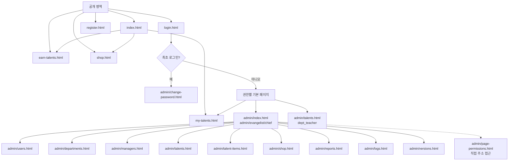
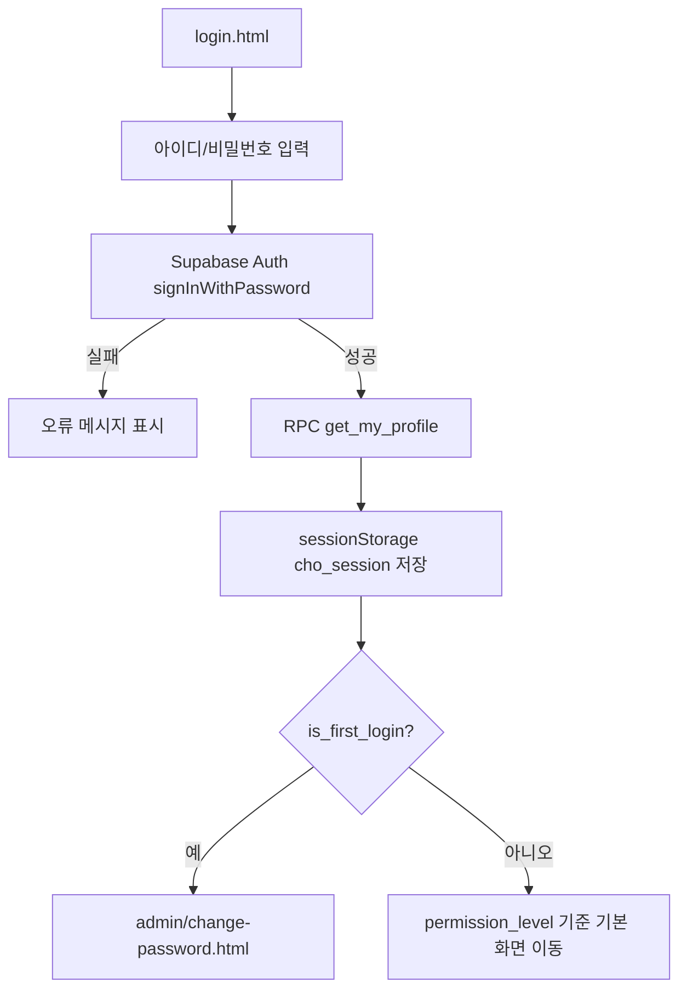
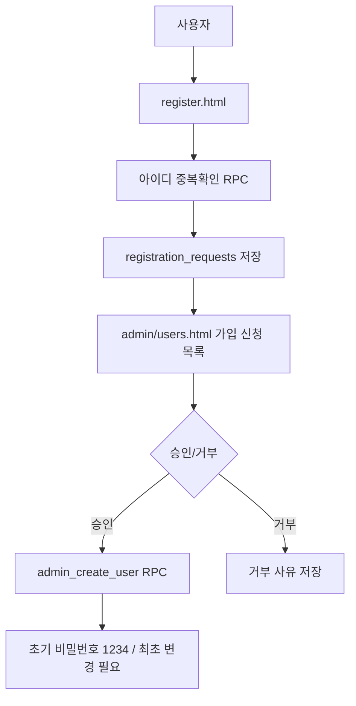
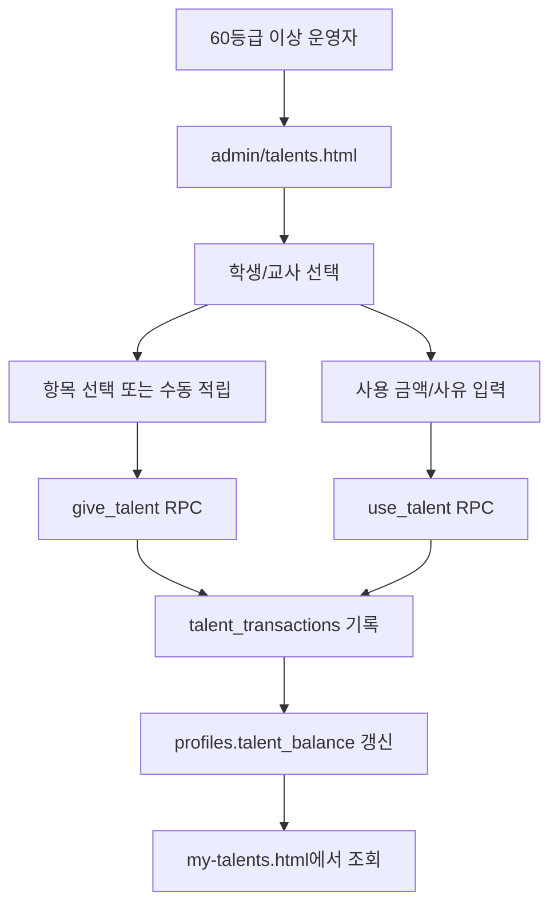
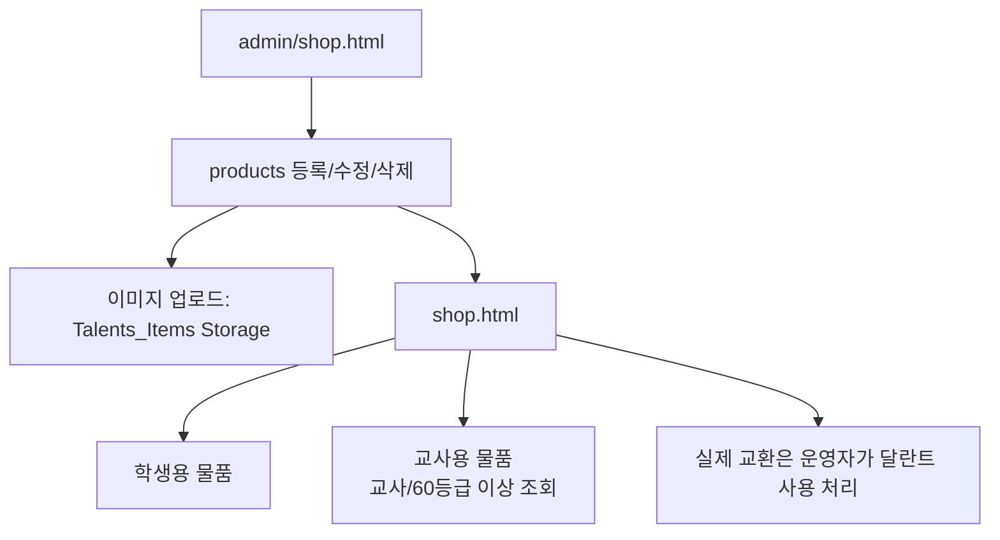

# CHO-Talents

초등부 달란트 운영을 위한 정적 웹 기반 관리 사이트입니다. 학생과 교사는 달란트 잔액과 상점 물품을 확인하고, 담당 교사 이상 권한자는 사용자, 달란트, 물품, 부서, 로그, 보고서를 관리합니다.

**Live:** https://cho-talents.github.io/CHO-Talents/

## 프로젝트 개요

| 항목 | 내용 |
|---|---|
| 서비스명 | 달란트 마을 / CHO-Talents |
| 목적 | 초등부 학생/교사 달란트 적립, 사용, 물품 교환, 운영 관리를 한 곳에서 처리 |
| 배포 | GitHub Pages 정적 사이트 |
| 데이터 | Supabase PostgreSQL, Auth, Storage, RPC, RLS |
| 현재 버전 | `v3.5.0` (`js/version.js` 기준, 2026-05-27) |

## 프로젝트 구조

```text
CHO-Talents/
├── index.html                     # 메인 환영 페이지
├── login.html                     # 통합 로그인
├── register.html                  # 계정 등록 신청
├── earn-talents.html              # 달란트 적립 방법 안내
├── shop.html                      # 달란트 상점 조회
├── my-talents.html                # 내 달란트 잔액/내역 조회
├── admin/                         # 담당 교사 이상 관리 화면
│   ├── index.html                 # 대시보드
│   ├── users.html                 # 사용자 관리 / 가입 신청 승인
│   ├── departments.html           # 부서 관리
│   ├── managers.html              # 관리자/부서관리자 권한 관리
│   ├── talents.html               # 학생/교사 달란트 지급 및 사용 처리
│   ├── talent-items.html          # 달란트 지급 항목 관리
│   ├── shop.html                  # 물품 등록/수정/삭제
│   ├── reports.html               # 작업 보고서 조회
│   ├── logs.html                  # 활동 로그 조회/확인 처리
│   ├── versions.html              # 버전 이력
│   ├── page-permissions.html      # 페이지 권한 매트릭스 관리
│   └── change-password.html       # 최초 로그인/비밀번호 변경
├── css/
│   ├── style.css                  # 메인 화면 스타일
│   ├── common.css                 # 공개/사용자 화면 공통 스타일
│   └── admin.css                  # 로그인/관리자 화면 스타일
├── js/
│   ├── supabase-config.js         # Supabase 설정, Auth 도메인, 공통 CRUD 유틸
│   ├── app.js                     # 메인 화면 효과/연결 상태 확인
│   ├── activity-log.js            # 활동 로그, 세션 캐시, 페이지뷰 기록
│   ├── auth.js                    # 로그인, 세션, 권한, 비밀번호 변경
│   ├── user-mgmt.js               # 사용자/부서 관리 RPC 래퍼
│   ├── talent.js                  # 달란트 잔액/내역/지급/사용
│   ├── product.js                 # 물품 조회/등록/수정/삭제/이미지 업로드
│   └── version.js                 # 버전 정보와 변경 이력
└── docs/                          # 작업 보고서, SQL, 구성 문서, 사용자 안내서
```

## 기술 스택

- **Frontend:** HTML / CSS / Vanilla JavaScript
- **Backend:** Supabase (PostgreSQL, Auth, REST, RPC, RLS, Storage)
- **Hosting:** GitHub Pages
- **Auth:** Supabase email/password Auth. 화면에서는 `아이디 + @cho-talents.app` 형태로 로그인 처리
- **Security:** RLS 정책과 `SECURITY DEFINER` RPC로 사용자/달란트/로그 등 민감 데이터 접근 제어

## 사용자 권한 체계

현재 구현은 `user_type`과 `permission_level`을 함께 사용합니다.

- `user_type`: `student` 또는 `teacher`
- `permission_level`: 실제 접근 권한. 숫자 등급으로 비교합니다.

| 권한 | 코드 | 등급 | 기본 이동 | 주요 권한 |
|---|---|---:|---|---|
| 관리자 | `admin` | 100 | `admin/index.html` | 전체 관리, 페이지 권한 관리, 상위 운영 기능 |
| 전도사님 | `evangelist` | 90 | `admin/index.html` | 관리자 계열 화면, 달란트 항목 관리, 물품 삭제 등 |
| 부장 | `chief` | 80 | `admin/index.html` | 대시보드, 부서/관리자/보고서/로그/버전, 사용자/달란트/물품 관리 |
| 부서 담당 교사 | `dept_teacher` | 60 | `admin/talents.html` | 사용자/달란트/물품 관리. 담당 범위 중심 운영 |
| 일반 교사 | `teacher` | 40 | `my-talents.html` | 내 달란트 확인, 교사용/학생용 상점 조회 |
| 학생 | `student` | 20 | `my-talents.html` | 내 달란트 확인, 학생용 상점 조회 |
| 비로그인 | 없음 | 0 | 공개 페이지 | 메인, 적립 안내, 학생용 상점, 계정 신청 |

권한 노출 기준은 화면의 `data-min-perm`과 `initPage(minRank, loginPath)`로 관리합니다. 서버 작업은 Supabase RLS/RPC에서 한 번 더 제한합니다.

## 페이지별 연결고리



### 공개/사용자 화면

| 페이지 | 연결 | 동작 |
|---|---|---|
| `index.html` | 상점, 로그인, 달란트 적립, 내 달란트 | 로그인 상태면 사용자 배지와 로그아웃 표시. 내 달란트 카드가 권한별 기본 화면으로 이동 |
| `login.html` | 계정 등록 신청, 메인 | 로그인 성공 후 최초 로그인은 비밀번호 변경, 그 외는 권한별 기본 화면으로 이동 |
| `register.html` | 로그인 | 아이디 중복확인 후 가입 신청 저장. 관리자가 승인하면 초기 비밀번호 `1234`로 사용 가능 |
| `earn-talents.html` | 메인, 상점, 내 달란트 | 달란트 적립 방법 안내. 로그인 상태면 권한별 메뉴 추가 표시 |
| `shop.html` | 메인, 적립 안내, 내 달란트 | 학생용 물품은 공개 조회 가능. 교사용 물품은 교사 또는 60등급 이상만 탭으로 조회 |
| `my-talents.html` | 로그인 필요 | 본인 달란트 총 적립/사용/잔액과 최근 내역 조회 |

### 관리 화면

| 페이지 | 최소 등급 | 주요 기능 |
|---|---:|---|
| `admin/index.html` | 80 | 사용자/부서/보고서/로그 요약, 미확인 오류 로그 알림, 빠른 이동 |
| `admin/users.html` | 60 | 사용자 목록과 권한 범위 내 수정/삭제/비밀번호 초기화. 가입 신청 승인/거부는 80등급 이상 |
| `admin/departments.html` | 80 | 부서 등록/수정/비활성화, 부서별 인원/담당자 확인 |
| `admin/managers.html` | 80 | 기존 사용자를 관리자 계열 권한으로 승격/수정, 담당 부서 지정 |
| `admin/talents.html` | 60 | 학생/교사 탭별 달란트 적립, 사용 처리, 최근 내역 확인 |
| `admin/talent-items.html` | 90 | 달란트 지급 항목 등록/수정/활성화. 학생 항목은 주 1회 지급 규칙과 연동 |
| `admin/shop.html` | 60 | 학생용/교사용 물품 등록, 수정, 이미지 업로드, 재고 관리. 삭제 버튼은 90등급 이상 |
| `admin/reports.html` | 80 | 작업 보고서 유형별 조회와 상세 보기 |
| `admin/logs.html` | 80 | 활동 로그 필터링, 오류 로그 확인 처리, 일괄 완료 처리 |
| `admin/versions.html` | 80 | 배포 버전과 변경 이력 확인 |
| `admin/page-permissions.html` | 100 | 페이지별 조회/관리 권한 매트릭스 설정. 상단 메뉴에는 노출되지 않으며 직접 주소로 접근 |
| `admin/change-password.html` | 로그인 | 최초 로그인 또는 비밀번호 변경 처리 |

## 주요 동작 프로세스

### 로그인/세션



- 모든 보호 페이지는 `initPage()`에서 세션을 확인합니다.
- 최초 로그인 사용자는 `change-password.html` 외 화면에 접근하려 하면 비밀번호 변경 화면으로 이동합니다.
- 권한이 부족한 페이지에 접근하면 로그인 페이지가 아니라 본인 권한의 기본 페이지로 이동합니다.

### 계정 등록 신청



### 달란트 지급/사용



### 물품/상점



### 로그/보고서

- `activity-log.js`가 페이지 방문, 로그인 실패/성공, 관리 작업, JS 오류를 `activity_logs`에 기록합니다.
- `ERROR`, `FATAL`, `CRITICAL` 로그는 미확인 상태로 남고, `admin/logs.html`에서 확인 처리합니다.
- `admin/reports.html`은 `reports` 테이블의 작업 보고서를 유형별로 조회합니다.

## 주요 데이터와 RPC

| 구분 | 리소스 | 용도 |
|---|---|---|
| 사용자 | `profiles` | 사용자 정보, 유형, 권한, 부서, 잔액 |
| 부서 | `departments` | 부서명, 설명, 반 개수, 활성 상태 |
| 가입 신청 | `registration_requests` | 계정 신청과 승인/거부 상태 |
| 달란트 | `talent_transactions` | 적립/사용 거래 내역 |
| 달란트 항목 | `talent_items` | 지급 항목과 지급 달란트 |
| 물품 | `products` | 상점 물품, 가격, 재고, 대상, 이미지 |
| 로그 | `activity_logs` | 페이지/오류/운영 활동 기록 |
| 보고서 | `reports` | 작업 계획, 검증, 테스트, 수정 보고서 |
| 페이지 권한 | `page_permissions` | 페이지별 조회/관리 권한 설정 |
| 이미지 | `Talents_Items` Storage | 물품 이미지 업로드/공개 URL |

| RPC | 목적 | 주요 호출 |
|---|---|---|
| `get_my_profile` | 로그인 사용자 프로필/권한 조회 | `auth.js`, `activity-log.js` |
| `check_username_available` | 가입 신청 아이디 중복확인 | `register.html` |
| `admin_list_users` | 사용자 목록 조회 | `user-mgmt.js` |
| `admin_create_user` | Auth 사용자와 프로필 생성 | `user-mgmt.js` |
| `admin_update_user` | 사용자 정보/권한 수정 | `user-mgmt.js` |
| `admin_delete_user` | 사용자 삭제 | `user-mgmt.js` |
| `admin_reset_password` | 비밀번호 `1234` 초기화 | `user-mgmt.js` |
| `change_my_password` | 본인 비밀번호 변경, 최초 로그인 해제 | `auth.js` |
| `give_talent` | 달란트 적립 | `talent.js` |
| `use_talent` | 달란트 사용 | `talent.js` |

## 운영/보안 메모

- 최고관리자(`is_super_admin`)는 일반 관리자도 삭제할 수 없도록 보호합니다.
- 사용자 관리 버튼은 본인 권한 등급 이하 대상에게만 표시됩니다.
- 일반 사용자에게는 아이디(`username`)가 숨겨지고, 관리자는 동명이인 구분을 위해 아이디를 함께 볼 수 있습니다.
- 물품 삭제와 달란트 항목 관리는 더 높은 운영 권한(`90+`)에 제한됩니다.
- 공개 상점은 학생용 물품만 조회합니다. 교사용 물품은 로그인한 교사 또는 60등급 이상 운영자만 조회합니다.
- 활동 로그에는 운영 확인을 위해 브라우저, OS, 화면 크기, IP 등 클라이언트 정보가 함께 저장될 수 있습니다.

## 관련 문서

- [프로젝트 구성도 및 프로세스 흐름도](docs/PROJECT_ARCHITECTURE_FLOW.md)
- [일반 사용자 사이트 안내서](docs/SITE_USER_GUIDE.md)
- `docs/TASK-*.md`: 작업별 계획, 변경 보고서, 테스트 결과
- `docs/*.sql`: Supabase 테이블/RPC/RLS 구성 기록
