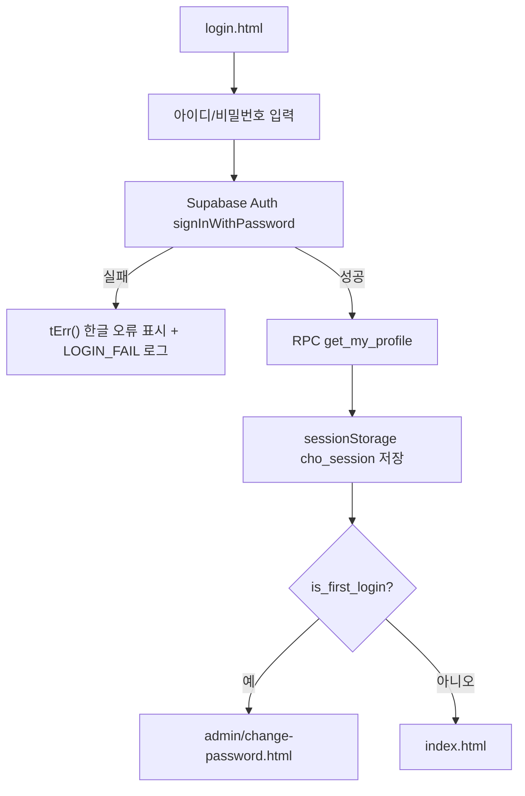
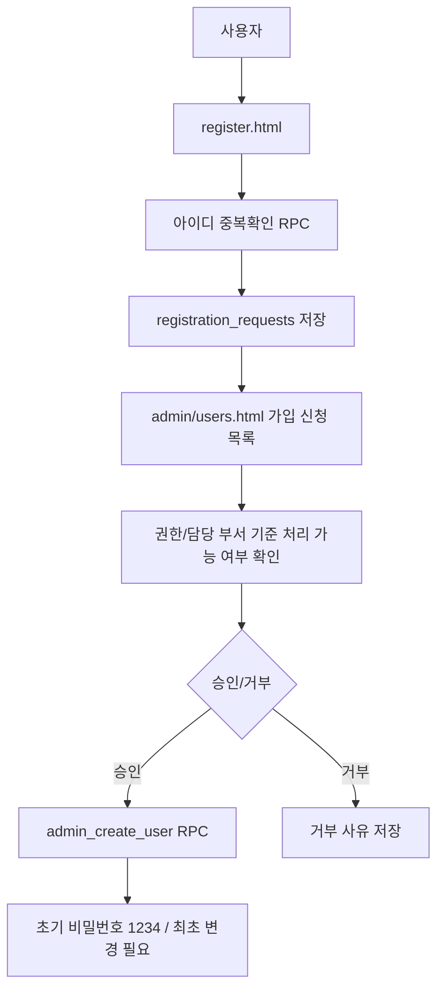
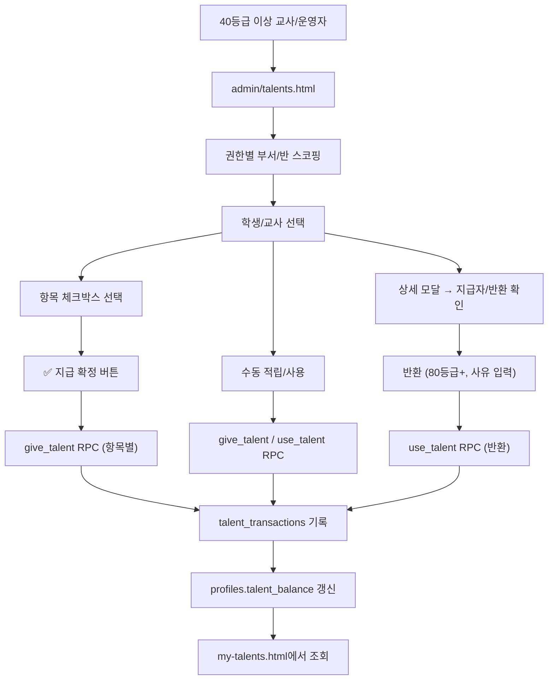
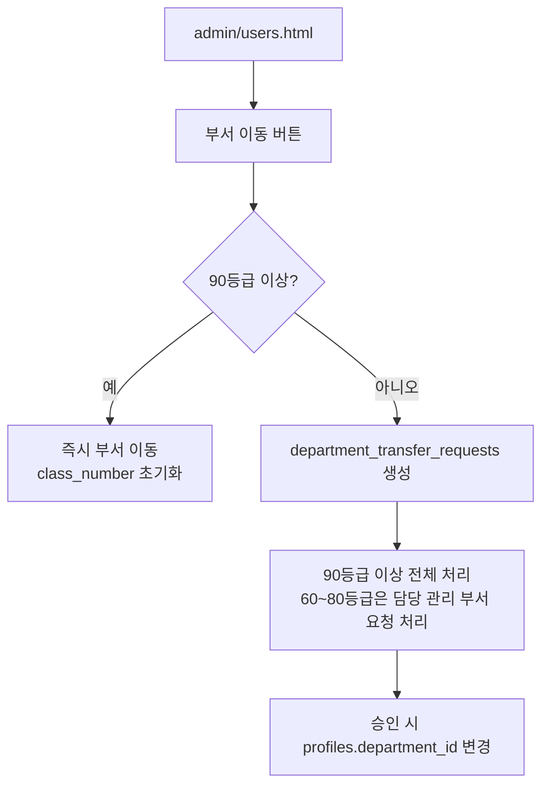
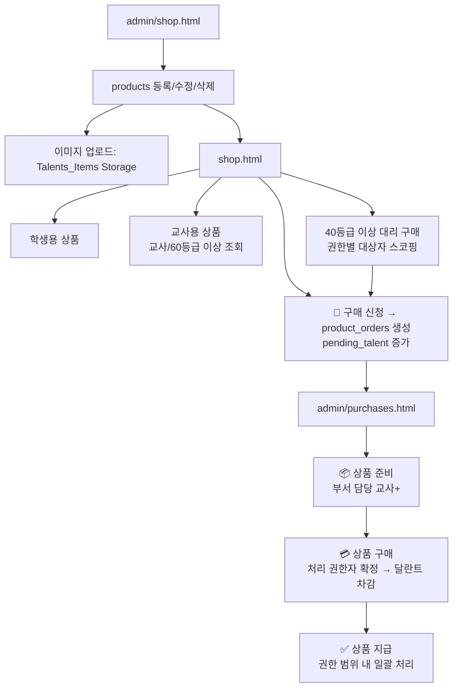

# CHO-Talents

초등부 달란트 운영을 위한 정적 웹 기반 관리 사이트입니다. 학생과 교사는 달란트 잔액과 상점 상품, 구매 내역, Q&A를 확인하고 구매 신청을 하며, 부서 담당 교사 이상 권한자는 권한 범위 안에서 달란트, 사용자, 상품, 구매, 부서, 질문, 보고서, 로그를 관리합니다.

**Live:** https://cho-talents.github.io/CHO-Talents/

## 프로젝트 개요

| 항목 | 내용 |
|---|---|
| 서비스명 | ⭐ 달란트 마을 / CHO-Talents |
| 목적 | 초등부 학생/교사 달란트 적립, 사용, 상품 구매, 운영 관리를 한 곳에서 처리 |
| 배포 | GitHub Pages 정적 사이트 |
| 데이터 | Supabase PostgreSQL, Auth, Storage, RPC, RLS |
| 현재 버전 | `v3.35.0` (`js/version.js` 기준, 2026-06-09) |
| 작성 기준 | `develop` 브랜치 현재 코드와 `APP_VERSION.history` |

## 현재 버전 요약

- `APP_VERSION.current`는 `3.35.0`으로 갱신되어 있습니다.
- **v3.35.0 주요 변경 사항**:
  - 다크 모드: 가이드, Q&A, 달란트 적립/수령, QR 관리, 권한/로그/작업이력 룰, 버전 이력의 잔여 흰 배경과 저대비 텍스트 보정
  - 달란트 적립: 안내 카드별로 `talent_items` 활성 항목의 지급 수량을 조회해 `+N 달란트` 배지 표시
  - 로그: `writeLog()`가 Supabase insert 반환 `error`를 실제 실패로 감지하고 콘솔 오류로 노출
  - 로그: 운영 DB가 구버전 스키마여도 `user_name`/`is_acknowledged` 선택 컬럼 제거 후 재시도하는 호환 적재 경로 추가
  - 작업 이력: `activity_logs` 적재 복구를 통해 `AUDIT_ACTIONS`에 등록된 관리 작업이 작업 이력에 표시되도록 공통 로그 경로 보강
  - 문서/가이드: 다크 모드 보정, 달란트 적립 금액 표시, 로그/작업 이력 검증 기준 갱신

- **v3.34.0 주요 변경 사항**:
  - 테마: 봄/여름/가을/겨울 제거, 일반/다크 2종만 유지
  - 테마: 네비게이션 우측 UI를 드롭다운에서 스위치 버튼으로 변경
  - 다크 모드: 네비게이션 드롭다운, 관리 드롭다운, 필터, 모달 등 주요 흰 배경 영역을 어두운 표면색으로 정리
  - 즐겨찾기: 모바일/PC 모두 최소 1개, 최대 10개까지 선택 가능
  - 즐겨찾기: 사용자 권한과 실제 네비게이션 노출 규칙에 맞는 항목만 설정/표시
  - 로그: 조회 기간 기본값을 1년으로 확대하고 라벨을 조회 기간 기준으로 정리
  - 작업 이력: `is_deleted`가 `NULL`인 기존 로그도 함께 표시되도록 조회 조건 보정
  - 문서/가이드: README, 사용자 안내서, 구성도, 학생/교사/관리자 가이드 최신 동작 기준으로 갱신

- **v3.32.0 주요 변경 사항**:
  - 작업 이력(admin/audit.html): AUDIT_ACTIONS 키 불일치 수정 및 70개 이상 액션 타입으로 확대
  - 작업 이력: 필터 그룹 6개 → 10개 확대 (사용자/등록/부서/달란트/상품·주문/Q&A/인증/로그관리/권한·설정)
  - 로그 시스템: ACTION_LABELS 한글 매핑 150개+ 추가, writeLog() 자동 한글 라벨 적용
  - 로그 뷰어(admin/logs.html): action 열 한글 라벨 표시 (영문 키 병기)
  - 전체 20개+ 페이지/JS: logInfo/logWarn/logError 호출의 details 키 한글화 (대상/변경내역/오류/금액 등)
  - 누락 로그 추가: qna.html(QNA_CREATE/ANSWER/COMMENT/DELETE/FAQ_SET), talent-items.html(TOGGLE/QUICKBTN), page-permissions.html(PAGE_PERM_UPDATE)
  - 즐겨찾기 DB 마이그레이션: user_preferences 테이블 신설, localStorage → Supabase DB 저장으로 전환 (비로그인 시 localStorage 폴백)
  - 즐겨찾기: 최초 로그인 시 기존 localStorage 데이터 자동 DB 마이그레이션
  - 문서/가이드: README.md, SITE_USER_GUIDE.md, PROJECT_ARCHITECTURE_FLOW.md, 3개 가이드 페이지 최신화

- **v3.31.0 주요 변경 사항**:
  - 달란트 관리: 반환 매칭을 트랜잭션 ID 기반 1:1 매칭으로 전면 재설계
  - 달란트 관리: 출석/달란트 지급 시 즉시 상태 업데이트 + 동시 클릭 방어 (_attendBusy)
  - 달란트 적립: 비로그인/학생 계정에서 교사 적립 탭 숨김
  - 네비게이션: 구매 배지 super_admin 사용자 주문 수 제외

- **v3.30.0 주요 변경 사항**:
  - 관리 페이지 전체 super_admin 사용자 숨김 확대 적용 (달란트/통계/구매/관리자/부서/대시보드)

- **v3.29.0 주요 변경 사항**:
  - 달란트 관리: 출석/달란트 지급 취소 후 재지급 가능하도록 반환 트랜잭션 매칭 로직 수정
  - 사용자 관리: is_super_admin=true 사용자 비표시 처리
  - 운영 메뉴: 로그 배지 업데이트 시 운영 드롭다운에도 배지 반영
  - 가이드: 권한별 탭 표시

- **v3.28.0 주요 변경 사항**:
  - 메인 페이지: 로그인 사용자 바로가기 카드 즐겨찾기 커스터마이징 기능 추가

- **v3.27.0 주요 변경 사항**:
  - 달란트 통계: 부서 담당 교사(60~79) 담당 부서만 조회, 부장교사(80+) 전체 부서 조회
  - 달란트 관리: 본인 지급 불가, 출석 퀵버튼 지급/취소 토글, 항목별 취소 버튼
  - 달란트 관리: 주간(월~일) 1회 지급 제한 (UI+RPC), 일반 교사 교사 탭 숨김
  - 달란트 항목 관리: 접근 권한 60+, 퀵버튼 설정 80+
  - 사용자 관리: 구매 내역 조회 필드 수정
  - 달란트 적립: 교사/학생 탭 분리 및 실제 항목으로 변경

- **v3.26.2 주요 변경 사항**:
  - 공개 설정/비밀 설정 관리 위치 분리
  - `config/public-config.js`로 브라우저 공개 부트스트랩 설정 관리
  - Supabase `app_config` 테이블과 `get_public_app_config()` RPC 추가
  - 비밀 토큰은 DB 평문 저장 대신 `.env.local`, CI secret, Edge Function 환경변수/Vault 참조로 관리

- **v3.26.1 주요 변경 사항**:
  - 구매 취소: product_orders_status_check에 cancelled 추가 SQL 제공
  - QR관리: 수정 모달 라디오/체크박스 디자인 깨짐 수정
  - QR관리: 중복 항목 QR 생성 허용을 위한 UNIQUE 제약 제거 SQL 제공

- **v3.26.0 주요 변경 사항**:
  - 달란트 항목 관리: 퀵버튼 저장 오류 수정 (DB 컬럼 누락 시 안내 메시지 표시)
  - 달란트 통계: 부서별 상세 비율을 수령 항목 수 기준으로 계산 변경
  - QR관리: 수정 모달 디자인 개선 (반응형 + 모바일 최적화)
  - 내 구매 상품: 취소 시 DB 삭제 대신 cancelled 상태로 변경
  - 구매 관리: cancelled 필터 탭 및 상태 표시 추가
  - 사용자관리: 승인자 이름을 profiles에서 조회하여 표시 (관리자는 ID도 표시)
  - 전체: 드롭다운 z-index 9999 + overflow:visible 통일로 클리핑 완전 해결

- **v3.25.0 주요 변경 사항**:
  - 가이드: 학생/교사/관리자 가이드 권한별 접근 제어 (학생→학생만, 교사→학생+교사, 부서교사이상→전체)
  - 달란트 적립: 항목 카드 그리드 레이아웃 (모바일 3열, PC 5열)
  - Q&A: 학생/교사도 등록된 질문 열람 및 답변 가능 (FAQ 등록은 관리자만)
  - 내 달란트: 요약 카드 그리드 레이아웃 (모바일 3열, PC 5열)
  - 달란트 관리: 출석 퀵버튼을 달란트 항목 관리에서 유형별(학생/교사) 1개 지정 가능
  - 달란트 통계: 필터 라디오 이모지 + 칩 스타일, 그리드 라벨 변경, 상세 비율 그래프 추가
  - QR 관리: repeat 컬럼 없을 때 생성 오류 방지, 수령자 ID 관리자만 표시
  - QR 관리: 수정 모달 스크롤 개선, 저장방식 선택 (기존QR유지/새QR생성)
  - 내 구매 상품: 취소 시 profiles 테이블 사용으로 달란트 복원 수정
  - 대시보드: 요약카드/바로가기 그리드 (모바일 3열, PC 5열)
  - 사용자 관리: 상세 아이디/승인자 관리자(100+)만 표시
  - 부서 관리: 담당관리자 열 제거, 소속보기 관리자 우선 정렬
  - 전체: 테이블 overflow 변경으로 드롭다운 하단 항목 클리핑 해결
- **v3.24.0 주요 변경 사항**:
  - 실계정 권한 검증 결과 반영
  - 상품 구매: 일반 교사 대리구매 대상 조회를 `admin_list_users` RPC 기반으로 변경
  - 구매 관리: 부서 담당 교사는 담당 부서 주문만 목록에 표시
  - QR 관리: 생성 상태 메시지/저장 결과 확인/오류 표시 보강
- **v3.23.0 주요 변경 사항**:
  - QR 관리: 조회 기간 초기 from 날짜를 오늘-7일로 변경
  - 사용자 관리: 학생 그리드에서 권한 열 제거 + 통계 카드 모바일 3개씩 반응형
  - 부서 관리: 관리 버튼을 드롭다운으로 통합 (소속보기/수정/삭제)
  - 내 달란트: 수령 대기 상품수에 구매 신청(requested) 상태 포함
  - 달란트 관리: 출석 버튼 유지 + 달란트 지급/상세를 관리 드롭다운으로 통합
  - 달란트 관리: 잔여 달란트→달란트 명칭 변경, 모바일 열 숨김, 페이징(10/20)
  - 달란트 통계: 전체 탭 명칭 변경 + 부서별 상세 모달 + 사용자별 그룹핑/페이징
  - 상품 구매: 대리구매 검색에 부서/반 정보 추가
  - 상품 관리: 교사/학생 그룹별 표시 + 페이징 + 관리 드롭다운 통합
  - 구매 관리: 상태별 상품 합계 표시 + 일괄 처리 버튼 + 관리 드롭다운 통합
- **v3.22.0 주요 변경 사항**:
  - 사용자 관리: 교사/학생 그룹 분리, 관리 드롭다운 통합, 상세 정보 모달 신규
  - 사용자 관리: 등록일/마지막 로그인 컬럼 제거 → 상세 정보에서 확인, 그룹별 페이징
  - 달란트 수령: 학생 접근 허용, QR 입력 관리자 전용, 과녁/텍스트 제거
  - 달란트 수령: 활성 QR 코드 목록 그룹핑(학생/교사) + 만료 정렬 + 5개 페이징
  - 내 달란트: 수령 대기 상품수 카드 추가
  - 대시보드: 부서 담당 교사(60+) 접근 권한 추가 (26개 파일 반영)
  - 날짜 필터: 모든 페이지 from 기본값 오늘-7일로 변경
  - 로그: 삭제 기간 라벨 추가
  - 페이지 접근/기능: 신규 페이지 및 기능 항목 대폭 추가
- **v3.21.0 주요 변경 사항**:
  - QR 관리: 날짜 검색 필터를 from-to 범위 형태로 변경, 초기값 오늘 날짜
  - QR 관리: 초기화 버튼 제거, 기간 프리셋 버튼 추가 (오늘/1주/1달/1년)
  - 내 달란트: 카드 순서 변경 (사용가능→수령예정→대기→완료→적립), 명칭에 "달란트" 접미사
  - 내 달란트: "상품 수령 예정" 카드 신규 추가
  - 가이드: "학생 가이드"를 "학생 가이드"로 전체 명칭 변경 (27개 HTML)
  - 가이드: 메뉴별 사용 방법 간결화, 내 달란트 흐름순 설명, 교사/관리자 가이드 업데이트
- **v3.19.0 주요 변경 사항**:
  - QR 관리: 지급 대상(학생/교사) 라디오 구분 + 대상별 달란트 항목 필터링
  - QR 관리: 유효기간 라디오(지정일/기간/무기한) + 모드별 날짜 입력 활성화 제어
  - QR 관리: 위치 제한 기능 - 카카오맵 API 주소 검색, 위도/경도 저장, 반경 선택(500m~5km)
  - QR 관리: 위치 제한 시 수령 페이지에서 Geolocation 거리 검증 (Haversine)
  - QR 관리: 초기화/5개 일괄 생성 버튼 제거, 생성 버튼 이모지+스타일 적용
  - QR 관리: 수정 모달에도 대상/유효기간/위치 제한 동일 적용
  - DB: `talent_qr_codes` 테이블에 `target_type`, `location_lat/lng/name/radius` 컬럼 추가
  - 설정: `supabase-config.js`에 `KAKAO_MAP_KEY` 상수 추가
- **v3.18.0 주요 변경 사항**:
  - 달란트 통계: 전체/부서별/사용자별/유형별 모든 뷰에 부서 필터 콤보박스 적용
  - 달란트 통계: 전체/학생/교사 라디오 버튼으로 사용자 유형별 필터링
  - 달란트 통계: 유형별 비율을 학생/교사 각각 항목별 비율로 변경 (기존 학생:교사 비율 대체)
  - 달란트 통계: "반별" 탭 → "사용자별"로 명칭 변경 + 유형 컬럼 추가
  - 기간 프리셋: 오늘/1주/1달/1년 버튼 - 통계, 로그, 작업이력, 구매관리 4개 페이지
  - 구매관리: 전체 탭 외 각 상태별 탭에도 부서/기간 필터 표시
  - 상품관리: 삭제를 소프트 삭제(삭제 대기)로 변경 - 비활성화 처리, 목록에서 숨김
  - 대시보드: 미확인 ERROR+ 카드를 관리자(100+)만 표시, 클릭 시 로그 페이지 이동
  - 대시보드: 바로가기에 달란트 통계, 달란트 QR 관리 추가
- **v3.17.0 주요 변경 사항**:
  - QR 관리: 수령자 목록 모달 (이름/아이디/부서/수령시간)
  - QR 관리: 지급방식 라디오 - 무제한 or 선착순(1~100,000명)
  - QR 관리: 코드값 관리자(100+)만 표시, 인쇄 시에도 동일 적용
  - QR 관리: `crypto.getRandomValues` 18자리 암호학적 랜덤 코드 생성
  - QR 관리: 달란트 항목 드롭다운 연동 (없을 때만 직접 입력)
  - QR 수령: `profiles.talent_balance` 연동, `balance_after`/`talent_item_id` 기록
- **v3.15.1 주요 변경 사항**:
  - Q&A: 삭제를 `admin_soft_delete_qna` RPC 함수로 전환 (SECURITY DEFINER, RLS 우회)
  - 달란트 관리: 사용 탭/섹션/함수 완전 제거 (물품 구매로만 사용)
  - 내 달란트: 항목별 적립현황 페이지 로드 시 자동 표시
  - 신규: `admin/talent-stats.html` 달란트 누적적립 통계 (전체/부서별/개인별)
  - 네비게이션: 달란트 드롭다운에 "달란트 통계" 메뉴 추가 (60등급 이상)
- **v3.15.0 주요 변경 사항**:
  - 달란트 관리: 수기 지급(수동 입력) 관리자(rank 100+)만 표시
  - 달란트 관리: 사용 탭 관리자만 표시 (물품 구매로만 사용)
  - 상품 구매: 교사→학생 상품 구매 버튼 숨김 (대리구매용 조회만 가능)
  - 상품 구매: 대리구매 시 선택 계정 유형별 상품 필터 (학생→학생상품, 교사→교사상품)
  - 상품 구매: 학생/교사 모두 카테고리별 그룹화 표시
  - 상품 구매: 카테고리 필터 콤보박스 + 상품명/카테고리 검색 기능
  - 구매 관리: 단계 되돌리기(↩) 기능 추가
  - 구매 관리: '전체' 탭에서 상세 다이얼로그로 처리 이력 표시
  - 내 달란트: '누적 적립' 클릭 시 항목별 달란트 수 + 퍼센트 표시
  - 전체: 모든 숫자 천단위 콤마 표시 (`fmtNum()` 전역 함수)
  - 네비게이션: 드롭다운 배지 합계를 그룹 토글에 표시
  - 학생 가이드: `body.page-body` 클래스 추가로 타이틀 짤림 해결
  - Q&A: RLS UPDATE 정책 완화로 삭제 권한 문제 해결 (`docs/TASK-036_qna_delete_fix.sql`)
- **v3.14.1 주요 변경 사항**:
  - 모바일: nav-dropdown-menu에 transform/left/top/min-width 초기화로 메뉴 표시 수정
- **v3.13.0 주요 변경 사항**:
  - 네비게이션 전면 개편: 평면 단일행 → 드롭다운 5그룹 (소개/달란트/상품/관리/운영)
  - `guide.html` 신규: 학생 가이드 페이지 (카드/스텝 기반 시각적 설명)
  - `qna.html` 신규: Q&A 게시판 (FAQ 상단 표시 + 질문 등록 + 관리자 답변/댓글 + FAQ 등록)
  - DB 변경: `qna` 테이블/RLS, `qna_comments` 테이블/RLS, 초기 FAQ 데이터
  - 로그인: `check_registration_status` RPC로 승인 대기 메시지 정상 표시
  - 비밀번호 변경: 8자 이상, 영문+숫자 필수, '1234' 사용 금지
  - 메인 페이지 네비: 브랜드 + 로그인/로그아웃 + 관리(60+)만 표시
- **v3.12.2 신규/변경 사항**:
  - 네비게이션 통일: 전체 페이지에 "내 구매 상품" 메뉴 추가, 보고서 리디렉트 수정
  - `my-orders.html` 신규: 로그인 사용자 본인 구매 내역 조회 (4단계 상태 배지, 관리자 정보 미표시)
  - 대리 구매 기능: `shop.html`에서 rank 40+ 대리 구매 모달 (스코핑 규칙 적용)
  - 달란트 관리 스코핑 강화: 일반 교사(40)는 반 미배정 시 빈 목록, 달란트 항목 관리 버튼 60+ 전용
  - 로그인 후 리디렉트: 모든 권한 `index.html`(메인 페이지)로 통일
  - 사용자 관리: 부서 담당 교사(60+) 반 수정 활성화, 부장 교사(80+) 부서 필터 추가
  - 관리자 관리: 학생 검색 제외, 부장 교사(80+) 부서 필터 추가
- **상품 구매 시스템** (v3.9.0~):
  - 구매 신청 → 상품 준비 → 상품 구매 → 상품 지급 4단계 흐름
  - `shop.html`에서 구매/대리 구매, `my-orders.html`에서 내 구매 확인, `my-talents.html`에서 사용 대기 확인, `admin/purchases.html`에서 관리
  - 구매 신청 시 달란트는 `pending_talent`(사용 대기)로 관리
- **달란트 관리**: 체크박스 선택 + 일괄 지급, 부장 교사(80+) 반환 처리, 일반 교사(40) 반 스코핑, 출석 버튼 (당일 중복 방지)
- **에러 처리**: `tErr()` 한글 번역, 전체 페이지 에러 로깅
- **로그 관리**: 소프트 삭제(`is_deleted=true`), 관리자(100+)만 삭제 가능

## 프로젝트 구조

```text
CHO-Talents/
├── index.html                     # 메인 환영 페이지
├── login.html                     # 통합 로그인
├── register.html                  # 계정 등록 신청
├── guide.html                     # 학생 가이드
├── qna.html                       # Q&A / FAQ / 질문 관리
├── earn-talents.html              # 달란트 적립 방법 안내
├── shop.html                      # 달란트 상점 조회 + 구매 신청 + 대리 구매
├── my-talents.html                # 내 달란트 잔액/내역/구매 내역 조회
├── my-orders.html                 # 내 구매 상품 (본인 구매 내역 조회)
├── admin/                         # 권한별 관리 화면
│   ├── index.html                 # 대시보드
│   ├── users.html                 # 사용자 관리 / 가입 신청 / 부서 이동
│   ├── departments.html           # 부서 관리
│   ├── managers.html              # 관리자/부서 담당 교사 권한 관리
│   ├── talents.html               # 학생/교사 달란트 지급·사용·반환
│   ├── talent-items.html          # 달란트 지급 항목 관리
│   ├── shop.html                  # 상품 등록/수정/삭제/활성 상태 관리
│   ├── purchases.html             # 구매 관리 (4단계 구매 흐름)
│   ├── reports.html               # 작업 보고서 조회 + JS 시더
│   ├── logs.html                  # 활동 로그 조회/확인/삭제 대기
│   ├── versions.html              # 버전 이력
│   ├── page-access.html           # 권한별 페이지 접근/요소 가시성 관리 (100+)
│   ├── page-features.html         # 권한별 페이지 기능 설정 관리 (100+)
│   ├── audit.html                 # 관리 작업 이력 조회 (100+)
│   ├── page-permissions.html      # 페이지 권한 매트릭스 (레거시)
│   └── change-password.html       # 최초 로그인/비밀번호 변경
├── css/
│   ├── style.css                  # 메인 화면 스타일
│   ├── common.css                 # 공개/사용자 화면 공통 스타일
│   └── admin.css                  # 로그인/관리자 화면 스타일
├── js/
│   ├── supabase-config.js         # Supabase 설정, Auth 도메인, 공통 CRUD 유틸
│   ├── app.js                     # 메인 화면 효과/연결 상태 확인
│   ├── activity-log.js            # 활동 로그, 세션 캐시, 소프트 삭제
│   ├── auth.js                    # 로그인, 세션, 권한, 비밀번호 변경, tErr() 에러 번역
│   ├── user-mgmt.js               # 사용자/부서 관리 RPC 래퍼
│   ├── talent.js                  # 달란트 잔액/내역/지급/사용/반환
│   ├── product.js                 # 상품 조회/등록/수정/삭제/비활성화/이미지 업로드
│   └── version.js                 # 버전 정보와 변경 이력
└── docs/                          # 작업 보고서, SQL, 구성 문서, 사용자 안내서
```

## 기술 스택

- **Frontend:** HTML / CSS / Vanilla JavaScript
- **Backend:** Supabase (PostgreSQL, Auth, REST, RPC, RLS, Storage)
- **Hosting:** GitHub Pages
- **Auth:** Supabase email/password Auth. 화면에서는 `아이디 + @cho-talents.app` 형태로 로그인 처리
- **Security:** RLS 정책과 `SECURITY DEFINER` RPC로 사용자/달란트/로그 등 민감 데이터 접근 제어
- **에러 처리:** `tErr()` 함수로 영문 DB 에러를 한글로 자동 변환, 전체 기능에 `logError`/`logWarn`/`logInfo` 로깅

## 사용자 권한 체계

현재 구현은 `user_type`과 `permission_level`을 함께 사용합니다.

- `user_type`: `student` 또는 `teacher`
- `permission_level`: 실제 접근 권한. 숫자 등급으로 비교합니다.

| 권한 | 코드 | 등급 | 기본 이동 | 주요 권한 |
|---|---|---:|---|---|
| 최고 관리자 | `admin` + `is_super_admin` | 110 | `index.html` | 관리자 포함 전체 사용자 관리, 보고서 초기화, 페이지 접근/기능/감사/로그 관리 |
| 관리자 | `admin` | 100 | `index.html` | 전체 관리, 페이지 접근/기능/감사/로그 관리, 로그 삭제 대기 처리 |
| 전도사님 | `evangelist` | 90 | `index.html` | 달란트 항목 관리, 상품 삭제, 부서 즉시 이동, 전체 구매 처리 |
| 부장 교사 | `chief` | 80 | `index.html` | 대시보드, 부서/관리자/보고서/버전, 달란트 반환 처리 |
| 부서 담당 교사 | `dept_teacher` | 60 | `index.html` | 담당 부서 중심 사용자/부서/달란트/상품/구매/Q&A 답변 관리 |
| 일반 교사 | `teacher` | 40 | `index.html` | 담당 부서/반 학생 달란트 처리, 대리 구매, 내 달란트, 교사용/학생용 상점 |
| 학생 | `student` | 20 | `index.html` | 내 달란트/구매 내역 확인, 학생용 상점 구매 신청, Q&A 질문 |
| 비로그인 | 없음 | 0 | 공개 페이지 | 메인, 학생 가이드, Q&A FAQ, 적립 안내, 학생용 상점, 계정 신청 |

권한 노출 기준은 화면의 `data-min-perm`과 `initPage(minRank, loginPath)`로 관리합니다. 서버 작업은 Supabase RLS/RPC에서 한 번 더 제한합니다.

## 페이지별 연결고리

```mermaid
flowchart TD
  Public["공개 영역"] --> Home["index.html"]
  Public --> Guide["guide.html"]
  Public --> QNA["qna.html"]
  Public --> Earn["earn-talents.html"]
  Public --> Shop["shop.html"]
  Public --> Login["login.html"]
  Public --> Register["register.html"]

  Home --> Guide
  Home --> QNA
  Home --> Earn
  Home --> Shop
  Home --> MyTalents["my-talents.html"]
  Home --> MyOrders["my-orders.html"]
  Login --> FirstLogin{"최초 로그인?"}
  FirstLogin -->|예| ChangePassword["admin/change-password.html"]
  FirstLogin -->|아니오| Home

  Home --> AdminDash["admin/index.html<br/>80+"]
  Home --> Users["admin/users.html<br/>60+"]
  Home --> Departments["admin/departments.html<br/>60+"]
  Home --> Managers["admin/managers.html<br/>80+"]
  Home --> Talents["admin/talents.html<br/>40+"]
  Home --> TalentItems["admin/talent-items.html<br/>90+"]
  Home --> AdminShop["admin/shop.html<br/>60+"]
  Home --> Purchases["admin/purchases.html<br/>60+"]
  Home --> Reports["admin/reports.html<br/>80+"]
  Home --> Versions["admin/versions.html<br/>80+"]
  Home --> PageAccess["admin/page-access.html<br/>100+"]
  Home --> PageFeatures["admin/page-features.html<br/>100+"]
  Home --> Audit["admin/audit.html<br/>100+"]
  Home --> Logs["admin/logs.html<br/>100+"]
  Home -.-> PagePerms["admin/page-permissions.html<br/>100+ 직접 주소 접근"]
```



### 공개/사용자 화면

| 페이지 | 연결 | 동작 |
|---|---|---|
| `index.html` | 학생 가이드, Q&A, 상점, 로그인, 달란트 적립, 내 달란트 | 로그인 상태면 로그아웃 버튼과 60등급 이상 관리 버튼 표시 |
| `login.html` | 계정 등록 신청, 메인 | 로그인 성공/실패 로그 기록. 승인 대기/거부 계정 구분 안내 |
| `register.html` | 로그인 | 영문/숫자/`_`/`-` 아이디 중복확인 후 가입 신청. 실패 시 에러 로깅 |
| `guide.html` | 메인, Q&A, 상점, 내 달란트 | 사이트 이용 방법을 카드/스텝 형태로 안내 |
| `qna.html` | 메인, 학생 가이드 | FAQ 공개 조회, 로그인 사용자 질문 등록, 60등급 이상 답변/FAQ 등록 |
| `earn-talents.html` | 메인, 상점, 내 달란트 | 달란트 적립 방법 안내. `talent_items` 활성 항목의 지급 수량을 카드별 `+N 달란트` 배지로 표시 |
| `shop.html` | 메인, 적립 안내, 내 달란트, 내 구매 상품 | 학생용 상품 공개 조회. 교사/60등급 이상은 교사용 탭. 로그인 시 구매 신청, 40등급 이상은 대리 구매 가능 |
| `my-talents.html` | 로그인 필요 | 누적 적립/사용 완료/사용 대기/사용 가능 잔액, 달란트 내역, 구매 내역 조회 |
| `my-orders.html` | 로그인 필요 | 본인 구매 신청 내역과 4단계 진행 상태 조회 |

### 관리 화면

| 페이지 | 최소 등급 | 주요 기능 |
|---|---:|---|
| `admin/index.html` | 80 | 사용자/부서/보고서 요약, 가입 대기자 수. 미확인 ERROR+ 카드/알림/최근 이슈 로그는 100등급 이상(클릭 시 로그 이동). 바로가기에 달란트 통계/QR 관리 포함 |
| `admin/users.html` | 60 | 사용자 목록, 권한 범위 내 수정/삭제/비밀번호 초기화, 가입 신청 처리, 부서 이동 요청/승인 |
| `admin/departments.html` | 60 | 부서 등록/수정/비활성화, 반 개수 관리, 부서별 인원/담당자 확인 |
| `admin/managers.html` | 80 | 기존 사용자를 관리자 계열 권한으로 승격/수정, 담당 부서 지정 |
| `admin/talents.html` | 40 | 학생/교사 탭별 달란트 체크박스 선택+일괄 지급, 수동 적립/사용, 반환(80+). 일반 교사는 담당 부서/반 제한 |
| `admin/talent-items.html` | 90 | 달란트 지급 항목 등록/수정/활성화. 학생 항목은 주 1회 지급 규칙과 연동 |
| `admin/talent-qr.html` | 90 | QR 코드 생성(qrcode.js 이미지), 수정(새 코드 재생성), 비활성화. 기간(from~to datetime) 설정 |
| `admin/shop.html` | 60 | 학생용/교사용 상품 등록, 수정, 이미지 업로드. 삭제 버튼(90+)은 소프트 삭제(삭제 대기=비활성화)로 목록에서 숨김 |
| `admin/purchases.html` | 60 | 구매 관리: 4단계 처리, 모든 상태 탭에 부서/기간 필터(기본 오늘) + 기간 프리셋, 구매 확정 시 달란트 차감 |
| `admin/reports.html` | 80 | 작업 보고서 유형별 조회, 상세 보기, 등록/수정, 선택 삭제 |
| `admin/logs.html` | 100 | 활동 로그 필터링(기본 1년) + 기간 프리셋, 상세 보기, 한글 액션 라벨 표시, 오류 로그 확인 처리, 소프트 삭제(삭제 대기) |
| `admin/versions.html` | 80 | 배포 버전과 변경 이력 확인 |
| `admin/page-access.html` | 100 | 유형/권한별 페이지 접근/요소 가시성 설정 |
| `admin/page-features.html` | 100 | 권한별 페이지 기능(수정/삭제/승인 등) 설정값 관리 |
| `admin/audit.html` | 100 | 관리 작업 이력 조회 (70+ 액션 타입, 10개 카테고리 필터, 한글 상세 내역). 기간 필터 기본값 1년 + 기간 프리셋, 자동 조회 |
| `admin/page-permissions.html` | 100 | 페이지별 조회/관리 권한 매트릭스 설정 (레거시) |
| `admin/change-password.html` | 로그인 | 최초 로그인 또는 비밀번호 변경 처리 |

## 주요 동작 프로세스

### 로그인/세션



- 모든 보호 페이지는 `initPage()`에서 세션을 확인합니다.
- 최초 로그인 사용자는 `change-password.html` 외 화면에 접근하려 하면 비밀번호 변경 화면으로 이동합니다.
- 일반 로그인 성공 후에는 모든 권한이 `index.html`로 이동하고, 상단 메뉴에서 권한에 맞는 기능만 표시됩니다.
- 권한이 부족한 보호 페이지에 접근하면 현재 통합 기본 화면인 `index.html`로 이동합니다.
- 승인 대기 계정 로그인 시 "승인 대기 중" 안내, 거부 계정은 "거부됨" 안내를 구분 표시합니다.

### 계정 등록 신청



- 관리자/전도사님은 모든 가입 신청을 처리할 수 있습니다.
- 부장 교사는 전체 신청을 볼 수 있지만 담당 부서 신청만 처리합니다.
- 부서 담당 교사는 담당 부서 신청만 보고 처리합니다.

### 달란트 지급/사용/반환



### 부서 이동



- 소속 부서/반 변경은 일반 수정 모달이 아니라 부서 이동 요청/승인 흐름으로 처리합니다.

### 상품 구매



구매 권한 범위:

| 권한 | 조회 | 처리 |
|---|---|---|
| 부서 담당 교사 | 담당 부서 신청 | 담당 부서 신청의 준비/구매 확정/지급 처리 |
| 부장 교사 | 전체 신청 | 담당 관리 부서 신청 처리 |
| 전도사님 이상 | 전체 신청 | 전체 처리 가능 |

### 로그/보고서

- `activity-log.js`가 페이지 방문, 로그인, 관리 작업, 에러를 `activity_logs`에 기록합니다.
- 모든 기능의 성공/실패/거부가 `logInfo`/`logWarn`/`logError`로 기록됩니다.
- `writeLog()`는 Supabase insert의 반환 `error`를 확인하고, 구버전 DB 스키마의 선택 컬럼 오류는 제거 후 재시도합니다.
- `ERROR`, `FATAL`, `CRITICAL` 로그는 미확인 상태로 남고, `admin/logs.html`에서 확인 처리합니다.
- 로그 삭제는 소프트 삭제(`is_deleted=true`)이며, 실제 삭제는 SQL Editor에서 수행합니다.
- `admin/reports.html`은 `reports` 테이블의 작업 보고서를 유형별로 조회하고, 등록/수정/삭제를 제공합니다.

## 주요 데이터와 RPC

| 구분 | 리소스 | 용도 |
|---|---|---|
| 사용자 | `profiles` | 사용자 정보, 유형, 권한, 부서, 반, 잔액, 사용 대기 달란트 |
| 사용자 설정 | `user_preferences` | 사용자별 즐겨찾기 바로가기 설정 (JSONB) |
| 부서 | `departments` | 부서명, 설명, 반 개수, 활성 상태 |
| 가입 신청 | `registration_requests` | 계정 신청과 승인/거부 상태 |
| 부서 이동 | `department_transfer_requests` | 부서 이동 요청, 승인/거부, 처리 기록 |
| 달란트 | `talent_transactions` | 적립/사용 거래 내역 |
| 달란트 항목 | `talent_items` | 지급 항목과 달란트 금액 |
| 상품 | `products` | 상점 상품, 가격, 대상, 이미지, 활성 상태 |
| 상품 주문 | `product_orders` | 구매 신청, 4단계 상태 관리, 담당자 기록 |
| Q&A | `qna` | FAQ, 사용자 질문, 답변, 공개 여부 |
| QR 코드 | `talent_qr_codes` | QR 코드 생성/유효기간(`valid_from`/`valid_until`)/1회 사용 관리 |
| QR 스캔 | `talent_qr_scans` | QR 코드 스캔 이력 (중복 수령 방지) |
| 로그 | `activity_logs` | 페이지/오류/운영 활동 기록, 소프트 삭제 |
| 보고서 | `reports` | 작업 계획, 검증, 테스트, 수정 보고서 |
| 페이지 권한 | `page_permissions` | 페이지별 조회/관리 권한 설정 (레거시) |
| 권한별 접근 | `role_page_access` | 권한 등급별 페이지 접근/요소 가시성 설정 |
| 권한별 기능 | `role_page_features` | 권한 등급별 페이지 기능 설정값 |
| 이미지 | `Talents_Items` Storage | 상품 이미지 업로드/공개 URL |

| RPC | 목적 | 주요 호출 |
|---|---|---|
| `get_my_profile` | 로그인 사용자 프로필/권한 조회 | `auth.js`, `activity-log.js` |
| `check_username_available` | 가입 신청 아이디 중복확인 | `register.html` |
| `check_registration_status` | 미승인/거부 계정 로그인 안내 조회 | `login.html` |
| `admin_list_users` | 사용자 목록 조회 | `user-mgmt.js` |
| `admin_create_user` | Auth 사용자와 프로필 생성 | `user-mgmt.js` |
| `admin_update_user` | 사용자 정보/권한/부서/반 수정 | `user-mgmt.js` |
| `admin_delete_user` | 사용자 삭제 | `user-mgmt.js` |
| `admin_reset_password` | 비밀번호 `1234` 초기화 | `user-mgmt.js` |
| `change_my_password` | 본인 비밀번호 변경, 최초 로그인 해제 | `auth.js` |
| `give_talent` | 달란트 적립 (항목별 또는 수동) | `talent.js` |
| `use_talent` | 달란트 사용/반환 | `talent.js` |
| `request_product_order` | 상품 구매 신청 (사용 대기 달란트 관리) | `shop.html` |
| `confirm_product_purchase` | 상품 구매 확정 (실제 달란트 차감) | `admin/purchases.html` |

## 운영/보안 메모

- 최고관리자(`is_super_admin`, rank 110)는 일반 관리자(rank 100)를 포함한 모든 사용자를 관리할 수 있습니다.
- 사용자 관리 버튼은 본인 또는 본인보다 낮은 권한 대상에게만 표시됩니다.
- 아이디(`username`)는 관리자에게 전체 표시되고, 비관리자는 본인 아이디만 볼 수 있습니다. 동명이인은 표시명에 번호를 붙여 구분합니다.
- 소속 부서/반 변경은 부서 이동 요청/승인 흐름으로 처리합니다 (수정 모달에서 부서 변경 불가).
- 상품 삭제와 달란트 항목 관리는 90등급 이상에 제한됩니다.
- 페이지 접근/페이지 기능/작업 이력/로그 화면은 100등급 이상만 접근합니다.
- 교사가 `shop.html`에 접근하면 기본 필터가 교사용으로 자동 설정됩니다.
- 영문 DB/RPC 에러는 `tErr()` 함수를 통해 한글로 변환되어 사용자에게 표시됩니다.
- 활동 로그에는 브라우저, OS, 화면 크기, IP 등 클라이언트 정보가 저장됩니다.

## DB 스키마 초기 설정

새 Supabase Database를 처음 구성할 때는 단일 설치 문서를 먼저 사용합니다.

| 파일 | 용도 |
|---|---|
| `docs/INITIAL_DATABASE_SETUP.sql` | 현재 테이블, RPC, RLS, Storage 버킷, 기본 데이터를 새 DB에 설치 |
| `docs/INITIAL_DATABASE_SETUP.md` | SQL Editor 방식과 PowerShell/psql 자동 설치 방법 |
| `scripts/install-supabase-database.ps1` | `.env.local` 값을 읽어 새 프로젝트 공개 설정까지 반영하는 자동 설치 스크립트 |

아래 SQL 파일들은 과거 작업별 변경 이력이며, 빈 새 DB에는 위 단일 설치 SQL을 우선 사용합니다:

| 파일 | 용도 |
|---|---|
| `docs/TASK-023_fixes.sql` | `activity_logs`에 `is_deleted`/`deleted_at` 컬럼, `role_page_access`/`role_page_features` 테이블 |
| `docs/TASK-026_schema.sql` | `product_orders` 테이블, `profiles.pending_talent` 컬럼, 구매 관련 RPC |
| `docs/TASK-032_fixes.sql` | `check_registration_status` RPC, `qna` 테이블/RLS, 초기 FAQ 데이터 |
| `docs/TASK-033_fixes.sql` | `qna` 테이블/RLS 재생성 (IF NOT EXISTS), 초기 FAQ 데이터 안전 재삽입 |
| `docs/TASK-039_user_preferences.sql` | `user_preferences` 테이블 (즐겨찾기 DB 저장), RLS 정책 |
| `docs/TASK-047_activity_logs_grants.sql` | 운영 DB의 `activity_logs` INSERT 권한/정책 복구. 로그/작업 이력 DB 적재가 401로 거부될 때 적용 |

## 관련 문서

- [프로젝트 구성도 및 프로세스 흐름도](docs/PROJECT_ARCHITECTURE_FLOW.md)
- [일반 사용자 사이트 안내서](docs/SITE_USER_GUIDE.md)
- `docs/TASK-*.md`: 작업별 계획, 변경 보고서, 테스트 결과
- `docs/*.sql`: Supabase 테이블/RPC/RLS 구성 기록
