# CHO-Talents 프로젝트 구성도 및 프로세스 흐름도

작성 기준: 2026-06-03 KST 현재 코드 기준 (v3.26.0)
대상 배포: https://cho-talents.github.io/CHO-Talents/  
문서 목적: 다음 검토자가 프로젝트 목적, 화면 구성, 권한 구조, 주요 데이터 흐름, 검증 지점을 빠르게 파악하도록 한다.

## 1. 프로젝트 목적

CHO-Talents는 초등부 달란트 운영을 위한 정적 웹 기반 관리 시스템이다. 학생과 교사는 본인의 달란트 잔액, 구매 내역, Q&A, 상점 상품을 확인하고 구매 신청을 하며, 부서 담당 교사 이상 운영자는 사용자, 부서, 상품, 구매, 달란트 지급/사용/반환, 질문, 보고서, 로그를 관리한다.

| 목적 | 설명 |
|---|---|
| 역할별 화면 분리 | 사용자 권한에 따라 필요한 메뉴와 화면만 표시한다. |
| 달란트 운영 관리 | 적립/사용/반환 내역과 잔액을 `profiles`, `talent_transactions` 중심으로 관리한다. |
| 상품 구매 시스템 | 4단계 구매 흐름(신청→준비→구매→지급)으로 상품 교환을 관리하며, 되돌리기와 구매 취소(cancelled)도 가능하다. |
| 승인 기반 계정 운영 | 신규 사용자는 신청 후 관리자 승인으로 계정이 생성된다. |
| 부서 이동 관리 | 부서 변경은 요청→승인 흐름으로 처리한다 (90등급 이상은 즉시 이동). |
| 운영 추적 | 페이지 방문, 오류, 관리 작업을 로그로 남기고 오류 로그를 확인 처리한다. |
| 에러 한글화 | 영문 DB/RPC 에러를 `tErr()` 함수로 한글 변환하여 사용자에게 표시한다. |
| 보안 강화 | Supabase Auth, RLS, SECURITY DEFINER RPC로 민감 데이터 접근을 제한한다. |

## 2. 전체 시스템 구성

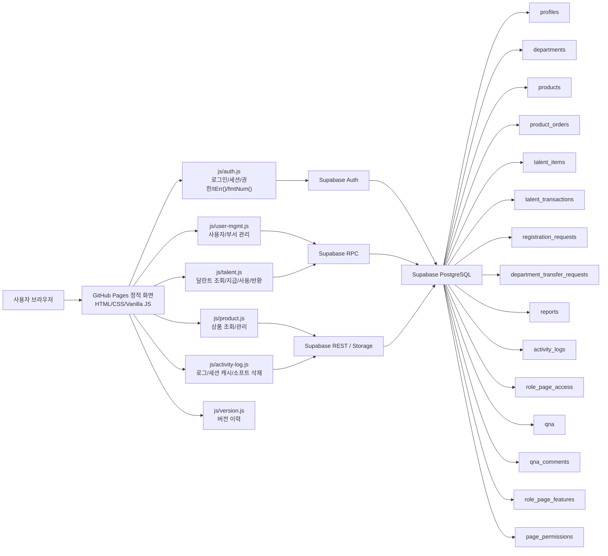

## 3. 폴더 및 파일 구성

| 경로 | 역할 |
|---|---|
| `index.html` | 메인 진입 화면. 학생 가이드, Q&A, 상점, 로그인, 적립 안내, 내 달란트로 이동. 동적 로그인/로그아웃 버튼 |
| `login.html` | 통합 로그인. 성공/실패 로그 기록. 승인 대기/거부 계정 구분 안내 |
| `register.html` | 계정 등록 신청. 영문/숫자/`_`/`-` 아이디 중복확인 후 승인 대기 등록 |
| `guide.html` | 학생 가이드. 사이트 이용 흐름을 카드/스텝 중심으로 안내 |
| `teacher-guide.html` | 교사 가이드. 일반 교사(40+) 이상만 접근 가능, 미만 시 학생 가이드로 리다이렉트 |
| `admin-guide.html` | 관리자 가이드. 부서 담당 교사(60+) 이상만 접근 가능, 미만 시 교사/학생 가이드로 리다이렉트 |
| `qna.html` | Q&A/FAQ. 공개 FAQ 조회, 관리자 FAQ 직접 등록, 로그인 사용자 질문/답변 등록, 60등급 이상 답변+FAQ 등록, 90등급 이상 삭제 |
| `earn-talents.html` | 달란트 적립 방법 안내. 항목 카드 그리드(모바일 3열, PC 5열) |
| `shop.html` | 상점 조회 + 구매 신청 + 대리 구매. 비로그인은 학생용, 교사는 교사용 기본 필터 |
| `my-talents.html` | 로그인 사용자 본인의 사용 가능 달란트/상품 수령 예정/사용 대기/사용 완료/누적 적립 달란트, 달란트 내역, 구매 내역 |
| `my-orders.html` | 로그인 사용자 본인의 구매 신청 내역과 4단계 상태 조회 |
| `admin/index.html` | 80등급 이상 대시보드. 사용자/부서/보고서/가입대기 요약. 미확인 ERROR+ 카드는 100등급 이상만 표시(클릭→로그). 바로가기에 달란트 통계/QR 관리 포함 |
| `admin/users.html` | 60등급 이상 사용자 관리. 교사/학생 그룹별 분리(학생은 권한 열 제거). 관리 드롭다운. 통계 카드 모바일 3개씩 반응형. 가입 신청/부서 이동 요청/승인 처리. 페이징(모바일 5개/PC 10개) |
| `admin/departments.html` | 60등급 이상 부서 관리. 관리 드롭다운(소속보기/수정/삭제). 부서별 인원(교사 전체 포함)/담당자 확인 |
| `admin/managers.html` | 80등급 이상 관리자 계열 권한 관리. 수정만 가능 |
| `admin/talents.html` | 40등급 이상 달란트 처리. 출석 버튼+관리 드롭다운(달란트 지급/상세). 잔여 달란트→달란트 명칭 변경. 사용/누적 달란트 모바일 숨김. 모바일 10/PC 20 페이징. 수동 적립은 100등급(관리자)만 표시 |
| `admin/talent-stats.html` | 60등급 이상 달란트 누적적립 통계. 라디오 이모지+칩 스타일. 부서별/사용자별: 달란트/항목 라벨, 비율 그래프. 부서별 상세: 전체 대비 비율 pct-bar. 사용자별 상세: 항목명→수령수→달란트→비율 순서, 비율 pct-bar. 라디오 필터, 부서 필터, 기간 프리셋 |
| `admin/talent-items.html` | 90등급 이상 달란트 지급 항목 관리. ⚡퀵 버튼 지정(유형별 1개) |
| `admin/talent-qr.html` | 90등급 이상 QR 코드 생성(qrcode.js 이미지)/수정(새 코드 재생성)/비활성화. 지급 대상(학생/교사) 구분, 유효기간 라디오(지정일/기간/무기한), 반복 수령(none/daily/weekday/week_weekday), 위치 제한(카카오맵 API, 반경 500m~5km, Geolocation 검증). 검색/필터(대상/조건), 날짜 from-to 범위 필터(초기값 오늘, 오늘/1주/1달/1년 프리셋) |
| `admin/shop.html` | 60등급 이상 상품 관리. 교사/학생 그룹별 분리+페이징(모바일 10/PC 20). 카테고리 열 맨 왼쪽, 대상 열 삭제. 관리 드롭다운(수정/삭제). 삭제는 소프트 삭제 |
| `admin/purchases.html` | 60등급 이상 구매 관리. 상태별 상품 합계+일괄 처리 버튼(일괄 준비/구매 확정). 관리 드롭다운. 부서/기간 필터(기본 오늘) + 기간 프리셋, 4단계 구매 흐름 + 되돌리기(↩) |
| `admin/reports.html` | 80등급 이상 보고서 조회/등록/수정/삭제 |
| `admin/logs.html` | 100등급 이상 로그 조회/확인/소프트 삭제 대기 처리. 기간 프리셋(오늘/1주/1달/1년) |
| `admin/versions.html` | 80등급 이상 버전 이력 확인 |
| `admin/page-access.html` | 100등급 이상 유형/권한별 페이지 접근/요소 가시성 설정 |
| `admin/page-features.html` | 100등급 이상 권한별 페이지 기능 설정값 관리 |
| `admin/audit.html` | 100등급 이상 관리 작업 이력 조회 (기간 프리셋(오늘/1주/1달/1년), 자동 조회, 카테고리별 필터) |
| `admin/page-permissions.html` | 100등급 페이지 권한 매트릭스 관리 (레거시, 직접 주소 접근) |
| `admin/change-password.html` | 로그인 사용자 비밀번호 변경 |
| `css/` | 메인(`style.css`), 공통(`common.css`), 관리자(`admin.css`) 스타일 |
| `js/` | Supabase 설정, 인증/tErr, 로그, 사용자/달란트/상품/버전 모듈 |
| `docs/` | 작업 기록, SQL 스키마, 구성 문서, 사용자 안내서 |

## 4. 권한 구조

현재 권한은 `permission_level`을 숫자 등급으로 환산해 비교한다. `user_type`은 학생/교사 구분이고, 실제 화면 접근은 `permission_level`이 결정한다.

| 권한 | 코드 | 등급 | 기본 이동 | 설명 |
|---|---|---:|---|---|
| 최고 관리자 | `admin` + `is_super_admin` | 110 | `index.html` | 관리자 포함 전체 사용자 관리, 시스템 설정, 보고서 초기화 |
| 관리자 | `admin` | 100 | `index.html` | 전체 운영 관리, 페이지 접근/기능/감사/로그 관리 |
| 전도사님 | `evangelist` | 90 | `index.html` | 달란트 항목/상품 삭제, 부서 즉시 이동, 전체 구매 처리 |
| 부장 교사 | `chief` | 80 | `index.html` | 대시보드, 부서, 관리자, 보고서, 버전, 달란트 반환 |
| 부서 담당 교사 | `dept_teacher` | 60 | `index.html` | 담당 부서 사용자/달란트/상품/구매/Q&A 관리 |
| 일반 교사 | `teacher` | 40 | `index.html` | 담당 부서/반 학생 달란트 처리, 대리 구매, 교사용/학생용 상점 |
| 학생 | `student` | 20 | `index.html` | 내 달란트, 내 구매 상품, Q&A 질문, 학생용 상점, 구매 신청 |
| 비로그인 | 없음 | 0 | 공개 페이지 | 메인, 학생 가이드, Q&A FAQ, 적립 안내, 학생용 상점, 계정 신청 |

권한 제어 기준:

| 기준 | 구현 위치 | 내용 |
|---|---|---|
| 페이지 진입 | `initPage(minRank, loginPath)` | 로그인, 최초 비밀번호 변경, 최소 등급을 확인 |
| 메뉴 노출 | `data-min-perm`, `applyPermNav()` | 현재 등급보다 높은 메뉴는 숨김 |
| 권한 비교 | `PERMISSION_RANK` | `super_admin:110`부터 `student:20`까지 숫자 비교 |
| 사용자 관리 | `admin_update_user`, `admin_delete_user` 등 RPC | 상위 권한자/최고관리자 보호 |
| 페이지 접근 | `role_page_access` | `initPage()`에서 보조 확인. 페이지 최소 등급을 통과한 뒤 요소 숨김 설정을 적용 |
| 페이지 기능 | `role_page_features` | 권한별 기능 설정값 관리 테이블. 현재 공통 런타임 차단은 `data-min-perm`, 직접 rank 체크, RLS/RPC가 담당 |
| 데이터 접근 | Supabase RLS | 익명/저권한 직접 조회 제한 |

## 5. 화면 연결 구조

```mermaid
flowchart TD
  Public["공개 영역"] --> Home["index.html"]
  Public --> Guide["guide.html"]
  Public --> QNA["qna.html"]
  Public --> Earn["earn-talents.html"]
  Public --> Shop["shop.html"]
  Public --> Login["login.html"]
  Public --> Register["register.html"]

  Home --> Guide
  Home --> QNA
  Home --> Earn
  Home --> Shop
  Home --> MyTalents["my-talents.html"]
  Home --> MyOrders["my-orders.html"]
  Login --> Password{"최초 로그인?"}
  Password -->|예| ChangePassword["admin/change-password.html"]
  Password -->|아니오| Home

  Home --> AdminDash["admin/index.html<br/>80+"]
  Home --> Users["admin/users.html<br/>60+"]
  Home --> Departments["admin/departments.html<br/>60+"]
  Home --> Managers["admin/managers.html<br/>80+"]
  Home --> Talents["admin/talents.html<br/>40+"]
  Home --> TalentItems["admin/talent-items.html<br/>90+"]
  Home --> AdminShop["admin/shop.html<br/>60+"]
  Home --> Purchases["admin/purchases.html<br/>60+"]
  Home --> Reports["admin/reports.html<br/>80+"]
  Home --> Versions["admin/versions.html<br/>80+"]
  Home --> PageAccess["admin/page-access.html<br/>100+"]
  Home --> PageFeatures["admin/page-features.html<br/>100+"]
  Home --> Audit["admin/audit.html<br/>100+"]
  Home --> Logs["admin/logs.html<br/>100+"]
  Home -.-> PagePerms["admin/page-permissions.html<br/>100+ 직접 주소 접근"]
```

## 6. 로그인 및 세션 흐름

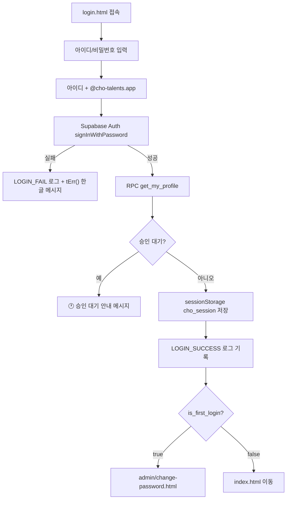

보호 페이지는 `initPage()`에서 다음 순서로 처리한다.

1. Supabase Auth 세션 확인
2. 프로필/권한 로드 (세션 캐시 활용)
3. 최초 로그인 상태면 비밀번호 변경 화면으로 이동
4. 최소 권한 미달이면 `index.html`로 이동
5. `role_page_access` 확인: 페이지 최소 등급 통과 후 보조 접근/요소 숨김 설정 적용
6. 통과 시 `auth-ready` 적용, 역할 배지/메뉴/페이지 데이터 로드

## 7. 신규 계정 신청 흐름

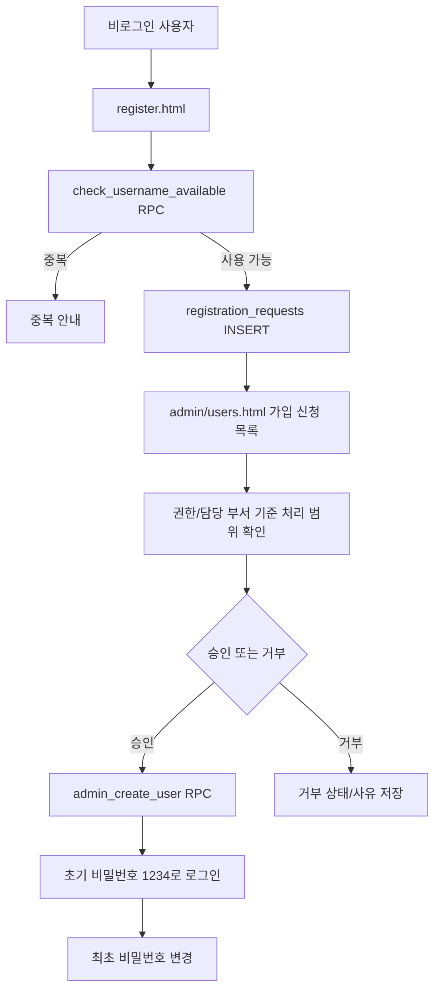

가입 신청 처리 권한:

| 권한 | 조회 | 처리 |
|---|---|---|
| 관리자/전도사님 | 전체 신청 | 전체 처리 |
| 부장 교사 | 전체 신청 | 담당 부서만 처리 |
| 부서 담당 교사 | 담당 부서만 | 담당 부서만 처리 |

## 8. 사용자/부서/관리자 관리 흐름

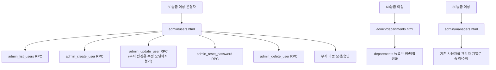

### 부서 이동 흐름

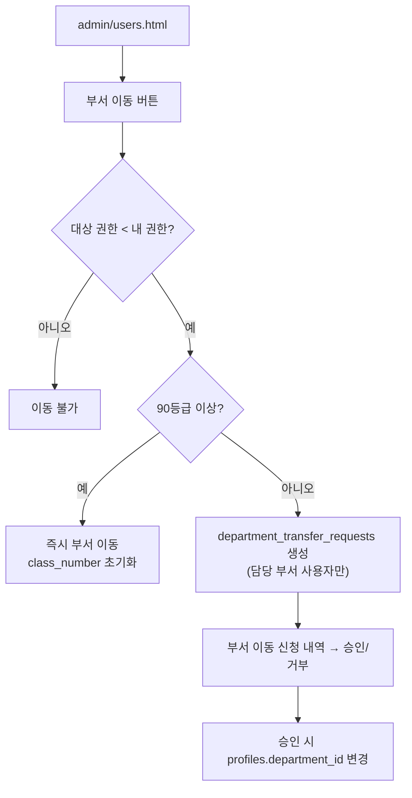

운영 제약:

| 항목 | 기준 |
|---|---|
| 사용자 등록/수정/삭제 | 본인보다 낮은 등급만 가능. 실제 검증은 RPC에서 수행 |
| 아이디 표시 | 관리자에게만 전체 노출. 그 외에는 본인 아이디만 표시 |
| 동명이인 | 같은 이름/유형/부서면 `①`, `②` 번호를 붙여 구분 표시 |
| 최고관리자 | `is_super_admin` 사용자는 삭제/수정 보호 |
| 담당 부서 | 관리 권한 계열은 담당 관리 부서를 지정할 수 있음 |
| 부서 스코핑 | 90등급 미만은 담당 부서 사용자만 조회. 담당 부서 없으면 빈 목록 |

## 9. 달란트 처리 흐름

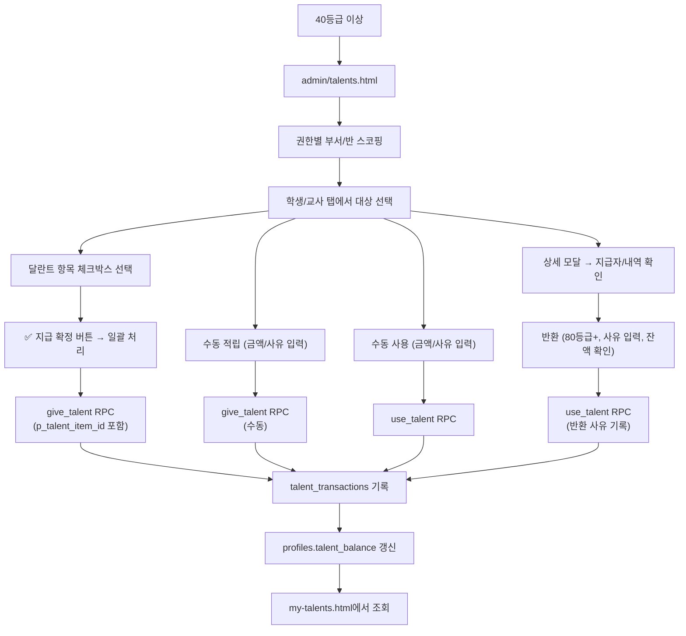

달란트 지급 규칙:

| 항목 | 내용 |
|---|---|
| 지급 방식 | 체크박스 선택 + 일괄 확정 |
| 출석 버튼 | 테이블 각 행에 '출석' 버튼 → 클릭 즉시 출석 달란트 지급 (당일 중복 방지) |
| 이미 지급된 항목 | 오늘/이번 주 지급 여부 자동 표시 |
| 반환 | 80등급(부장 교사) 이상, 사유 필수, 잔여 > 0일 때만 |
| 지급자 기록 | `created_by` 필드에 지급자 ID 저장, 상세 모달에서 확인 |
| 에러 처리 | RPC 성공/실패/거부 모두 activity_logs에 기록 |

## 10. 상품 및 구매 흐름

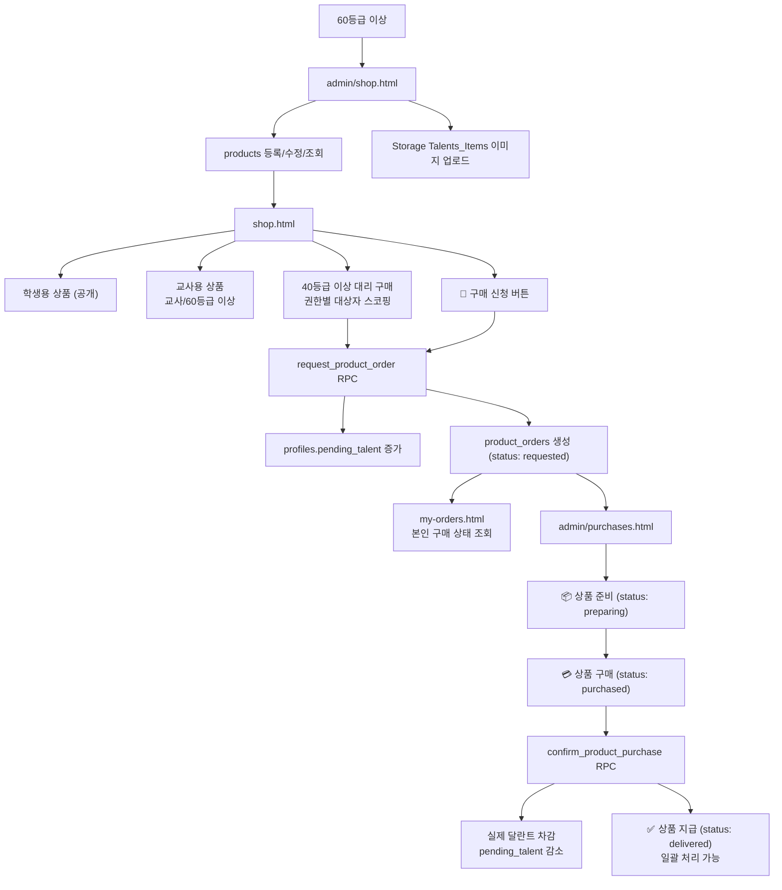

구매 관리 권한:

| 권한 | 조회 범위 | 처리 범위 |
|---|---|---|
| 부서 담당 교사 | 담당 부서 신청 | 담당 부서 신청의 준비/구매 확정/지급 처리 |
| 부장 교사 | 전체 신청 | 담당 관리 부서 신청 처리 |
| 전도사님 이상 | 전체 신청 | 전체 처리 가능 |

상품 정책:

| 항목 | 기준 |
|---|---|
| 학생용 상품 | 비로그인도 조회 가능 |
| 교사용 상품 | 로그인한 교사 또는 60등급 이상만 조회 |
| 교사 기본 필터 | 교사 접속 시 교사용 탭 자동 선택 |
| 상품 등록/수정 | 60등급 이상 |
| 상품 삭제 | 90등급 이상. 소프트 삭제(삭제 대기=비활성화) - 목록에서 숨김 |
| 구매 신청 | 로그인 사용자 (잔여 달란트 확인) |
| 대리 구매 | 40등급 이상. 권한별 부서/반/사용자 범위 제한 |

## 11. 보고서 및 로그 흐름

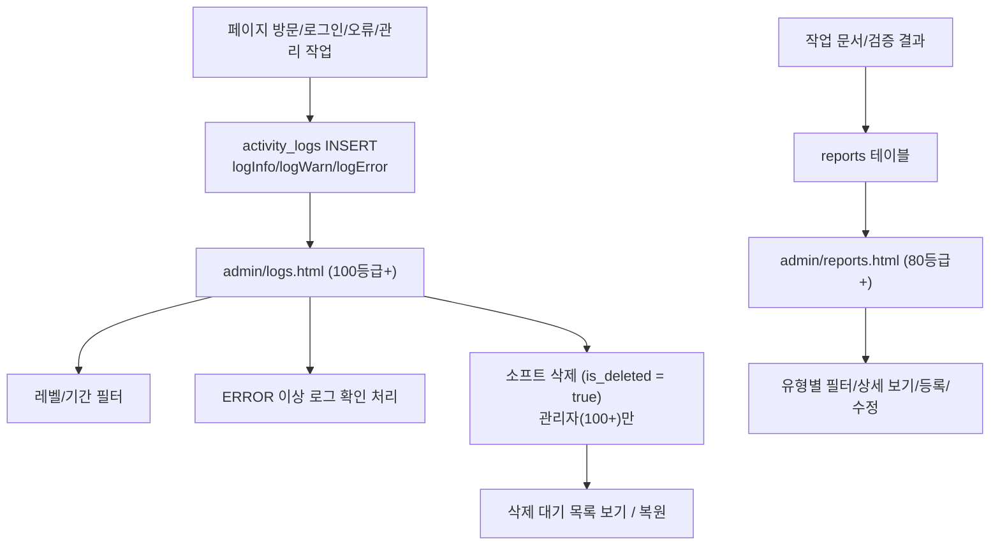

로그 레벨: `TRACE`, `DEBUG`, `INFO`, `WARN`, `ERROR`, `FATAL`, `CRITICAL`

- `ERROR`, `FATAL`, `CRITICAL`은 기본적으로 미확인 상태로 저장
- 운영자가 확인 내용을 남기면 확인 처리
- 로그 삭제는 소프트 삭제(`is_deleted=true`) 방식
- 실제 삭제는 관리자가 SQL Editor에서 직접 실행: `DELETE FROM activity_logs WHERE is_deleted = true;`
- 전체 기능의 성공/실패/거부가 `logInfo`/`logWarn`/`logError`로 기록됨

## 12. 작업 이력(감사) 흐름

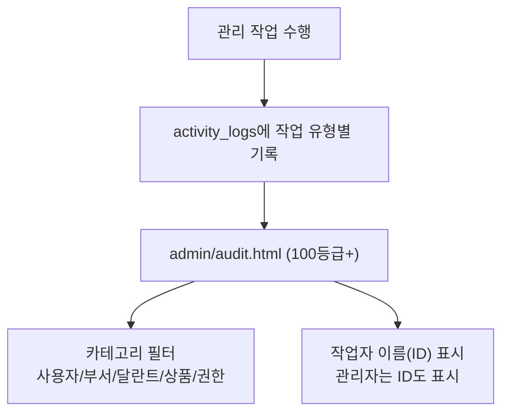

## 13. 에러 처리 흐름

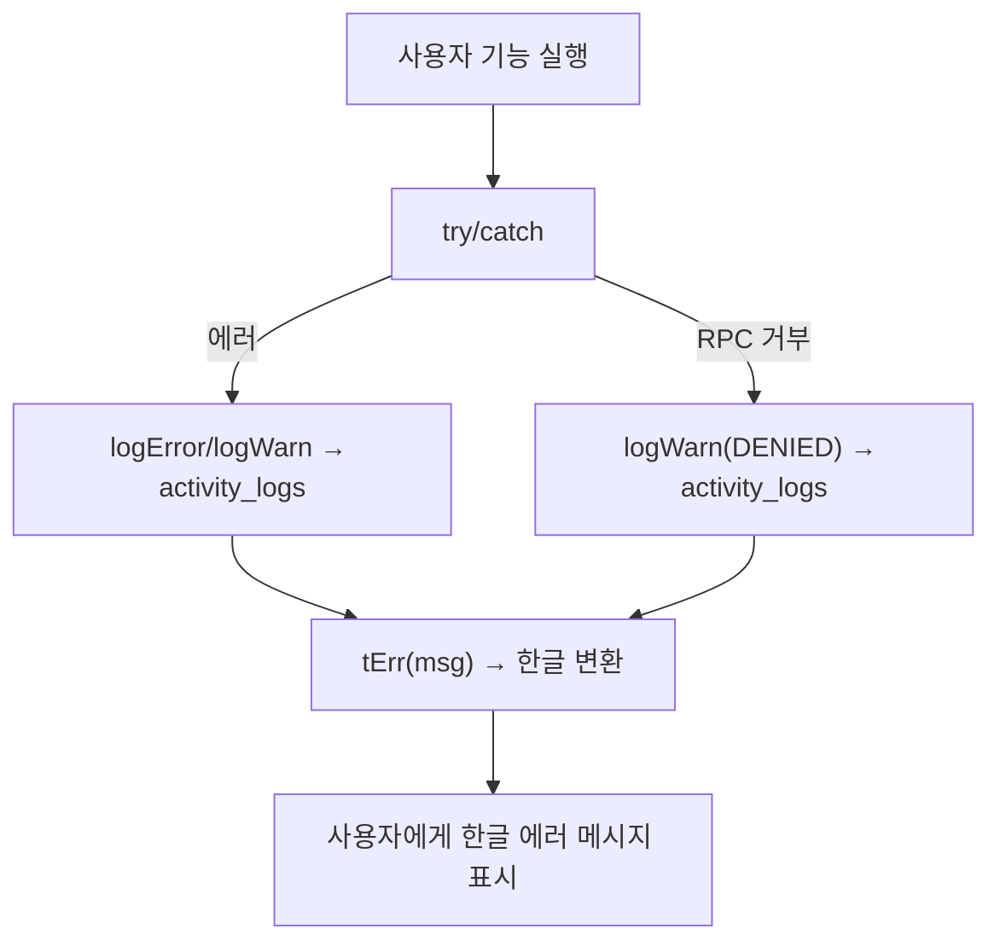

`tErr()` 함수는 25개 이상의 정규식 패턴으로 영문 DB/RPC 에러를 한글로 변환한다. 이미 한글인 메시지는 그대로 반환한다.

## 14. 주요 Supabase 리소스

| 리소스 | 용도 |
|---|---|
| `profiles` | 사용자 유형, 권한, 부서, 반, 달란트 잔액, 사용 대기 달란트(`pending_talent`) |
| `departments` | 부서명, 설명, 반 개수, 활성 상태 |
| `registration_requests` | 가입 신청/승인/거부 |
| `department_transfer_requests` | 부서 이동 요청/승인/거부 |
| `talent_items` | 달란트 지급 항목 (학생용/교사용 구분) |
| `talent_transactions` | 달란트 적립/사용/반환 내역. `created_by`로 지급자 추적 |
| `products` | 상점 상품 (학생용/교사용 구분) |
| `product_orders` | 구매 신청/4단계 상태 관리/담당자 기록 |
| `qna` | FAQ, 사용자 질문, 답변, 공개 여부, 소프트 삭제 |
| `qna_comments` | Q&A 질문별 댓글(답변) 스레드 |
| `reports` | 작업 보고서 |
| `talent_qr_codes` | QR 코드 생성/관리. `target_type`(학생/교사), `valid_from`/`valid_until` 기간, `max_uses` (0=무제한, N=선착순), `location_*` 위치 제한, `repeat_type`(none/daily/weekday/week_weekday), `repeat_days` INT[], `repeat_weeks` INT[] |
| `talent_qr_scans` | QR 코드 스캔 이력. 반복 수령 시 오늘 기준 중복 체크 |
| `activity_logs` | 활동/오류 로그. `is_deleted`/`deleted_at` 소프트 삭제, `user_name` 기록 |
| `role_page_access` | 권한 등급별 페이지 접근/요소 가시성 설정 |
| `role_page_features` | 권한 등급별 페이지 기능 설정값 |
| `page_permissions` | 페이지 권한 설정 (레거시) |
| `Talents_Items` | 상품 이미지 Storage 버킷 |

## 15. 주요 RPC

| RPC | 목적 |
|---|---|
| `get_my_profile` | 로그인 사용자 프로필/권한 조회 |
| `check_username_available` | 가입 신청 아이디 중복확인 |
| `check_registration_status` | 미승인/거부 계정 로그인 안내 조회 |
| `admin_list_users` | 사용자 목록 조회 |
| `admin_create_user` | Auth 사용자와 profile 생성 |
| `admin_update_user` | 사용자 정보/권한 수정 |
| `admin_delete_user` | 사용자 삭제 |
| `admin_reset_password` | 비밀번호 `1234` 초기화 |
| `change_my_password` | 본인 비밀번호 변경 및 최초 로그인 해제 |
| `give_talent` | 달란트 적립. 수동 지급과 `p_talent_item_id` 기반 항목 지급에 사용 |
| `use_talent` | 달란트 사용 및 반환 사유 기록 |
| `request_product_order` | 상품 구매 신청 (사용 대기 달란트 관리) |
| `confirm_product_purchase` | 상품 구매 확정 (실제 달란트 차감) |

## 16. 빠른 검증 체크리스트

1. `login.html`에서 로그인 성공/실패 메시지가 한글로 표시되는지 확인한다.
2. 승인 대기 계정 로그인 시 "승인 대기 중" 안내가 구분 표시되는지 확인한다.
3. 최초 로그인 사용자가 `admin/change-password.html`로 강제 이동하는지 확인한다.
4. 일반 로그인 성공 후 `index.html`로 이동하고 권한별 메뉴만 표시되는지 확인한다.
5. 비로그인 상태에서 `my-talents.html`이 로그인으로 이동하는지 확인한다.
6. 비로그인 `shop.html`에서 학생용 상품만 조회되는지 확인한다.
7. 교사 로그인 후 `shop.html`에서 교사용 탭이 기본 선택되는지 확인한다.
8. 40등급 이상 대리 구매 대상자 목록이 권한 범위 안에서만 표시되는지 확인한다.
9. 상품 구매 신청 시 `pending_talent`이 증가하고 달란트가 즉시 차감되지 않는지 확인한다.
10. `my-orders.html`에서 본인 구매 신청 상태만 조회되는지 확인한다.
11. `admin/purchases.html`에서 4단계 구매 흐름이 정상 작동하는지 확인한다.
12. 40등급 이상이 `admin/talents.html`에서 체크박스 일괄 지급이 되는지 확인한다.
13. 80등급 이상만 달란트 반환이 가능한지 확인한다.
14. 부서 이동이 수정 모달이 아닌 부서 이동 버튼으로만 되는지 확인한다.
15. 60등급 이상이 `admin/users.html`, `admin/shop.html`, `admin/purchases.html`을 사용할 수 있는지 확인한다.
16. 80등급 이상이 대시보드, 관리자, 보고서, 버전 화면을 사용할 수 있는지 확인한다.
17. 100등급 이상만 `admin/page-access.html`, `admin/page-features.html`, `admin/audit.html`, `admin/logs.html`에 접근 가능한지 확인한다.
18. `qna.html`에서 공개 FAQ, 로그인 질문 등록, 60등급 이상 댓글(답변)/FAQ 등록/직접 FAQ 추가, 90등급 이상 삭제가 동작하는지 확인한다.
19. 아이디가 관리자에게만 표시되고 일반 사용자는 본인 것만 보이는지 확인한다.
20. 에러 메시지가 한글로 변환되어 표시되는지 확인한다.
21. 주요 기능의 성공/실패/거부가 활동 로그에 기록되는지 확인한다.

## 17. 다음 작업자가 먼저 볼 파일

| 우선순위 | 파일 | 이유 |
|---:|---|---|
| 1 | `README.md` | 현재 구조, 페이지 연결, 권한, 운영 흐름 요약 |
| 2 | `docs/PROJECT_ARCHITECTURE_FLOW.md` | 상세 구성도와 프로세스 흐름 |
| 3 | `js/auth.js` | 권한 등급, 리디렉트, 세션, tErr() 에러 번역 |
| 4 | `js/activity-log.js` | 로그 기록, 세션 캐시, 소프트 삭제 |
| 5 | `js/user-mgmt.js` | 사용자/부서 관리 RPC |
| 6 | `js/talent.js` | 달란트 지급/사용/반환 |
| 7 | `js/product.js` | 상품 조회/관리 |
| 8 | `admin/*.html` | 각 관리 화면의 실제 접근 권한과 UI 동작 |
| 9 | `docs/TASK-026_schema.sql` | 구매 시스템 DB 스키마 및 RPC |
| 10 | `docs/TASK-032_fixes.sql` | Q&A 테이블/RLS와 미승인 로그인 안내 RPC |
| 11 | `docs/TASK-035_qna_comments.sql` | Q&A 댓글 테이블/RLS 및 삭제 권한 수정 |
