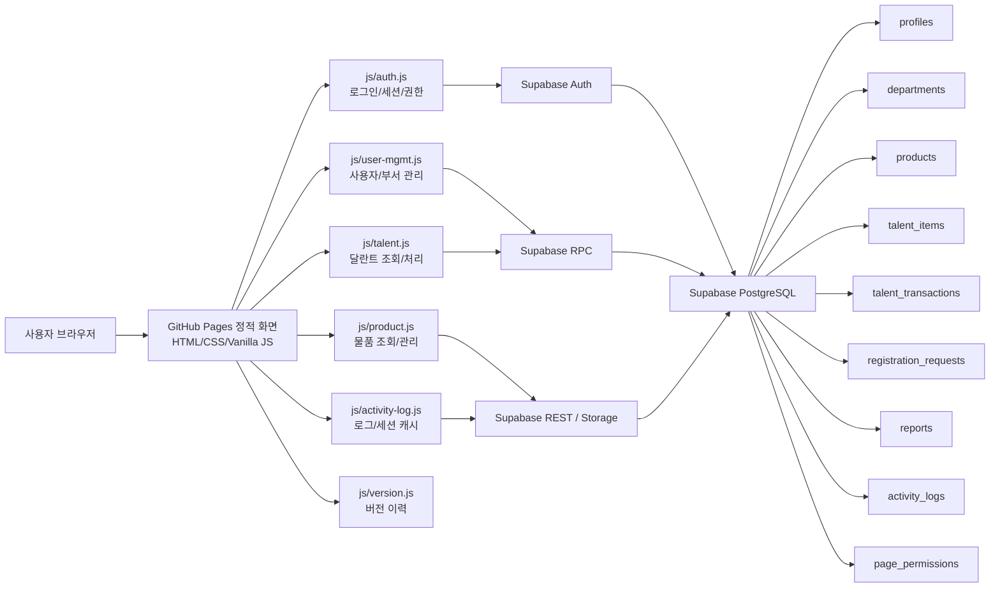
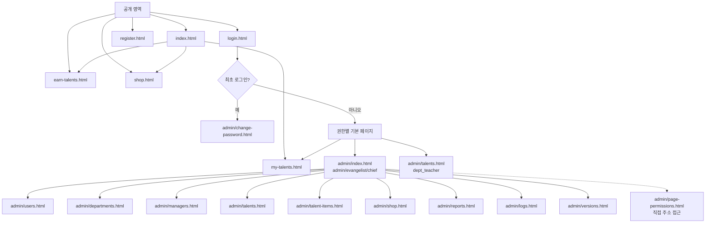
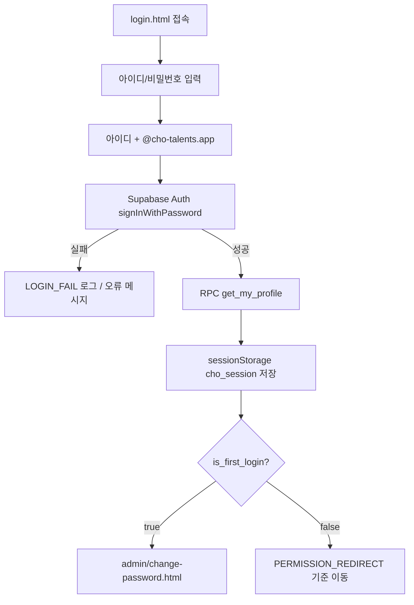
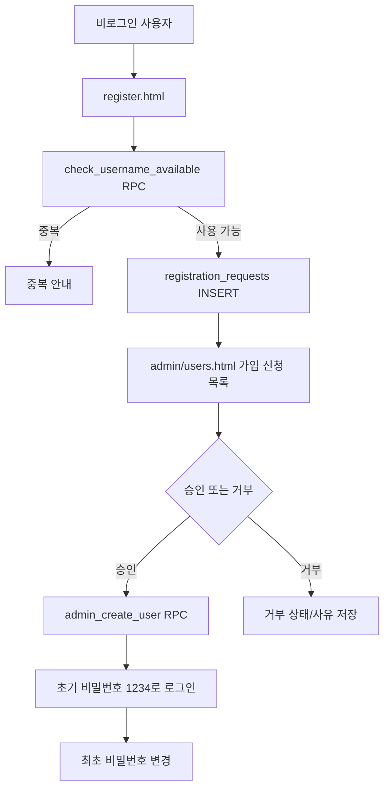
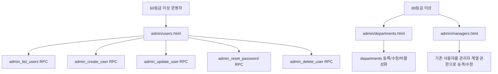
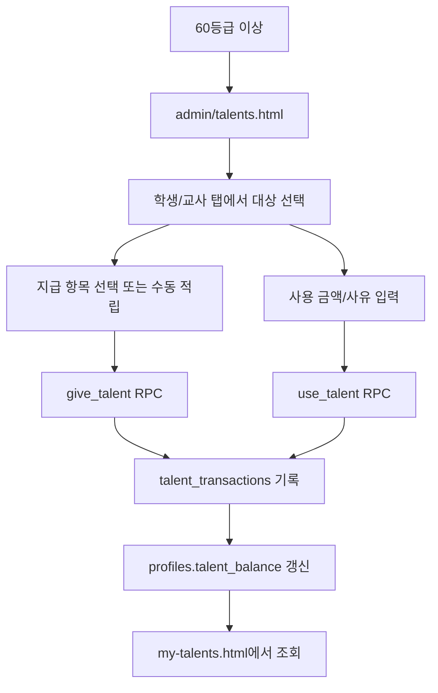
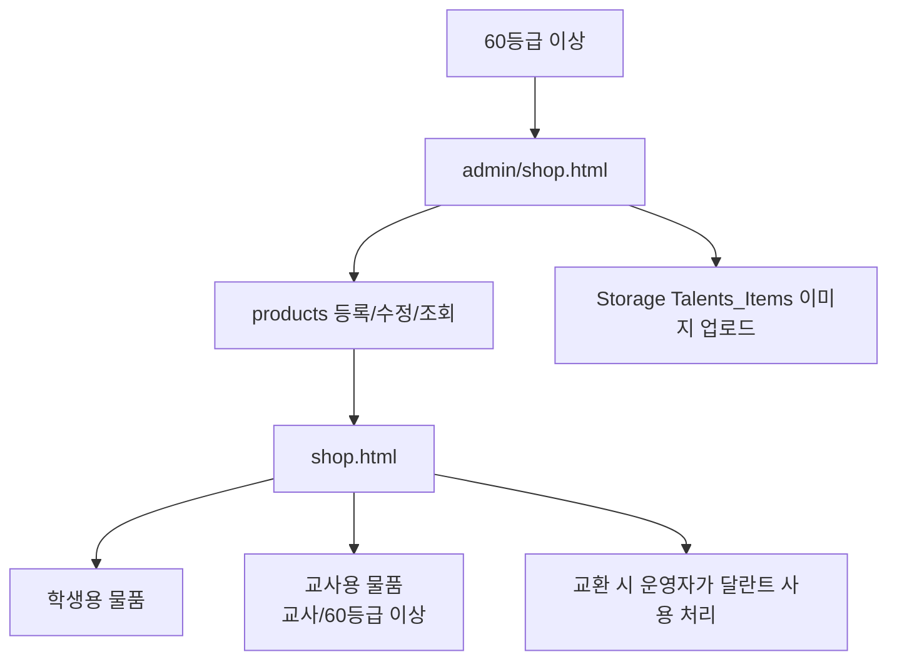
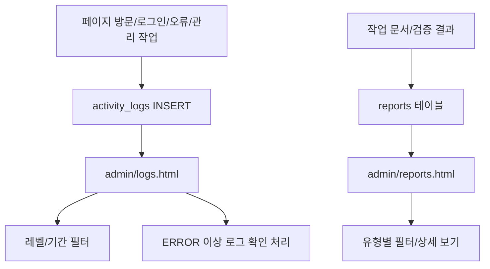

# CHO-Talents 프로젝트 구성도 및 프로세스 흐름도

작성 기준: 2026-05-27 KST 현재 코드 기준
대상 배포: https://cho-talents.github.io/CHO-Talents/  
문서 목적: 다음 검토자가 프로젝트 목적, 화면 구성, 권한 구조, 주요 데이터 흐름, 검증 지점을 빠르게 파악하도록 한다.

## 1. 프로젝트 목적

CHO-Talents는 초등부 달란트 운영을 위한 정적 웹 기반 관리 시스템이다. 학생과 교사는 본인의 달란트 잔액과 상점 물품을 확인하고, 부서 담당 교사 이상 운영자는 사용자, 부서, 물품, 달란트 지급/사용, 보고서, 로그를 관리한다.

| 목적 | 설명 |
|---|---|
| 역할별 화면 분리 | 사용자 권한에 따라 필요한 메뉴와 화면만 표시한다. |
| 달란트 운영 관리 | 적립/사용 내역과 잔액을 `profiles`, `talent_transactions` 중심으로 관리한다. |
| 상품 교환 구조 | 학생용/교사용 상품을 구분해 조회하고 운영자가 교환 처리를 한다. |
| 승인 기반 계정 운영 | 신규 사용자는 신청 후 관리자 승인으로 계정이 생성된다. |
| 운영 추적 | 페이지 방문, 오류, 관리 작업을 로그로 남기고 오류 로그를 확인 처리한다. |
| 보안 강화 | Supabase Auth, RLS, SECURITY DEFINER RPC로 민감 데이터 접근을 제한한다. |

## 2. 전체 시스템 구성

## 3. 폴더 및 파일 구성

| 경로 | 역할 |
|---|---|
| `index.html` | 메인 진입 화면. 상점, 로그인, 적립 안내, 내 달란트로 이동 |
| `login.html` | 통합 로그인. 모든 사용자가 같은 화면에서 로그인 |
| `register.html` | 계정 등록 신청. 아이디 중복확인 후 승인 대기 등록 |
| `earn-talents.html` | 달란트 적립 방법 안내 |
| `shop.html` | 상점 조회. 비로그인은 학생용, 교사/운영자는 추가 탭 표시 |
| `my-talents.html` | 로그인 사용자 본인의 달란트 요약/내역 |
| `admin/index.html` | 80등급 이상 대시보드 |
| `admin/users.html` | 60등급 이상 사용자 관리. 가입 신청 처리는 80등급 이상 |
| `admin/departments.html` | 80등급 이상 부서 관리 |
| `admin/managers.html` | 80등급 이상 관리자 계열 권한 관리 |
| `admin/talents.html` | 60등급 이상 학생/교사 달란트 처리 |
| `admin/talent-items.html` | 90등급 이상 달란트 지급 항목 관리 |
| `admin/shop.html` | 60등급 이상 물품 관리 |
| `admin/reports.html` | 80등급 이상 보고서 조회 |
| `admin/logs.html` | 80등급 이상 로그 조회 및 확인 처리 |
| `admin/versions.html` | 80등급 이상 버전 이력 확인 |
| `admin/page-permissions.html` | 100등급 페이지 권한 매트릭스 관리. 상단 메뉴에는 노출되지 않으며 직접 주소로 접근 |
| `admin/change-password.html` | 로그인 사용자 비밀번호 변경 |
| `css/` | 메인, 공통, 관리자 스타일 |
| `js/` | Supabase 설정, 인증, 로그, 사용자/달란트/물품/버전 모듈 |
| `docs/` | 작업 기록, SQL, 구성 문서, 사용자 안내서 |

## 4. 권한 구조

현재 권한은 `permission_level`을 숫자 등급으로 환산해 비교한다. `user_type`은 학생/교사 구분이고, 실제 화면 접근은 `permission_level`이 결정한다.

| 권한 | 코드 | 등급 | 기본 이동 | 설명 |
|---|---|---:|---|---|
| 관리자 | `admin` | 100 | `admin/index.html` | 전체 운영 관리, 페이지 권한 관리 |
| 전도사님 | `evangelist` | 90 | `admin/index.html` | 관리자 계열 운영, 달란트 항목/물품 삭제 가능 |
| 부장 | `chief` | 80 | `admin/index.html` | 대시보드, 부서, 관리자, 보고서, 로그, 버전 관리 |
| 부서 담당 교사 | `dept_teacher` | 60 | `admin/talents.html` | 사용자/달란트/물품 관리 |
| 일반 교사 | `teacher` | 40 | `my-talents.html` | 내 달란트, 교사용/학생용 상점 조회 |
| 학생 | `student` | 20 | `my-talents.html` | 내 달란트, 학생용 상점 조회 |
| 비로그인 | 없음 | 0 | 공개 페이지 | 메인, 적립 안내, 학생용 상점, 계정 신청 |

권한 제어 기준:

| 기준 | 구현 위치 | 내용 |
|---|---|---|
| 페이지 진입 | `initPage(minRank, loginPath)` | 로그인, 최초 비밀번호 변경, 최소 등급을 확인 |
| 메뉴 노출 | `data-min-perm`, `applyPermNav()` | 현재 등급보다 높은 메뉴는 숨김 |
| 권한 비교 | `PERMISSION_RANK` | `admin:100`부터 `student:20`까지 숫자 비교 |
| 사용자 관리 | `admin_update_user`, `admin_delete_user` 등 RPC | 상위 권한자/최고관리자 보호 |
| 데이터 접근 | Supabase RLS | 익명/저권한 직접 조회 제한 |

## 5. 화면 연결 구조

## 6. 로그인 및 세션 흐름

보호 페이지는 `initPage()`에서 다음 순서로 처리한다.

1. Supabase Auth 세션 확인
2. 프로필/권한 로드
3. 최초 로그인 상태면 비밀번호 변경 화면으로 이동
4. 최소 권한 미달이면 본인 권한 기본 화면으로 이동
5. 통과 시 `auth-ready` 적용, 역할 배지/메뉴/페이지 데이터 로드

## 7. 신규 계정 신청 흐름

## 8. 사용자/부서/관리자 관리 흐름

운영 제약:

| 항목 | 기준 |
|---|---|
| 사용자 등록/수정 | 본인 이하 등급 중심으로 가능. 실제 검증은 RPC에서 수행 |
| 아이디 표시 | 관리자에게만 아이디 노출. 그 외에는 이름 중심 표시 |
| 동명이인 | 같은 이름/유형/부서면 `①`, `②` 번호를 붙여 표시 |
| 최고관리자 | `is_super_admin` 사용자는 삭제/수정 보호 |
| 담당 부서 | 관리 권한 계열은 담당 관리 부서를 지정할 수 있음 |

## 9. 달란트 처리 흐름

`admin/talent-items.html`에서는 90등급 이상이 학생용/교사용 달란트 지급 항목을 관리한다.

## 10. 물품 및 상점 흐름

정책:

| 항목 | 기준 |
|---|---|
| 학생용 물품 | 비로그인도 조회 가능 |
| 교사용 물품 | 로그인한 교사 또는 60등급 이상만 조회 |
| 물품 등록/수정 | 60등급 이상 |
| 물품 삭제 | 90등급 이상 |
| 실제 구매 처리 | 상점에는 구매 버튼이 없고, 운영자가 달란트 사용으로 처리 |

## 11. 보고서 및 로그 흐름

로그 레벨은 `TRACE`, `DEBUG`, `INFO`, `WARN`, `ERROR`, `FATAL`, `CRITICAL`을 사용한다. `ERROR`, `FATAL`, `CRITICAL`은 기본적으로 미확인 상태로 저장되고 운영자가 확인 내용을 남긴다.

## 12. 주요 Supabase 리소스

| 리소스 | 용도 |
|---|---|
| `profiles` | 사용자 유형, 권한, 부서, 달란트 잔액 |
| `departments` | 부서명, 설명, 반 개수, 활성 상태 |
| `registration_requests` | 가입 신청/승인/거부 |
| `talent_items` | 달란트 지급 항목 |
| `talent_transactions` | 달란트 적립/사용 내역 |
| `products` | 상점 물품 |
| `reports` | 작업 보고서 |
| `activity_logs` | 활동/오류 로그 |
| `page_permissions` | 페이지 권한 설정 |
| `Talents_Items` | 물품 이미지 Storage 버킷 |

## 13. 주요 RPC

| RPC | 목적 |
|---|---|
| `get_my_profile` | 로그인 사용자 프로필/권한 조회 |
| `check_username_available` | 가입 신청 아이디 중복확인 |
| `admin_list_users` | 사용자 목록 조회 |
| `admin_create_user` | Auth 사용자와 profile 생성 |
| `admin_update_user` | 사용자 정보/권한 수정 |
| `admin_delete_user` | 사용자 삭제 |
| `admin_reset_password` | 비밀번호 `1234` 초기화 |
| `change_my_password` | 본인 비밀번호 변경 및 최초 로그인 해제 |
| `give_talent` | 달란트 적립 |
| `use_talent` | 달란트 사용 |

## 14. 빠른 검증 체크리스트

1. `login.html`에서 로그인 성공/실패 메시지가 정상인지 확인한다.
2. 최초 로그인 사용자가 `admin/change-password.html`로 강제 이동하는지 확인한다.
3. 권한이 부족한 페이지 직접 접근 시 본인 기본 화면으로 이동하는지 확인한다.
4. 비로그인 상태에서 `my-talents.html`이 로그인으로 이동하는지 확인한다.
5. 비로그인 `shop.html`에서 학생용 물품만 조회되는지 확인한다.
6. 교사 로그인 후 `shop.html`에서 교사용 탭이 보이는지 확인한다.
7. 60등급 이상이 `admin/users.html`, `admin/talents.html`, `admin/shop.html`을 사용할 수 있는지 확인한다.
8. 80등급 이상이 대시보드, 부서, 관리자, 보고서, 로그, 버전 화면을 사용할 수 있는지 확인한다.
9. 90등급 이상만 `admin/talent-items.html`과 물품 삭제 버튼을 사용할 수 있는지 확인한다.
10. 100등급만 `admin/page-permissions.html`에 접근 가능한지 확인한다.
11. 오류 로그가 `admin/logs.html`에서 확인 처리되는지 확인한다.

## 15. 다음 작업자가 먼저 볼 파일

| 우선순위 | 파일 | 이유 |
|---:|---|---|
| 1 | `README.md` | 현재 구조, 페이지 연결, 권한, 운영 흐름 요약 |
| 2 | `docs/PROJECT_ARCHITECTURE_FLOW.md` | 상세 구성도와 프로세스 흐름 |
| 3 | `js/auth.js` | 권한 등급, 리디렉트, 세션, 비밀번호 정책 |
| 4 | `js/activity-log.js` | 로그 기록, 세션 캐시, 페이지뷰 |
| 5 | `js/user-mgmt.js` | 사용자/부서 관리 RPC |
| 6 | `js/talent.js` | 달란트 조회/처리 |
| 7 | `js/product.js` | 물품 조회/관리 |
| 8 | `admin/*.html` | 각 관리 화면의 실제 접근 권한과 UI 동작 |
