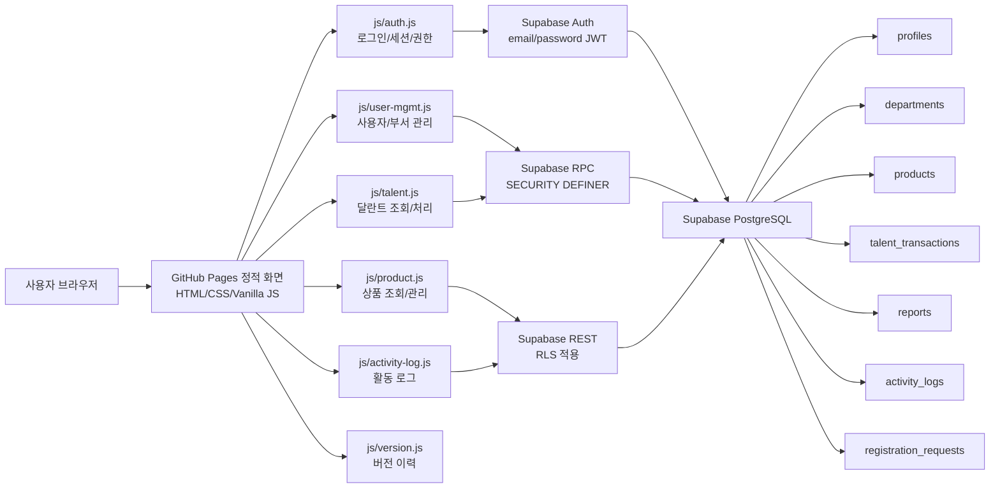
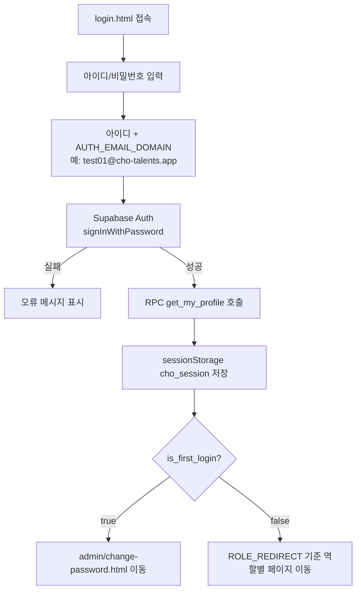
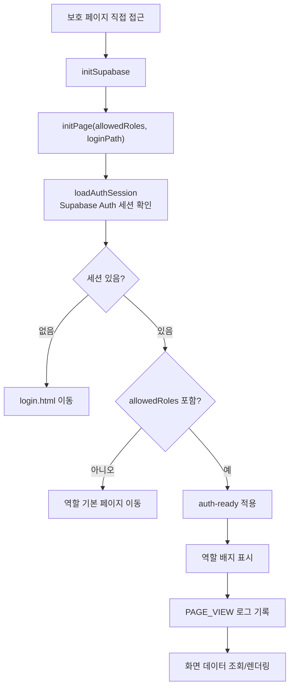
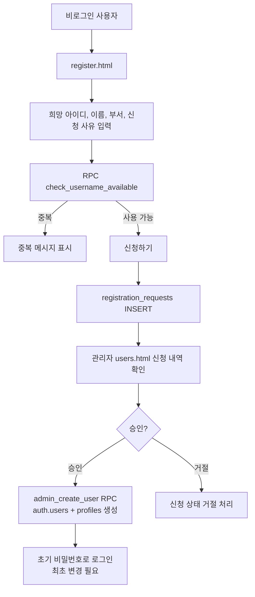
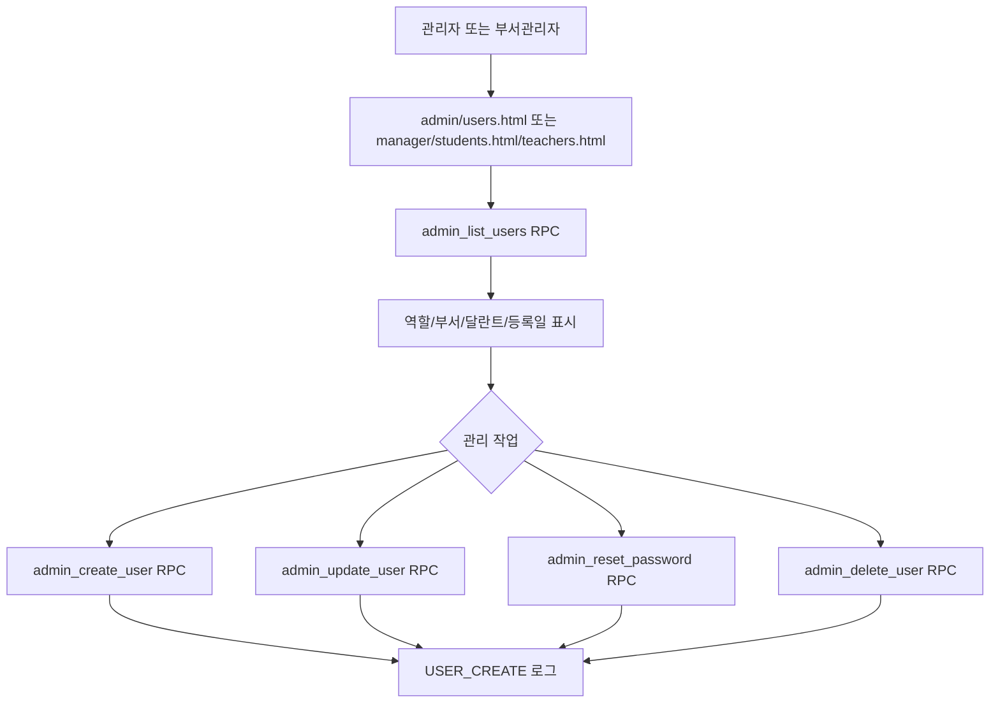
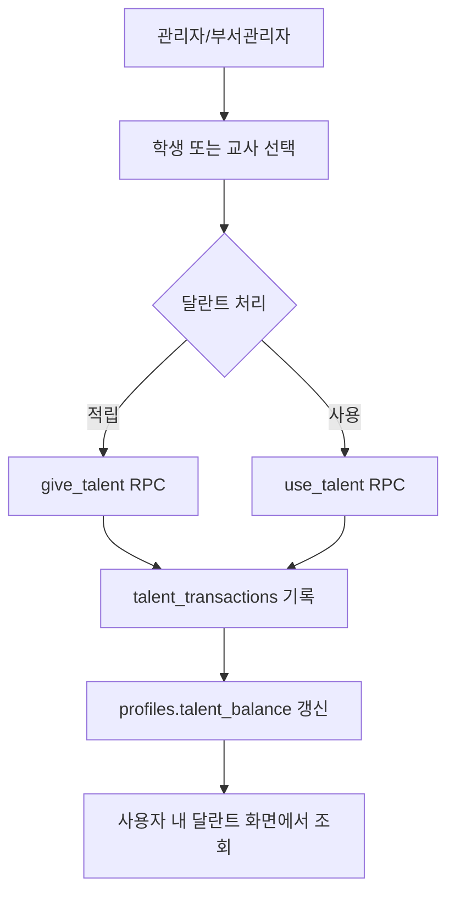
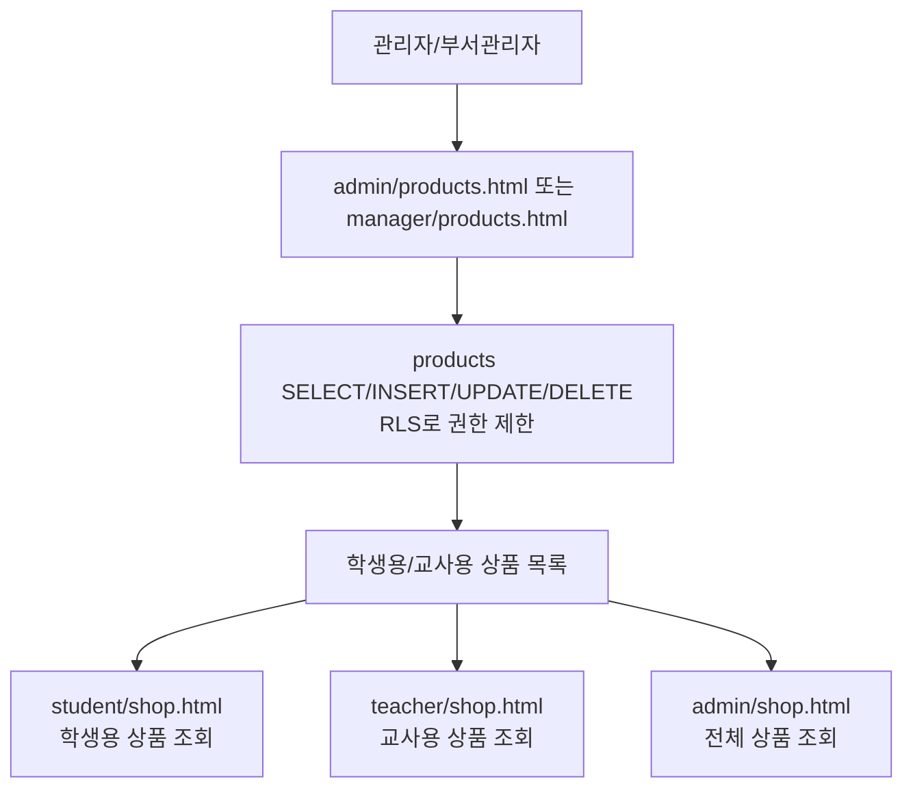
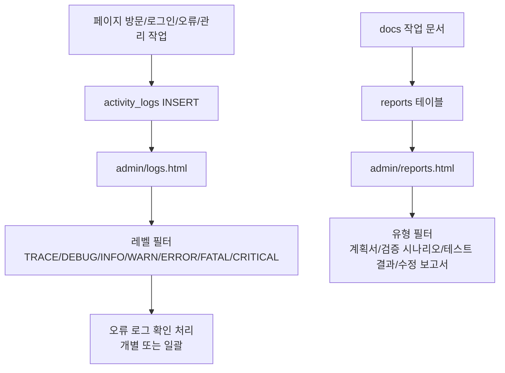
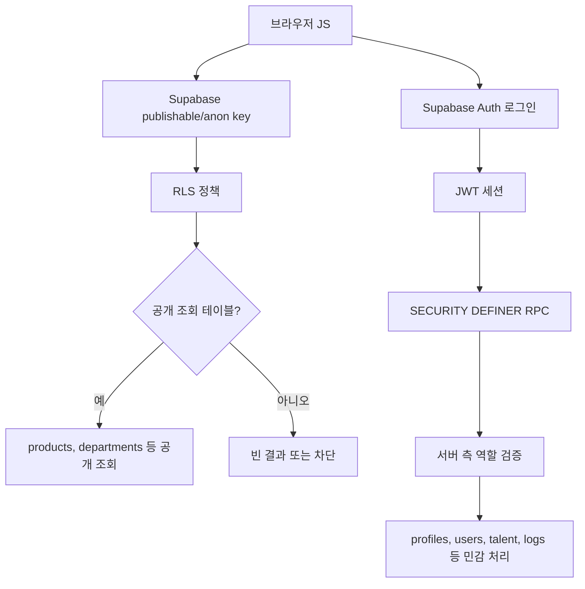

# CHO-Talents 프로젝트 구성도 및 프로세스 흐름도

작성 기준: 2026-05-26 KST 검증 결과  
대상 배포: https://cho-talents.github.io/CHO-Talents/  
문서 목적: 다음 검토자가 이 문서만 먼저 읽어도 프로젝트 목적, 화면 구성, 권한 구조, 주요 데이터 흐름, 검증 시 주의할 지점을 빠르게 파악하도록 한다.

## 1. 프로젝트 목적

CHO-Talents는 초등부 달란트 운영을 위한 정적 웹 기반 관리 시스템이다. 학생과 교사는 달란트 잔액과 상점 상품을 확인하고, 부서관리자와 관리자는 사용자, 부서, 상품, 달란트 지급/사용, 보고서, 로그를 관리한다.

핵심 개발 목적은 다음과 같다.

| 목적 | 설명 |
|---|---|
| 역할별 서비스 분리 | 관리자, 부서관리자, 교사, 학생이 각자 필요한 화면만 사용한다. |
| 달란트 운영 관리 | 사용자의 달란트 적립/사용 내역과 잔액을 관리한다. |
| 상품 교환 구조 | 학생용/교사용 상품을 구분해 조회하고 관리한다. |
| 승인 기반 계정 운영 | 신규 계정 신청 후 관리자 승인 흐름으로 운영한다. |
| 보안 강화 | Supabase Auth, JWT, RLS, SECURITY DEFINER RPC 기반으로 민감 데이터 직접 접근을 막는다. |
| 운영 추적 | 활동 로그와 보고서 화면으로 운영 상태를 확인한다. |

## 2. 전체 시스템 구성도

## 3. 폴더 및 파일 구성

| 경로 | 역할 |
|---|---|
| `index.html` | 메인 진입 화면. 상점/로그인 등 공개 진입점 제공 |
| `login.html` | 통합 로그인 화면. 모든 역할이 이 화면으로 로그인 |
| `register.html` | 계정 등록 신청 화면. 부서 선택 및 아이디 중복확인 |
| `earn-talents.html` | 달란트 적립 안내 공개 화면 |
| `admin/` | 관리자 전용 화면 묶음 |
| `manager/` | 부서관리자 중심 화면 묶음 |
| `teacher/` | 교사 전용 상점/내 달란트 화면 |
| `student/` | 학생 상점/내 달란트 화면 |
| `css/common.css` | 전체 공통 스타일 |
| `css/admin.css` | 관리자/부서관리자 계열 화면 스타일 |
| `js/supabase-config.js` | Supabase URL, anon key, Auth 도메인, 공통 유틸 |
| `js/auth.js` | 로그인, 로그아웃, 세션 로드, 권한 체크, 비밀번호 변경 |
| `js/activity-log.js` | 로그 기록/조회, 세션 캐시, 페이지뷰 기록 |
| `js/user-mgmt.js` | 사용자/부서 관리. 사용자 CRUD는 RPC 기반 |
| `js/talent.js` | 달란트 잔액/거래 내역/지급/사용 처리 |
| `js/product.js` | 상품 조회/등록/수정/삭제 |
| `js/version.js` | 화면에 표시되는 버전 이력 데이터 |
| `docs/` | 작업 계획, 변경 보고서, 테스트 결과, 본 구성 문서 |

## 4. 권한 및 기본 이동 경로

통합 로그인 후 `js/auth.js`의 `ROLE_REDIRECT` 기준으로 역할별 기본 페이지가 결정된다.

| 권한 | 역할 코드 | 기본 이동 | 주요 기능 |
|---|---|---|---|
| 관리자 | `admin` | `admin/index.html` | 전체 사용자/부서/관리자/상품/보고서/로그/버전 관리 |
| 부서관리자 | `dept_manager` | `manager/index.html` | 담당 부서 학생/교사/상품/달란트 관리 |
| 교사 | `teacher` | `teacher/my-talents.html` | 교사 상점, 내 달란트 확인 |
| 학생 | `student` | `student/my-talents.html` | 학생 상점, 내 달란트 확인 |
| 비로그인 | 없음 | `login.html` 또는 공개 페이지 | 메인, 등록 신청, 적립 안내, 일부 공개 조회 |

권한 체크는 보호 페이지의 `initPage(allowedRoles, loginPath)` 호출로 수행한다. 접근 권한이 없으면 로그인 페이지가 아니라 해당 사용자의 역할 기본 페이지로 돌려보내는 구조다.

## 5. 화면 구성도

```mermaid
flowchart TD
  Public["공개 영역"] --> Index["index.html"]
  Public --> Login["login.html"]
  Public --> Register["register.html"]
  Public --> Earn["earn-talents.html"]
  Public --> StudentShop["student/shop.html<br/>현재 공개 조회 가능 또는 보호 전환 후보"]

  Login --> AdminArea["admin 영역"]
  Login --> ManagerArea["manager 영역"]
  Login --> TeacherArea["teacher 영역"]
  Login --> StudentArea["student 영역"]

  AdminArea --> AdminDash["admin/index.html"]
  AdminArea --> AdminUsers["admin/users.html"]
  AdminArea --> AdminDepartments["admin/departments.html"]
  AdminArea --> AdminManagers["admin/managers.html"]
  AdminArea --> AdminProducts["admin/products.html"]
  AdminArea --> AdminReports["admin/reports.html"]
  AdminArea --> AdminLogs["admin/logs.html"]
  AdminArea --> AdminVersions["admin/versions.html"]
  AdminArea --> ChangePassword["admin/change-password.html"]

  ManagerArea --> ManagerDash["manager/index.html"]
  ManagerArea --> ManagerStudents["manager/students.html"]
  ManagerArea --> ManagerTeachers["manager/teachers.html"]
  ManagerArea --> ManagerProducts["manager/products.html"]
  ManagerArea --> ManagerTalents["manager/my-talents.html"]

  TeacherArea --> TeacherShop["teacher/shop.html"]
  TeacherArea --> TeacherTalents["teacher/my-talents.html"]

  StudentArea --> StudentTalents["student/my-talents.html"]
```

## 6. 로그인 및 세션 흐름도

현재 검증에서 모든 테스트 계정은 최초 로그인 상태로 확인되었다.

| 테스트 계정 | 권한 | 로그인 직후 확인된 이동 |
|---|---|---|
| `test01 / 1234` | 관리자 | `admin/change-password.html` |
| `test02 / 1234` | 부서관리자 | `admin/change-password.html` |
| `test03 / 1234` | 교사 | `admin/change-password.html` |
| `test04 / 1234` | 학생 | `admin/change-password.html` |

## 7. 보호 페이지 초기화 흐름도

대부분의 보호 페이지는 아래 패턴을 따른다.

검증상 주의사항:

| 항목 | 내용 |
|---|---|
| 최초 비밀번호 변경 강제 | 로그인 직후 변경 페이지 이동은 동작하나, `initPage()` 중앙에서 `isFirstLogin`을 강제하지 않으면 직접 URL 우회가 가능하다. |
| 관리자 페이지 권한 | `admin/reports.html`, `admin/logs.html`은 `initPage(['admin'], '../login.html')` 기반으로 관리자만 접근 가능하도록 수정 확인했다. |
| 학생 상점 정책 | `student/shop.html`은 현재 `initPage()`가 아니라 `loadAuthSession()`만 사용한다. 공개 조회 의도라면 정상, 보호 페이지 의도라면 수정 대상이다. |

## 8. 신규 계정 신청 흐름도

운영 관점에서 신규 계정은 `profiles` 생성 후 `is_first_login = true`로 두고, 최초 로그인 시 비밀번호 변경을 요구하는 흐름이 적합하다.

## 9. 사용자 및 부서 관리 흐름도

권한 기준:

| 기능 | 관리자 | 부서관리자 | 교사 | 학생 |
|---|---:|---:|---:|---:|
| 전체 사용자 조회 | 가능 | 제한 가능 | 불가 | 불가 |
| 사용자 생성/수정 | 가능 | 담당 범위 중심 | 불가 | 불가 |
| 사용자 삭제 | 가능 | 제한 또는 불가 정책 권장 | 불가 | 불가 |
| 비밀번호 초기화 | 가능 | 담당 범위 중심 | 불가 | 불가 |
| 부서 생성/수정/삭제 | 가능 | 불가 | 불가 | 불가 |

## 10. 달란트 처리 흐름도

조회 화면:

| 사용자 | 조회 화면 |
|---|---|
| 부서관리자 | `manager/my-talents.html` |
| 교사 | `teacher/my-talents.html` |
| 학생 | `student/my-talents.html` |

## 11. 상품 및 상점 흐름도

검증 결과:

| 화면 | 확인 내용 |
|---|---|
| `admin/products.html` | 학생용/교사용 필터와 상품 목록 표시 확인 |
| `manager/products.html` | 학생용/교사용 필터와 상품 목록 표시 확인 |
| `teacher/shop.html` | 교사용 상품 카드 표시 확인 |
| `student/shop.html` | 학생용 상품 카드 표시 확인 |

## 12. 보고서 및 로그 흐름도

권한 기준:

| 화면 | 접근 가능 권한 | 검증 결과 |
|---|---|---|
| `admin/reports.html` | 관리자 | 부서관리자/교사/학생 직접 접근 시 역할 페이지로 이동 확인 |
| `admin/logs.html` | 관리자 | 부서관리자/교사/학생 직접 접근 시 역할 페이지로 이동 확인 |

## 13. 데이터 접근 및 보안 구조

검증된 익명 접근 상태:

| 테이블/리소스 | 익명 조회 결과 | 판단 |
|---|---|---|
| `admin_users` | `[]` | 민감 데이터 차단 확인 |
| `profiles` | `[]` | 사용자 정보 차단 확인 |
| `reports` | `[]` | 보고서 데이터 차단 확인 |
| `activity_logs` | `[]` | 로그 데이터 차단 확인 |
| `products` | 데이터 반환 | 공개 상품 조회 의도 |
| `departments` | 데이터 반환 | 등록/표시용 공개 부서 조회 의도 |

## 14. 주요 Supabase RPC

| RPC | 목적 | 주요 호출 파일 |
|---|---|---|
| `get_my_profile` | 로그인 사용자 프로필/권한 조회 | `js/auth.js`, `js/activity-log.js` |
| `check_username_available` | 계정 신청 아이디 중복 확인 | `register.html` |
| `admin_list_users` | 사용자 목록 조회 | `js/user-mgmt.js` |
| `admin_create_user` | Auth 사용자와 profile 생성 | `js/user-mgmt.js` |
| `admin_update_user` | 사용자 정보 수정 | `js/user-mgmt.js` |
| `admin_delete_user` | 사용자 삭제 | `js/user-mgmt.js` |
| `admin_reset_password` | 초기 비밀번호 재설정 | `js/user-mgmt.js` |
| `change_my_password` | 본인 비밀번호 변경 및 최초 로그인 해제 | `js/auth.js` |
| `give_talent` | 달란트 적립 | `js/talent.js` |
| `use_talent` | 달란트 사용 | `js/talent.js` |

## 15. 빠른 검증 체크리스트

다음에 기능 검증을 다시 할 때는 아래 순서로 보면 된다.

1. `login.html`에서 테스트 계정 4개가 로그인되는지 확인한다.
2. 최초 로그인 계정은 `admin/change-password.html`로 이동하는지 확인한다.
3. 최초 비밀번호 미변경 상태에서 직접 URL 우회가 막히는지 확인한다.
4. 비로그인 상태에서 보호 페이지가 `login.html`로 이동하는지 확인한다.
5. 부서관리자/교사/학생이 `admin/reports.html`, `admin/logs.html`에 직접 접근할 수 없는지 확인한다.
6. 관리자 계정으로 보고서/로그/사용자/상품 목록이 표시되는지 확인한다.
7. 부서관리자 계정으로 담당 학생/교사/상품/내 달란트 화면이 표시되는지 확인한다.
8. 교사 계정으로 교사 상점과 내 달란트 화면이 표시되는지 확인한다.
9. 학생 계정으로 학생 상점과 내 달란트 화면이 표시되는지 확인한다.
10. 익명 REST 조회에서 `admin_users`, `profiles`, `reports`, `activity_logs`가 노출되지 않는지 확인한다.

## 16. 현재 검증 기준 주의사항

아래 항목은 다음 개발/검증 때 우선 확인해야 한다.

| 항목 | 상태 | 권장 방향 |
|---|---|---|
| 최초 비밀번호 변경 강제 | 로그인 직후 이동은 확인. 단, 공통 `initPage()`에서 중앙 강제하지 않으면 직접 URL 우회 가능 | `initPage()`에 `session.isFirstLogin` 차단 로직 추가 |
| `student/shop.html` 보호 정책 | 현재는 비로그인도 상품 조회 가능 | 공개 조회가 의도면 문서화, 보호가 의도면 `initPage()` 적용 |
| `version.js`와 실제 코드 일치 | `version.js`에 TASK-010 항목이 있으나 실제 흐름과 일치 여부 재확인 필요 | 릴리즈 문구와 실제 구현을 함께 검증 |
| 과거 SQL 문서 | `docs/TASK-002_schema.sql` 등은 현재 보안 구조와 다를 수 있음 | 과거 기록으로 표시하고 재실행 금지 안내 권장 |

## 17. 다음 작업자가 먼저 볼 파일

| 우선순위 | 파일 | 이유 |
|---:|---|---|
| 1 | `docs/PROJECT_ARCHITECTURE_FLOW.md` | 전체 목적, 구성, 흐름, 검증 기준 |
| 2 | `js/auth.js` | 로그인, 세션, 권한, 최초 비밀번호 변경 정책 |
| 3 | `js/supabase-config.js` | Supabase 연결과 Auth 도메인 |
| 4 | `js/user-mgmt.js` | 사용자 관리 RPC 흐름 |
| 5 | `js/talent.js` | 달란트 처리 흐름 |
| 6 | `js/product.js` | 상품 조회/관리 흐름 |
| 7 | `js/activity-log.js` | 로그 기록/조회 흐름 |
| 8 | `admin/reports.html`, `admin/logs.html` | 관리자 전용 데이터 화면 접근 제어 |

